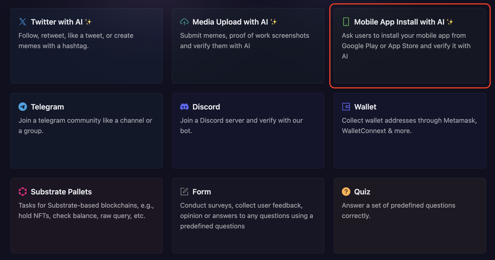
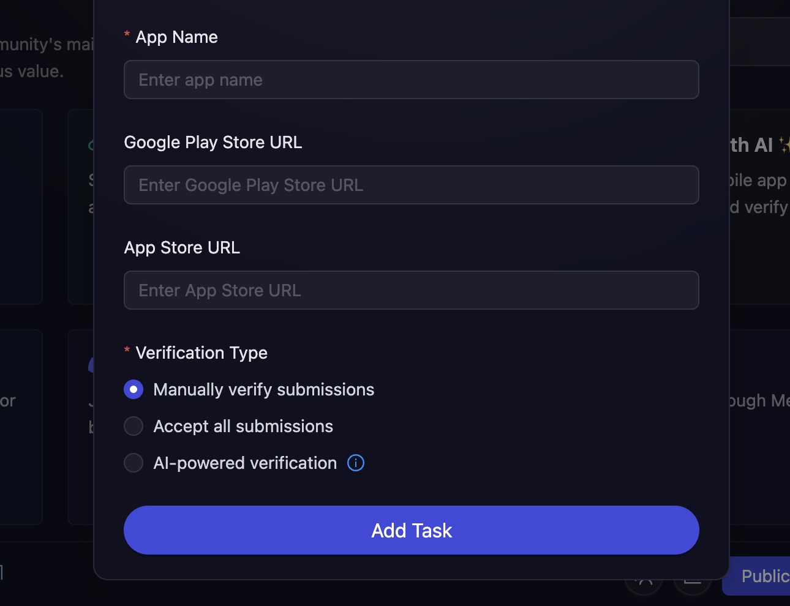

# Mobile App - AI Powered Verification

Mobile App tasks help you drive app downloads and installations from both Google Play Store and Apple App Store. Participants are prompted to install your mobile application and provide screenshot evidence of the installation. This task type is perfect for boosting app downloads, increasing user acquisition, and building your mobile app's user base through community engagement.

- On the event page, click on Quests tab where you can find the **Mobile App** block.

  

- Configure the basic details for your Mobile App task. For detailed instructions on setting up basic details, refer to the [Quest Basic Details](../quest-basic-details.md) guide.

- To configure the **Task Condition & Recurrence**, refer to the [Task Condition & Recurrence](../task-condition-and-recurrence.md) page.

- Next, fill in the app details:

  - **App Name**: Enter the name of your mobile application
  - **Google Play Store Link**: Provide the link to your app on Google Play Store (for Android users)
  - **App Store Link**: Provide the link to your app on Apple App Store (for iOS users)

  

- Participants will need to:

  1. Install the app from their respective app store (Google Play or App Store)
  2. Upload a screenshot as proof of installation showing the app installed on their device

- You can select from three verification types for this task. To learn more about all verification types offered by AirLyft, refer to the [Verification Types](../quest-verification-type.md) guide.

- Finally, click on **Add Task** to create your Mobile App installation task.

:::tip For instant help

1. Create a support ticket on our Discord: https://discord.gg/bx6ZCTwbYw
2. Join [this Telegram group](https://t.me/kyteone): https://t.me/kyteone

**_The AirLyft Team is there to help you. AirLyft is a platform to run marketing events, campaigns, quests and automatically distribute NFTs or Tokens as rewards._**

:::
