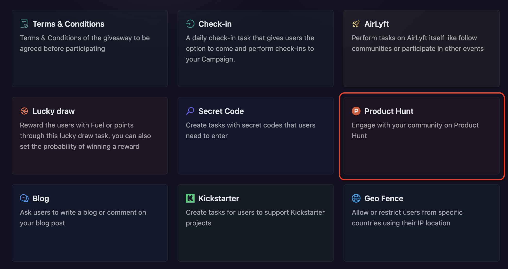
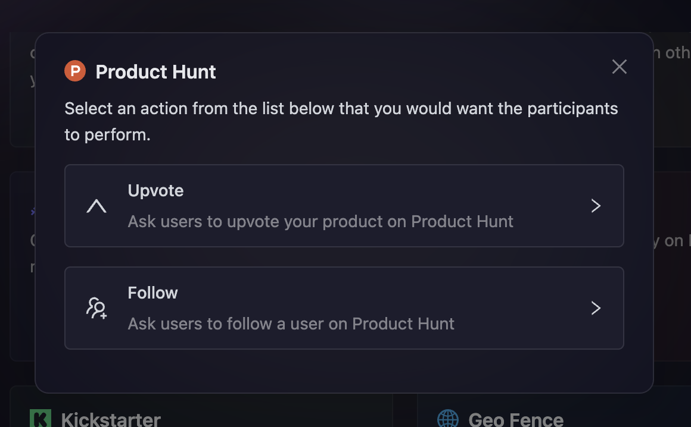
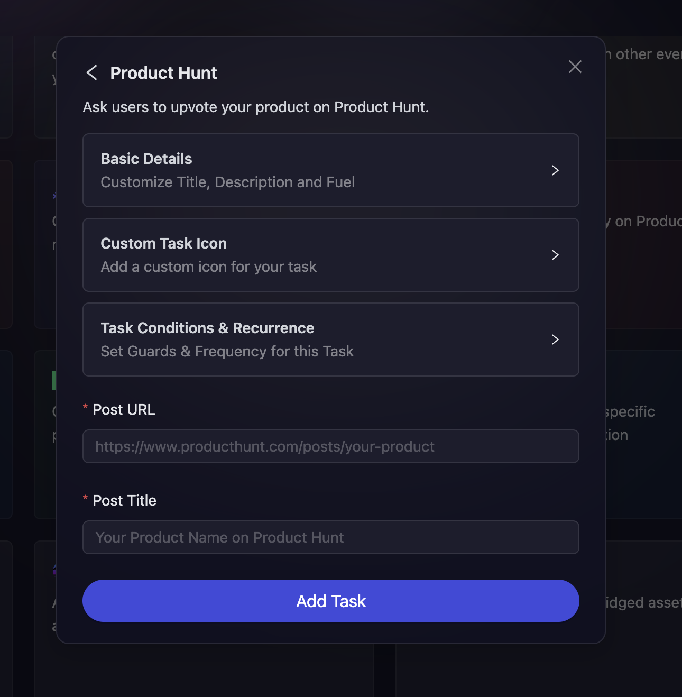
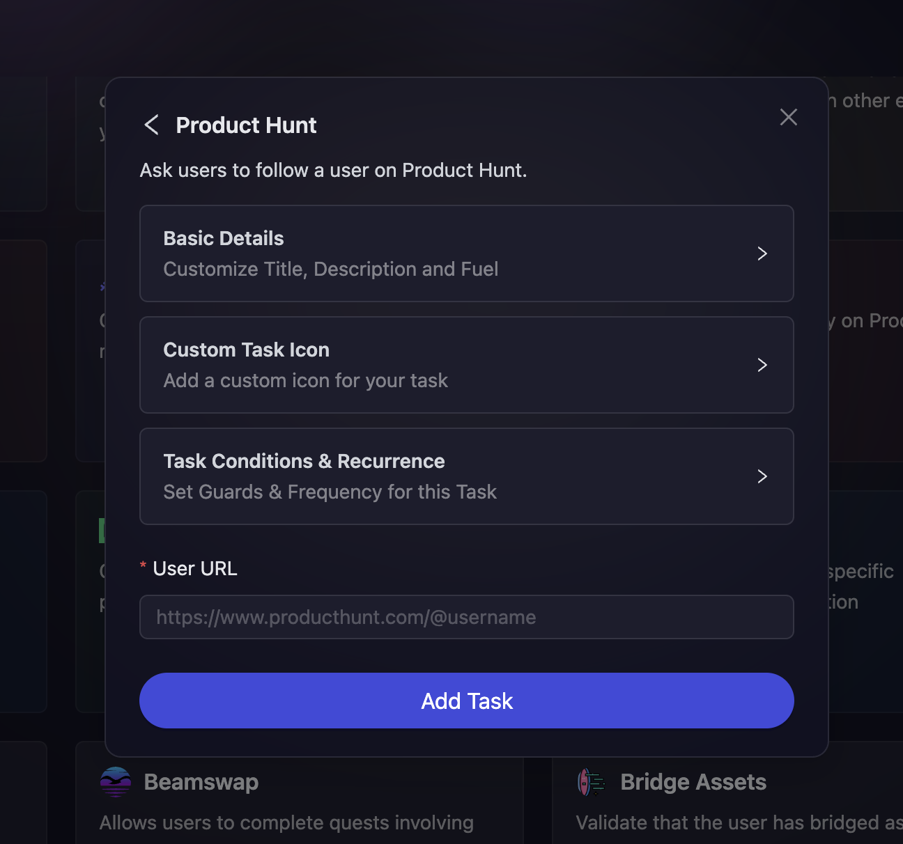

# Product Hunt

Product Hunt is a popular platform where the tech community discovers new products daily. With AirLyft's Product Hunt integration, you can create tasks that encourage your community to engage with your product listings on Product Hunt, helping boost visibility and community support. In this module, we will be discussing the following Product Hunt actions:

- [Upvote a Product Hunt Post](#upvote-a-product-hunt-post)
- [Follow a Product Hunt Profile](#follow-a-product-hunt-profile)

Creating these actions are simple and straightforward on AirLyft. Let's dive deep into the steps on how to create Product Hunt tasks.

- On the event page, click on Quests tab where you can find the **Product Hunt** block.

  

- After clicking on the Product Hunt box, you will be presented with options for selecting Product Hunt actions. Let's read in depth about each of them.

  

### Upvote a Product Hunt Post

This task allows participants to upvote your product on Product Hunt, helping increase your product's visibility and ranking.

- As shown in the screenshot above, click on the **Upvote** option.

- Configure the basic details for your Product Hunt upvote task. For detailed instructions on setting up basic details, refer to the [Quest Basic Details](../quest-basic-details.md) guide.

- To configure the **Task Condition & Recurrence**, refer to the [Task Condition & Recurrence](../task-condition-and-recurrence.md) page.

- Enter the **Post URL** of your Product Hunt listing that you want participants to upvote.

- Enter the **Post Title** to help participants identify the correct product listing.

  

- Finally, click on **Add Task** button to create your Product Hunt upvote task.

### Follow a Product Hunt Profile

This task encourages participants to follow your Product Hunt profile, helping you build a stronger presence on the platform.

- Click on the **Follow** option from the Product Hunt task options.

- Configure the basic details for your Product Hunt follow task. For detailed instructions on setting up basic details, refer to the [Quest Basic Details](../quest-basic-details.md) guide.

- To configure the **Task Condition & Recurrence**, refer to the [Task Condition & Recurrence](../task-condition-and-recurrence.md) page.

- Enter the **Profile Link** of the Product Hunt profile you want participants to follow.

  

- Finally, click on **Add Task** button to create your Product Hunt follow task.

:::tip For instant help

1. Create a support ticket on our Discord: https://discord.gg/bx6ZCTwbYw
2. Join [this Telegram group](https://t.me/kyteone): https://t.me/kyteone

**_The AirLyft Team is there to help you. AirLyft is a platform to run marketing events, campaigns, quests and automatically distribute NFTs or Tokens as rewards._**

:::
