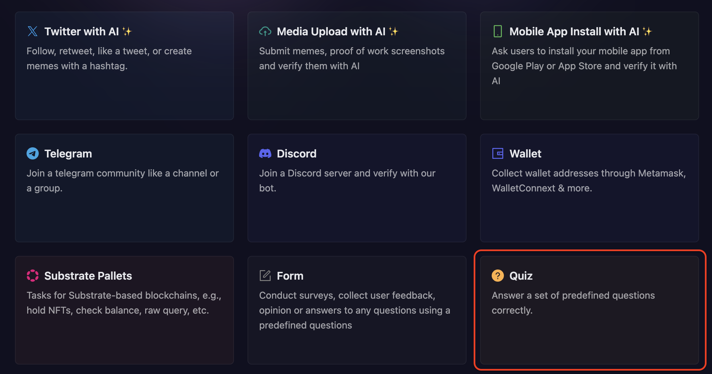
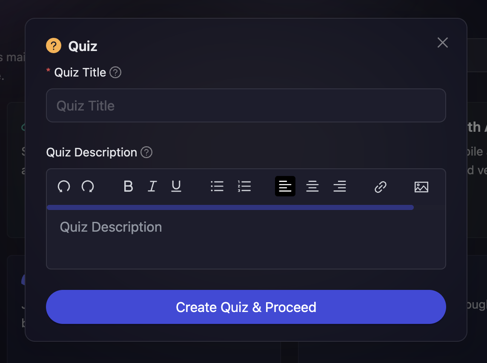
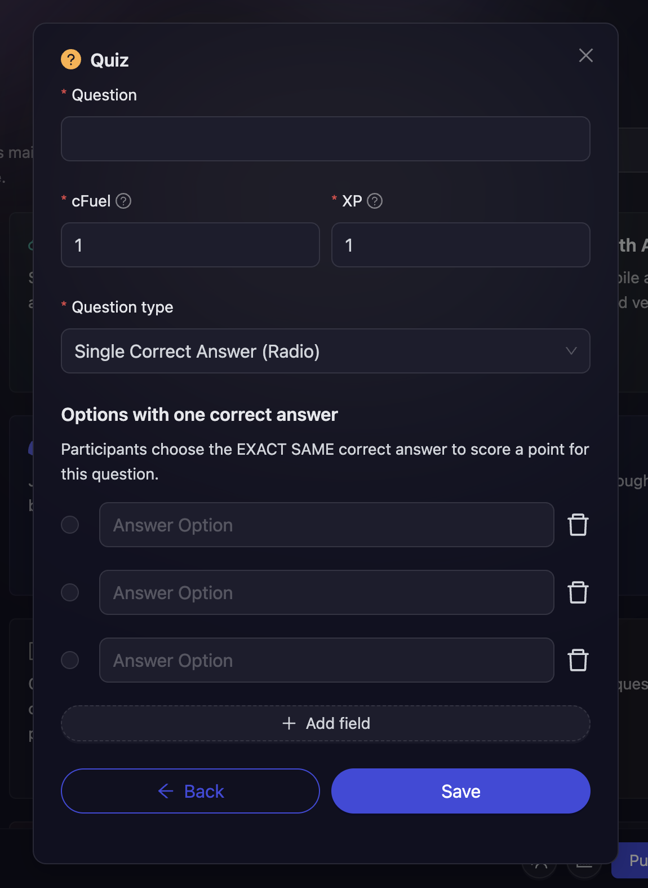
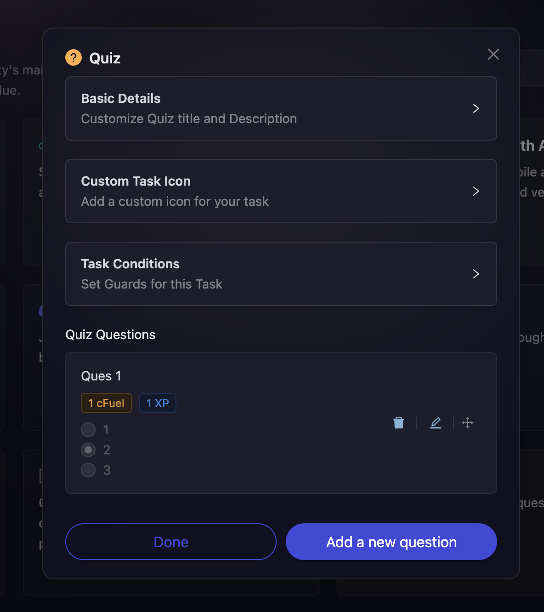

# Quiz

Most projects have moved from the same repetitive marketing method and moved towards more effective Learn 2 Earn campaigns using which they can impart knowledge of the product, team, roadmap, and many more. With that in mind, AirLyft has now made live it's Quiz Module where projects can create interactive quizzes and let users participate to get interactive rewards. Let's dive deep into how to create a quiz competition at AirLyft.

- Head over to the Quests tab under Campaign Information where you can find the **Quiz** option.

  

- Next, configure the basic details for your quiz task like Title and Description. For quiz tasks, enter a catchy title and description so that users have a great understanding of the type of questions they'll be answering.

  

- Next, click on the "Create Quiz & Proceed" button.

  

- The first thing you need to enter is the question that participants need to answer and assign cFuel and XP to each correct answer.

- Then you can select the Question Type as well. AirLyft provides two Question Types

  - Single Correct Answers(Radio)

  - Multiple Correct Answers(Checkbox)

    In case of Multiple Correct Answers, you can choose if a particular question has a single correct answer or multiple correct answers.

- If you want to add more questions, click on **Add a New Question** button, and follow the same process again.

- You can onfigure the basic details by referring to the [Quest Basic Details](../quest-basic-details.md) guide, set up task conditions using the [Task Condition & Recurrence](../task-condition-and-recurrence.md) page.

  

- Finally, click on Save and then Done to create the Quiz Action.

If you are facing any issues with Quiz task creation, please drop a line at [support@airlyft.freshdesk.com](mailto:support@airlyft.freshdesk.com)!
