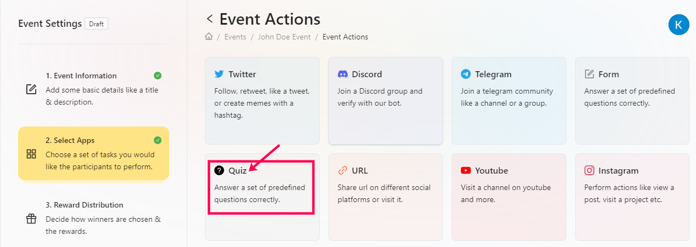
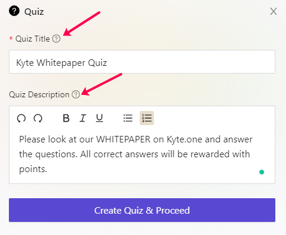
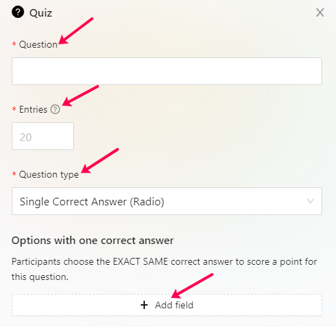

# Quiz

Most projects have moved from the same repetitive marketing method and moved towards more effective Learn 2 Earn campaigns using which they can impart knowledge of the product, team, roadmap, and many more. With that in mind, AirLyft has now made live it's Quiz Module where projects can create interactive quizzes and let users participate to get interactive rewards. Let's dive deep into how to create a quiz competition at AirLyft.

- First, log in to AirLyft and head over to the Quests tab under Campaign Information where you can find the Quiz option.

- Next, enter the Quiz Title and Description. It can be anything, say, KYTE's ROADMAP QUIZ, KYTE's WHITEPAPER & ROADMAP QUIZ, or anything based on your campaign requirements. Enter the quiz title and description in a catchy way so that the user has a great understanding of the type of questions they would be answering and be prepared for it. 

- Next, click on the "Create Quiz & Proceed" button. The first thing you need to enter is the question that participants need to answer and assign cFuel and XP to each correct answer. 

- Next is the selection of Question Type. AirLyft provides two Question Types 
    - Single Correct Answers(Radio)
    - Multiple Correct Answers(Checkbox)

You can choose if a particular question has a single correct answer or multiple correct answers. If you want to add more questions, follow the same process again and have further questions added.

- Finally, click on Save and then Done to create the Quiz Action. 

If you are facing any issues with Quiz task creation, please drop a line at ** support@kyte.one **!