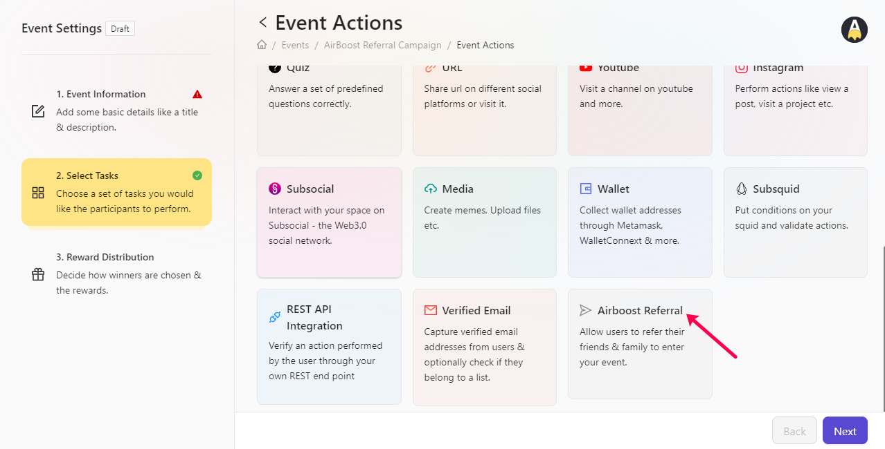
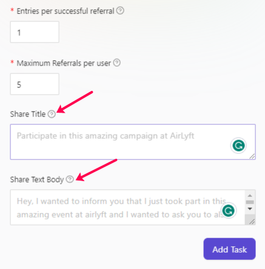
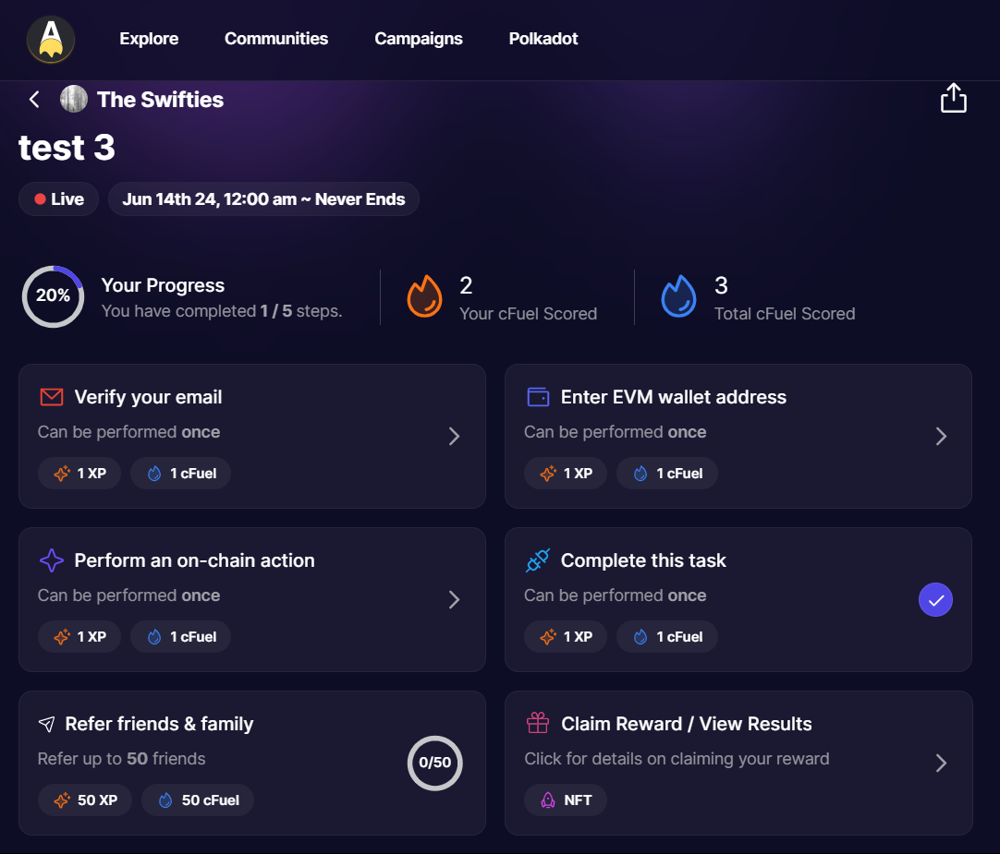
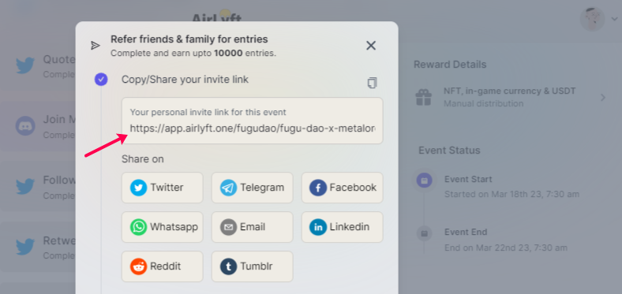
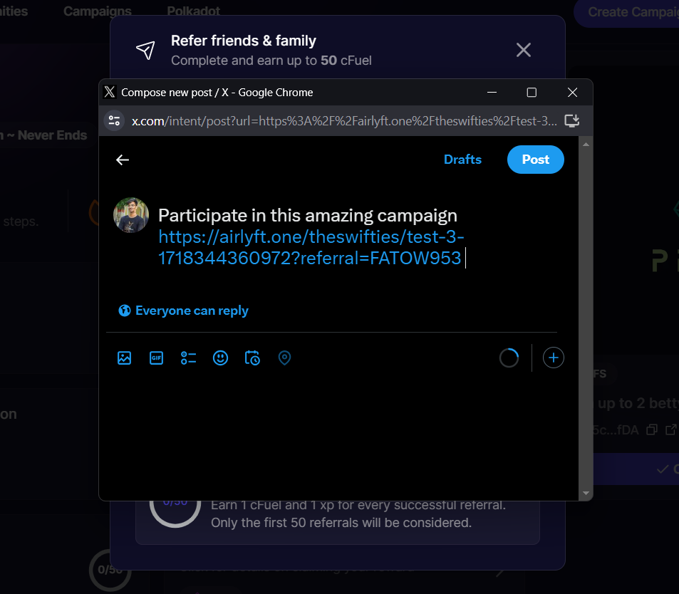
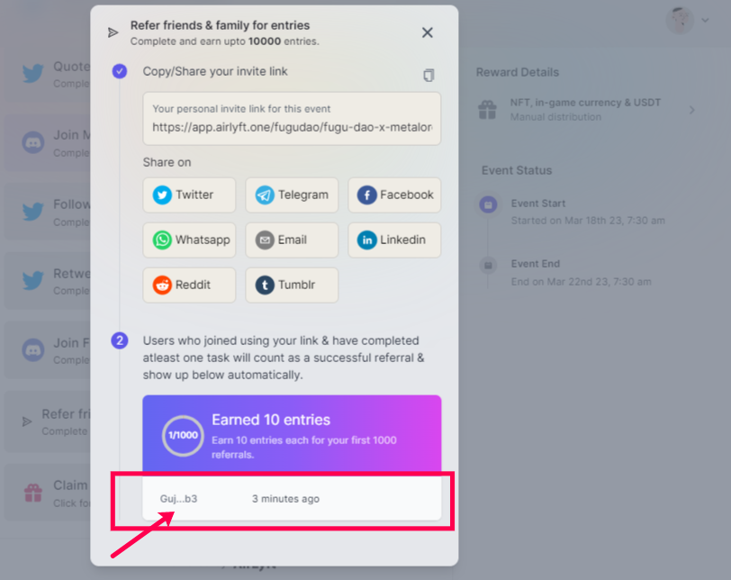

# AirBoost Referral

Want to create a viral referral task for your campaign? Use AirLyft's AirBoost referral module to get the most out of your referral campaign. Let's learn more about how to create your first referral task. 

Before starting, the important thing to note is that "**A Referral is only considered as successful if the referred individual completes at least anyone task in the event he/she is being referred for**".

- First, log in to AirLyft and head over to the Select Apps action under event creation where you can find the AirBoost option.

    

- Next is the set-up option for referrals in which the very first parameter to set up is the basic details of the referral event such as the Title and Description. 

- Next, you will have the option to enter the points that will have to be rewarded to users on each successful referral. You can also set up a limit on how many maximum referrals can per user do for their unique link. **Please note that entries once saved can't be updated. **

     

- Once the entry parameters are set, you need to then enter the Share Title which is the text that goes in the email subjects, Tweets, or DMs. Based on the text you enter, the referral URL will automatically be attached just after the share title text. 

- Above was the referral title and the next step was to enter the Share Text Body that goes in the email body and other long-form text areas. Again, please note that the referral URL will automatically be attached just after the share title text. 

    

- Finally, click on Add Task and woohoo, your referral task is successfully created and now the entire magic happens. Post-publishing your event, this is what a referral event would look like when anyone comes to participate in the event and provide their referral.

    

- Users when referring someone, they can see their personal invite link auto-populated in the box which you will have to share with others on any social link of your choice as shown in the image below. And, if you don't see your social channel, you can just copy the same link and share it manually even. 

    

- Let's say you want to share the link on Twitter. Just click on the Twitter option from the list of the social site available and an iFrame opens up where you can directly share it on your connected Twitter Account. Based on the social account selected, you need to share these with respective users and only then you can be considered for a referral.

    

- Again, **A REFERRAL IS ONLY CONSIDERED AS SUCCESSFUL IF THE REFERRED INDIVIDUAL COMPLETES AT LEAST ANYONE TASK IN THE EVENT HE/SHE IS BEING REFERRED FOR**. 

- Now, say the person you have referred has completed at least one task. In that case, participants can now go to their AirLyft app and see live data of those who have successfully participated using your referral link. 

    

:::tip For instant help

1. Create a support ticket on our Discord: https://discord.gg/bx6ZCTwbYw
2. Join [this Telegram group](https://t.me/kyteone): https://t.me/kyteone

**_The AirLyft Team is there to help you. AirLyft is a platform to run marketing events, campaigns, quests and automatically distribute NFTs or Tokens as rewards._**

:::