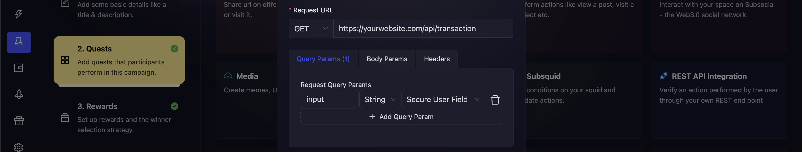

# REST API Integration

Since not all data is stored on a blockchain, AirLyft offers a comprehensive solution for those seeking to create and validate more in-depth actions based on your own product functionality. Simply let your development team create custom endpoints and connect them to our quests making your campaign experience smoother.

AirLyft integrates with any system that provides REST API access. Users can link their EVM/Substrate wallets, provide signatures for ownership verification, and then transmit their wallet address to the API, either as query params, body, or headers.

### What variables can AirLyft pass to the API?

AirLyft can pass the following information as a query/body param or header.

1. **Logged In user's id**: User's AirLyft UUID. Use this in case you have to save some data and match it with the exported data from the event.
2. **Secure User Field**: Any user input that is taken from the participant in the UI and securely sent to your API without being saved or logged in AirLyft's servers. Use this for usernames, keys, or any information your API might need to validate app installs, sign ups etc.
3. **Connected Wallet**: User's connected wallet address (Substrate or EVM depending on the quest type selected). Use this in case your dApp uses a wallet connection & you need to validate whether the user has used your particular feature.

These value types are available in all three params - Query, Body and Header.

:::tip

The below section is intended for Developers.

Configuring the REST API Integration often needs support from the dev or devrel team of your company. Our team also provides support to our Professional Plan community hosts. [Open a support ticket on our Discord](https://discord.gg/4W6Bxq9rtc) to move to a Professional Plan today.

:::

### How to create a REST API to validate an action for a dApp?

REST APIs are best used when the quest you want to create is complex and cannot be easily validated using a smart contract function or an indexer.

### Common Examples

#### Validate with EVM/Substrate Wallet

Say, your dApp allows users to do a transaction X, and you want to create a quest that validates that action. Your REST API should look like the following:

`GET your-website/api/transaction?wallet=0x12345`

The API should return some data that can then be used in the condition function to validate whether the user performed the task or not.

Now, you can configure your params in the UI similar to this:

#### Validate with User Input from the UI

Say, you want to validate an action "Sign up for my dApp" but you want the user to enter their username and your platform will inform AirLyft whether this is a registered user or not. You only want to verify the quest if the user is a registered user.

Your REST API should look like the following:

`GET your-website/api/transaction?input=0x12345`

The API should return some data that can then be used in the condition function to validate whether the user signed up or not.

Now, you can configure your params in the UI similar to this:

Finally, the data returned by your API will be send to the condition function. You can modify your condition function to validate the data and return `1` if this is a valid case or `0` if this is an invalid case.

:::note
**Caveats when only using Secure User Field without wallet connection**
Please note this secure user input will not be saved on our system for later retreival. It will just be sent to your API for validation. If you want to correlate later, you can design your API to also take a “Logged in user id” which you will be able to extract from AirLyft’s participants dashboard. AirLyft will also not stop different users from entering the same data twice and getting points for it incase your API responds true for the same input twice. To prevent this, either add this logic into your API or consider using the "Connected Wallet".

:::
