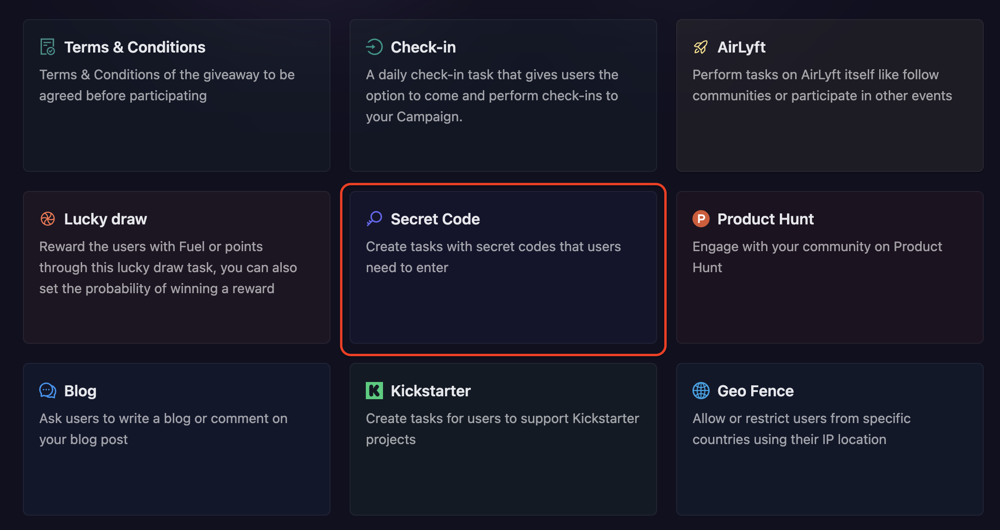
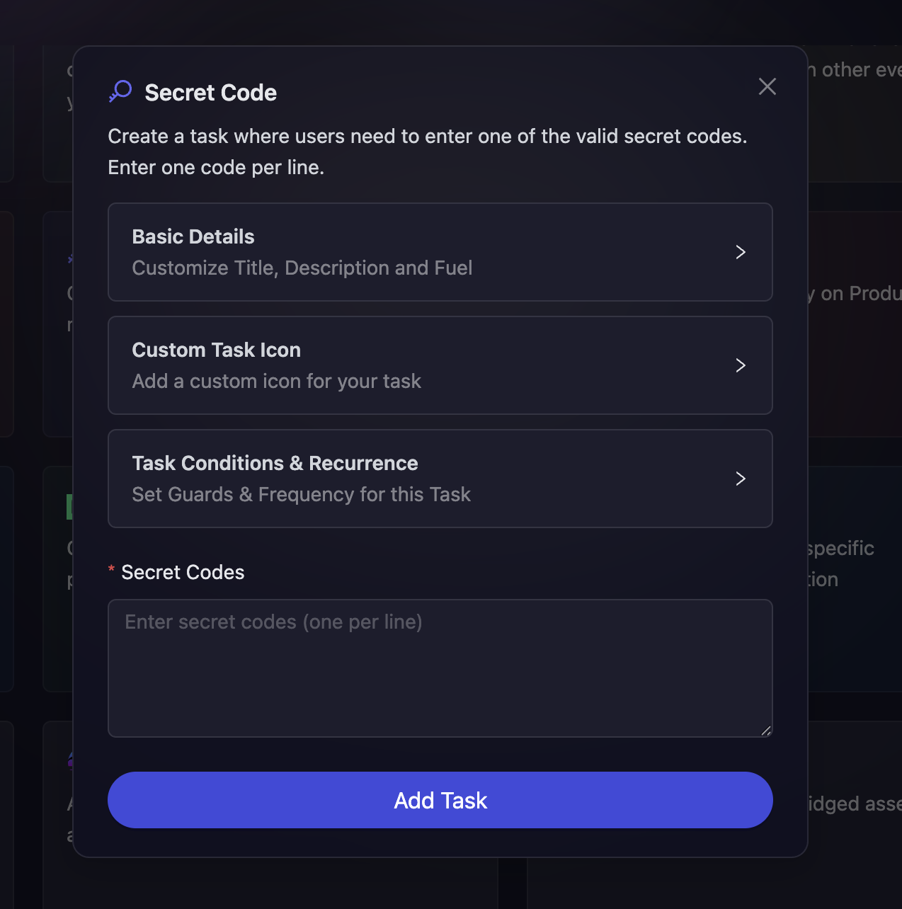

# Secret Code

The Secret Code task allows organizers to create engagement by hiding secret codes in various locations and challenging participants to find and enter them. This gamification element encourages deeper interaction with your content, social channels, or community spaces. Organizers can add one or more secret codes, making it flexible for multi-stage campaigns or different difficulty levels.

- On the event page, click on Quests tab where you can find the **Secret Code** block.

  

- Configure the basic details for your Secret Code task. For detailed instructions on setting up basic details, refer to the [Quest Basic Details](../quest-basic-details.md) guide.

- To configure the **Task Condition & Recurrence**, refer to the [Task Condition & Recurrence](../task-condition-and-recurrence.md) page.

- Next, add your secret codes by typin them in the secret code input field. You can add multiple codes to increase engagement opportunities.

> For each secret code, enter the exact code that participants will need to input. Make sure the codes are memorable but not too obvious.

- Finally, click on **Add Task** to create your Secret Code task.

:::tip For instant help

1. Create a support ticket on our Discord: https://discord.gg/bx6ZCTwbYw
2. Join [this Telegram group](https://t.me/kyteone): https://t.me/kyteone

**_The AirLyft Team is there to help you. AirLyft is a platform to run marketing events, campaigns, quests and automatically distribute NFTs or Tokens as rewards._**

:::
