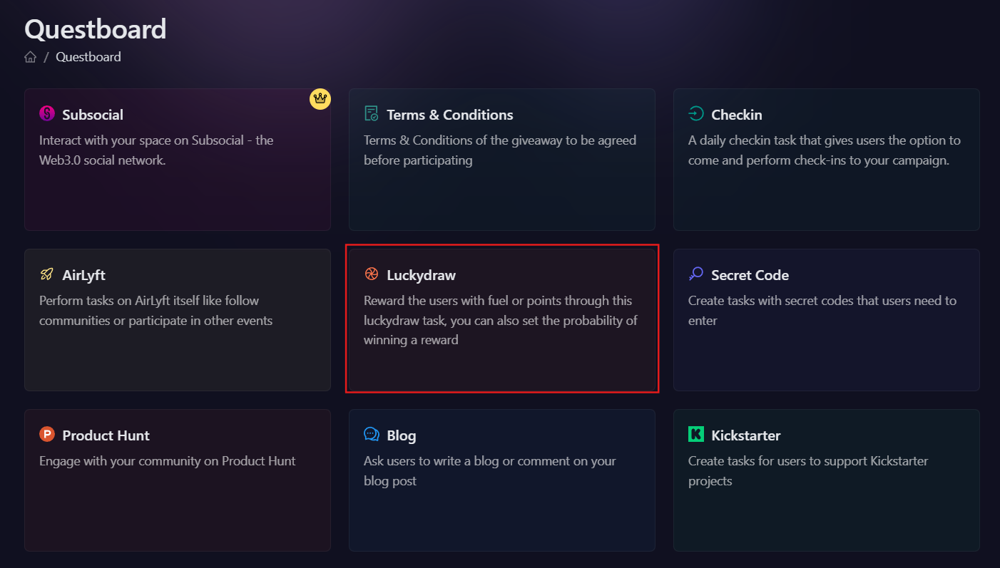
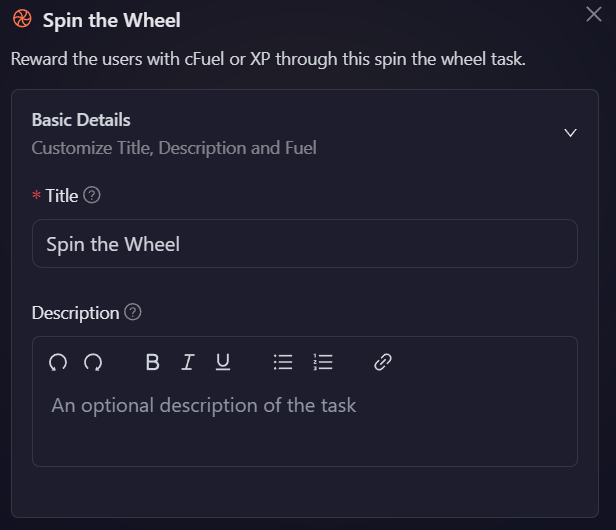
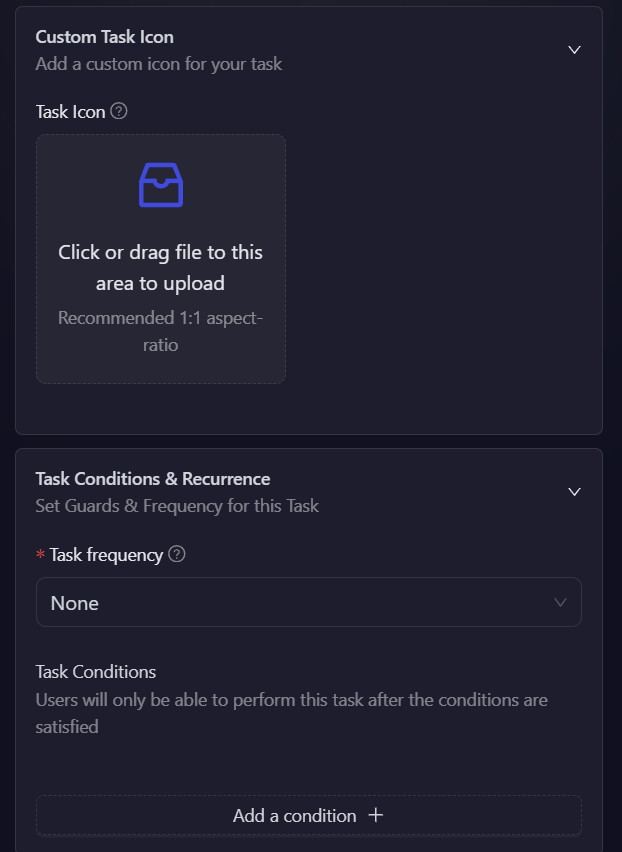
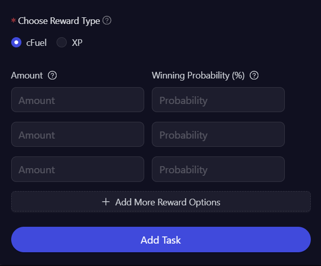

# Spin the Wheel

The **Spin the Wheel** task allows projects to reward participants with **cFuel** or **XP** through a randomized spin-the-wheel mechanism. This feature is ideal for gamified engagement, where users have a chance to win different reward amounts based on predefined probabilities.

- Login to AirLyft and create a campaign. On the campaign page, click on Quests tab where you can find the Spin the Wheel block.

  

- To set up a **Spin the Wheel** task, begin by configuring the **Basic Details**, including the title, description for the task. Providing a clear and engaging description helps participants understand the task and its rewards.

  

- Next, you can personalize the task further by adding a **custom task icon**.

  

- To configure the **Task Condition & Recurrence**, refer to the [Task Condition & Recurrence](../task-condition-and-recurrence.md) page.

  

- Now, choose the **reward type**, either **cFuel** or **XP**, based on what you want participants to receive.

- Once selected, enter the **reward amounts** and their respective **winning probabilities**. For example:

  - You can set up different reward tiers like:
    - 100 cFuel with 10% probability (rare reward)
    - 50 cFuel with 30% probability (uncommon reward)
    - 20 cFuel with 60% probability (common reward)

  The probabilities must add up to 100%. This setup ensures that different rewards have different chances of being won, creating an exciting and dynamic experience for participants. In the example above, when a user spins the wheel, they have a 60% chance to win 20 cFuel, a 30% chance to win 50 cFuel, and a 10% chance to win 100 cFuel.

- Finally, click **Add Task** to activate the Spin the Wheel task.

:::tip For instant help

1. Create a support ticket on our Discord: https://discord.gg/bx6ZCTwbYw
2. Join [this Telegram group](https://t.me/kyteone): https://t.me/kyteone

**_The AirLyft Team is there to help you. AirLyft is a platform to run marketing events, campaigns, quests and automatically distribute NFTs or Tokens as rewards._**

:::
