# Substrate Pallets

## About Substrate Pallets

Substrate Pallets allow us to interact with and verify conditions on any Substrate-based parachain by calling chain state functions. These functions provide a way to query the current state of the blockchain.

Chain state functions in Substrate-based networks like Polkadot and its parachains offer a powerful and efficient method to retrieve specific pieces of information from the blockchain. These functions can be used to verify user actions, account balances, smart contract states, and other on-chain data, making them ideal for creating verifiable quests in AirLyft campaigns.

## Example & Configuration on AirLyft

Let's see how we can use chain state functions to verify if a user follows a space on [GrillApp](https://grillapp.net/).

### (Optional) Steps to fetch information on Polkadotjs

If you are unsure which chain state function to call, you can also use this step to find your function on the polkadotjs UI. Configuration on AirLyft is in the [next step](#configuring-the-task-on-airlyft) which is very similar.

1. Navigate to the [Polkadotjs Apps website](https://polkadot.js.org/apps/).
2. Connect to the Subsocial parachain by selecting it from the network dropdown menu.
3. Go to the "Developer" tab and select "Chain State".
   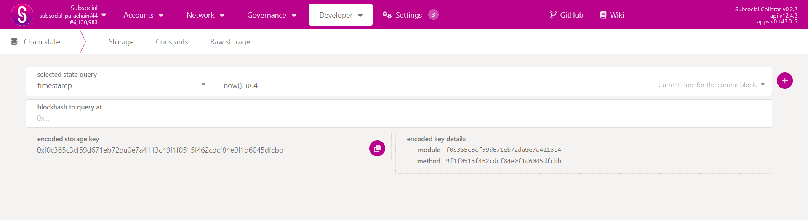
4. In the "selected state query" dropdown, choose `spaceFollows` > `spaceFollowedByAccount`.
5. Enter the following parameters:

   - u64: The ID of the space you want to check.
   - AccountId32: The address of the user you want to verify.

   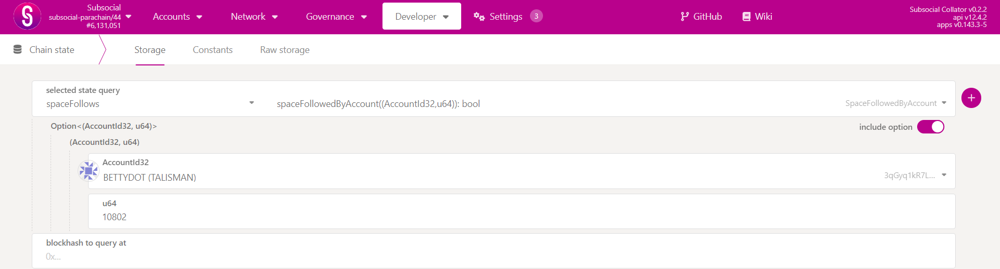

6. Click on the "**+**" button to execute the query.
7. If the user follows the space, you'll receive a `true` response. Otherwise, you'll get `false`.

### Configuring the task on AirLyft

- In your campaign page, go to the "Quests" tab, and select the **Substrate Pallets** quest from the options.
  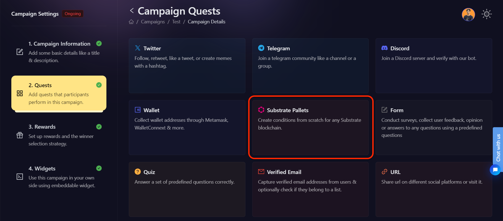

- You will then be presented with options for selecting Substrate Pallet actions. Let's read in depth about each of them.

  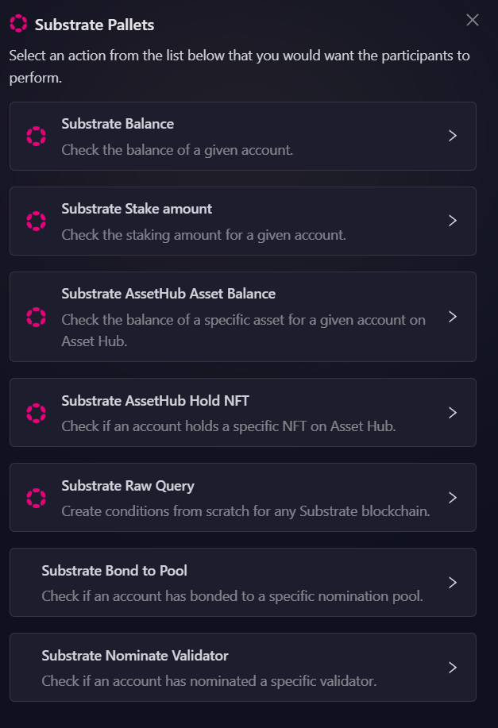

- [Check Substrate Balance](#check-substrate-balance)
- [Check Substrate Stake amount](#check-substrate-stake-amount)
- [Check Substrate AssetHub Asset Balance](#check-substrate-assethub-asset-balance)
- [Check If Substrate AssetHub Hold NFT](#allow-only-specific-accounts-on-twitter)
- [Substrate Raw Querry](#substrate-raw-querry)
- [Substrate Bond to Pool](#check-if-account-bonded-to-pool)
- [Substrate Nominate Validator](#check-if-account-has-nominated-validator)

AirLyft simplifies the process of creating Substrate Pallet tasks, making it as straightforward as using Polkadotjs. Let's dive deep into it.

#### Check Substrate Balance

- This option allows you to verify whether a user has a minimum required balance of a specific token in their Substrate-based wallet. This is particularly useful for campaigns that reward users for holding or maintaining a certain balance of an asset, ensuring they have an active presence in the ecosystem before participating in a quest.

1. Select the Substrate Balance option, as shown in the screenshot below.

   

2. Next, configure the basic details for your task. For detailed instructions on setting up basic details, refer to the [Quest Basic Details](../quest-basic-details.md) guide.

   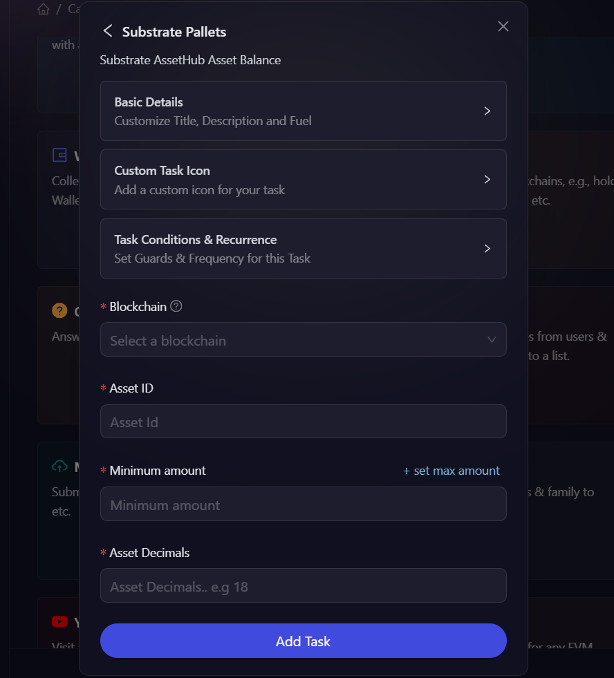

3. To configure the **Task Condition & Recurrence**, refer to the [Task Condition & Recurrence](../task-condition-and-recurrence.md) page.

4. Choose the **Blockchain** where the balance should be checked (e.g., Polkadot AssetHub, Subsocial, etc.). Enter the **Minimum balance** that users must hold to be eligible for completing the quest. This ensures that only users meeting the criteria can proceed.

5. Once all details are filled in, click the **Add Task** button to complete the process. The Substrate Balance quest is now set up and ready for users to participate.

#### Check Substrate Stake Amount

- This option enables you to check if a user has staked a specific amount of tokens. By using this task, you can create campaigns that incentivize users to participate in staking.

1. Navigate to the "Quests" tab in your campaign page and select the Substrate Pallets quest. From the available options, choose **Substrate Stake Amount**, as shown in the image below.

   

2. Next, configure the basic details for your task. For detailed instructions on setting up basic details, refer to the [Quest Basic Details](../quest-basic-details.md) guide.

   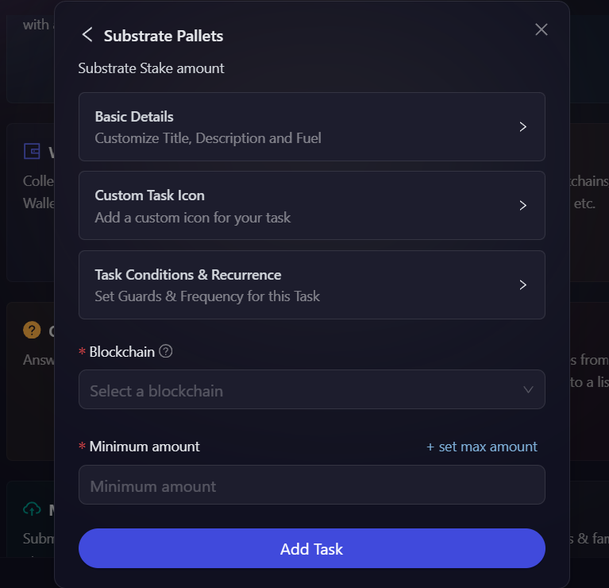

3. To configure the **Task Condition & Recurrence**, refer to the [Task Condition & Recurrence](../task-condition-and-recurrence.md) page.

4. Select the **Blockhain** where the staking amount should be checked and enter the **Minimum amount** that users must have to qualify.

5. Then click on **Add Task** button. That's it your Substrate Pallets quest has been created.

#### Check Substrate AssetHub Asset Balance

- This option lets you verify if a user holds a required amount of a specific token on Substrate AssetHub.

1. Select the **Substrate AssetHub Asset Balance** option, as shown in the screenshot below.

   

2. Next, configure the basic details for your task. For detailed instructions on setting up basic details, refer to the [Quest Basic Details](../quest-basic-details.md) guide.

   

3. To configure the **Task Condition & Recurrence**, refer to the [Task Condition & Recurrence](../task-condition-and-recurrence.md) page.

4. Select the **Blockhain** and then enter the **Asset ID**. Give the **Minimum amount** of the asset you want the user to hold along with the **Asset Decimals**.

5. Then click on **Add Task** button. That's it your Substrate Pallets quest has been created.

#### Check If Substrate AssetHub Hold NFT

- NFT-based campaigns are becoming increasingly popular, and this option enables you to confirm whether a user possesses a particular NFT on Substrate AssetHub. This is useful for quests that require users to hold certain NFTs before they can claim rewards or unlock exclusive experiences.

1. Select the Substrate AssetHub Hold NFT option, as shown in the screenshot below.
   

2. Next, configure the basic details for your task. For detailed instructions on setting up basic details, refer to the [Quest Basic Details](../quest-basic-details.md) guide.
   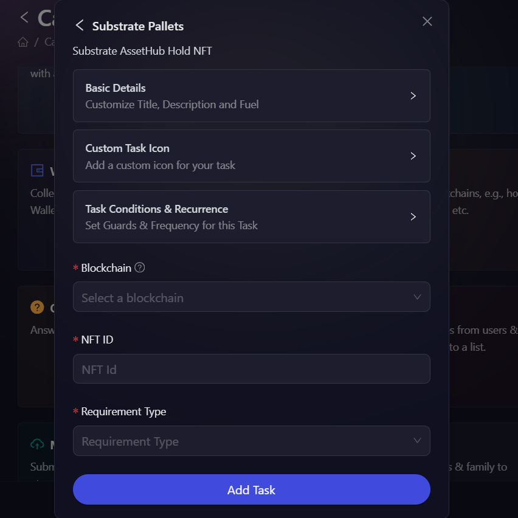

3. To configure the **Task Condition & Recurrence**, refer to the [Task Condition & Recurrence](../task-condition-and-recurrence.md) page.

4. Select your **Blockchain** and then enter the **NFT ID** and **Requirement Type**.

   To find an NFT ID:

   1. Visit [Polkadot.js Apps](https://polkadot.js.org/apps/#/explorer)
   2. Connect to the relevant AssetHub (e.g., Polkadot AssetHub)
   3. Go to Developer > Chain State
   4. Select `uniques` pallet > `asset` query
   5. Enter the collection ID and item ID

   The NFT ID format is typically `{collectionId}-{itemId}` (e.g., "123-456")

5. Then click on **Add Task** button. That's it your Substrate Pallets quest has been created.

#### Substrate Raw Querry

- This option verifies whether a user has bonded their tokens to a staking pool, an essential process in decentralized finance and staking ecosystems. By using this task, you can encourage users to engage in staking pools, supporting network security while earning passive income.

1. Next, configure the basic details for your task. For detailed instructions on setting up basic details, refer to the [Quest Basic Details](../quest-basic-details.md) guide.

2. To configure the task add the following details:

- Select **Subsocial** from the Blockchain dropdown.
- Select **Space Follows(spaceFollows)** from the Storage entry to query dropdown. Then choose **spaceFollowedByAccount(spaceFollowedByAccount)**.

3. The, toggle the button next to Account32 input box, and select **User's connected wallet** in the address field.

4. Enter the ID of the space you want to check, in our case "1".
   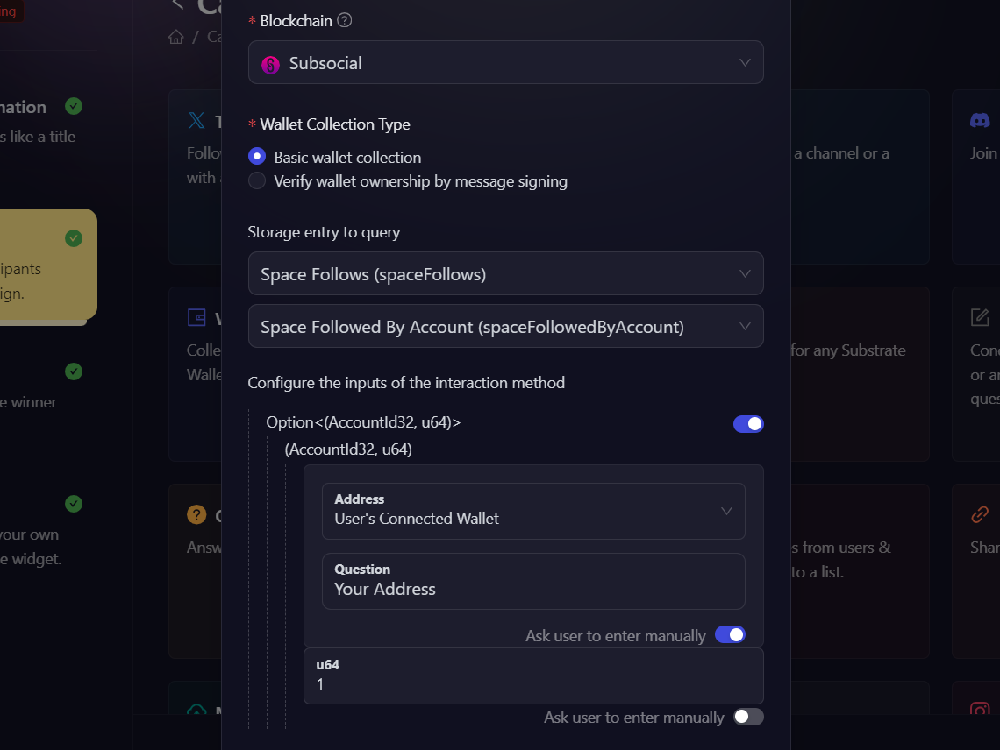

5. In the output condition, write a JavaScript condition for task validation. You can customize it based on your needs, but in our case we'll leave it as it is.

6. Then click on **Add Task** button. That's it your Substrate Pallets quest has been created.
   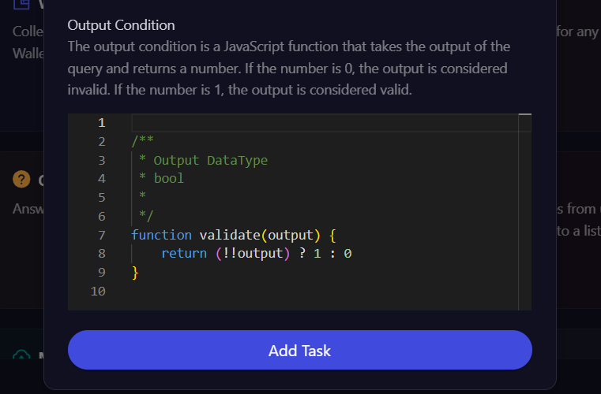

#### Substrate Bond to Pool

- This option checks if a user has nominated a validator, ensuring they are actively participating in governance and network security.

1. Select the Substrate Bond to Pool option, as shown in the screenshot below.
   

2. Next, configure the basic details for your task. For detailed instructions on setting up basic details, refer to the [Quest Basic Details](../quest-basic-details.md) guide.
   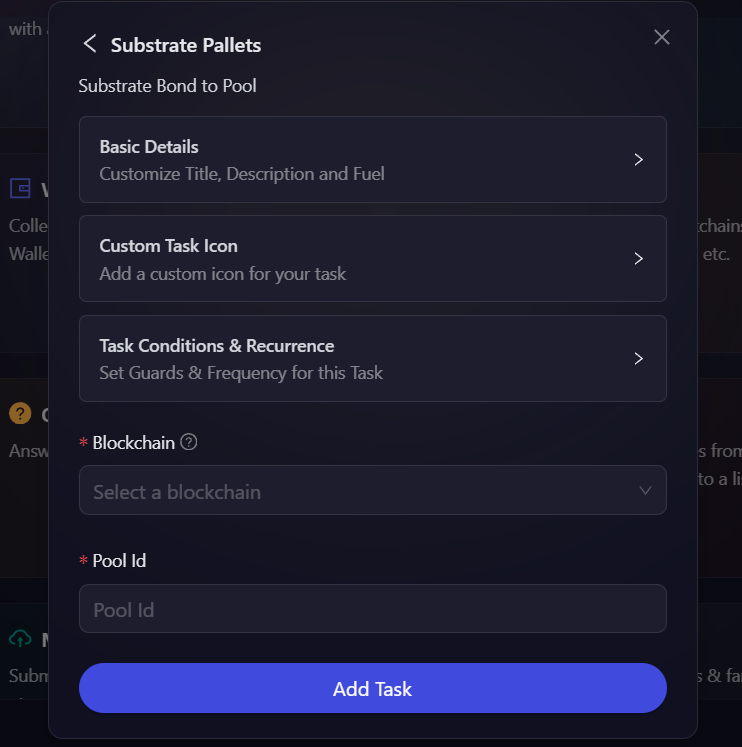

3. To configure the **Task Condition & Recurrence**, refer to the [Task Condition & Recurrence](../task-condition-and-recurrence.md) page.

4. Select the **Blockhain** and then enter the **Pool ID**.

5. Then click on **Add Task** button. That's it your Substrate Pallets quest has been created.

#### Substrate Nominate Validator

- This checks whether a user has nominated a validator in a Substrate-based staking system. It is ideal for quests that promote active participation in network validation and staking activities.

1. Select the Substrate Nominate Validator option, as shown in the screenshot below.
   

2. Next, configure the basic details for your task. For detailed instructions on setting up basic details, refer to the [Quest Basic Details](../quest-basic-details.md) guide.
   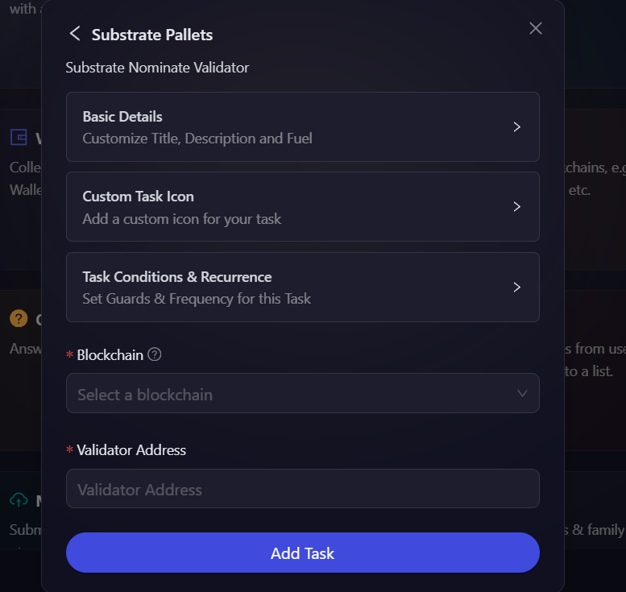

3. To configure the **Task Condition & Recurrence**, refer to the [Task Condition & Recurrence](../task-condition-and-recurrence.md) page.

4. Select the **Blockhain** and then enter the **Validator Address**.

5. Then click on **Add Task** button. That's it your Substrate Pallets quest has been created.

## Demo Event

To see this quest type in action and understand how it works in a real campaign, check out our demo event: [Substrate Pallets Demo](https://airlyft.one/airtest/substrate-pallets-demo)

:::tip For instant help

1. Create a support ticket on our Discord: https://discord.gg/bx6ZCTwbYw
2. Join [this Telegram group](https://t.me/kyteone): https://t.me/kyteone

**_The AirLyft Team is there to help you. AirLyft is a platform to run marketing events, campaigns, quests and automatically distribute NFTs or Tokens as rewards._**

:::
