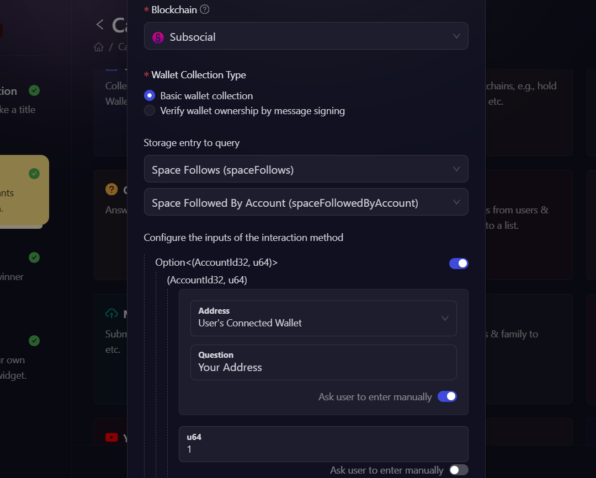

# Substrate Pallets

## About Substrate Pallets

Substrate Pallets allow us to interact with and verify conditions on any Substrate-based parachain by calling chain state functions. These functions provide a way to query the current state of the blockchain.

Chain state functions in Substrate-based networks like Polkadot and its parachains offer a powerful and efficient method to retrieve specific pieces of information from the blockchain. These functions can be used to verify user actions, account balances, smart contract states, and other on-chain data, making them ideal for creating verifiable quests in AirLyft campaigns.

## Example & Configuration on AirLyft

Let's see how we can use chain state functions to verify if a user follows a space on [GrillApp](https://grillapp.net/).

### Steps to fetch information on Polkadot.js

1. Navigate to the [Polkadot.js Apps website](https://polkadot.js.org/apps/).
2. Connect to the Subsocial parachain by selecting it from the network dropdown menu.
3. Go to the "Developer" tab and select "Chain State".

4. In the "selected state query" dropdown, choose `spaceFollows` > `spaceFollowedByAccount`.
5. Enter the following parameters:
    - u64: The ID of the space you want to check.
    - AccountId32: The address of the user you want to verify.

6. Click on the "**+**" button to execute the query.
7. If the user follows the space, you'll receive a `true` response. Otherwise, you'll get `false`.

### Configuring the task on AirLyft

AirLyft simplifies the process of creating Substrate Pallet tasks, making it as straightforward as using Polkadot.js. Here's how to configure this task:

1. In your campaign page, go to the "Quests" tab, and select the **Substrate Pallets** quest from the options.

2. Fill in the basic quest information (name, description, cFuel, and XP).
3. To configure the task add the following details:
    - Select **Subsocial** from the Blockchain dropdown.
    - Select **Space Follows(spaceFollows)** from the Storage entry to query dropdown. Then choose **spaceFollowedByAccount(spaceFollowedByAccount)**.
4. The, toggle the button next to Account32 input box, and select **User's connected wallet** in the address field.
5. Enter the ID of the space you want to check, in our case "1".

6. In the output condition, write a JavaScript condition for task validation. You can customize it based on your needs, but in our case we'll leave it as it is.
7. Then click on **Add Task** button. That's it your Substrate Pallets quest has been created.

## Demo Event

To see this quest type in action and understand how it works in a real campaign, check out our demo event: [Substrate Pallets Demo](https://airlyft.one/airtest/substrate-pallets-demo)

:::tip For instant help

1. Create a support ticket on our Discord: https://discord.gg/bx6ZCTwbYw
2. Join [this Telegram group](https://t.me/kyteone): https://t.me/kyteone

**_The AirLyft Team is there to help you. AirLyft is a platform to run marketing events, campaigns, quests and automatically distribute NFTs or Tokens as rewards._**

:::