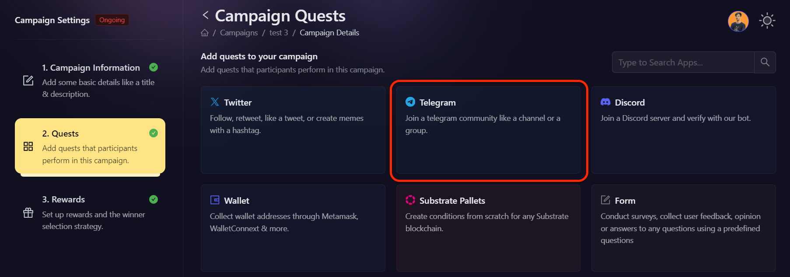
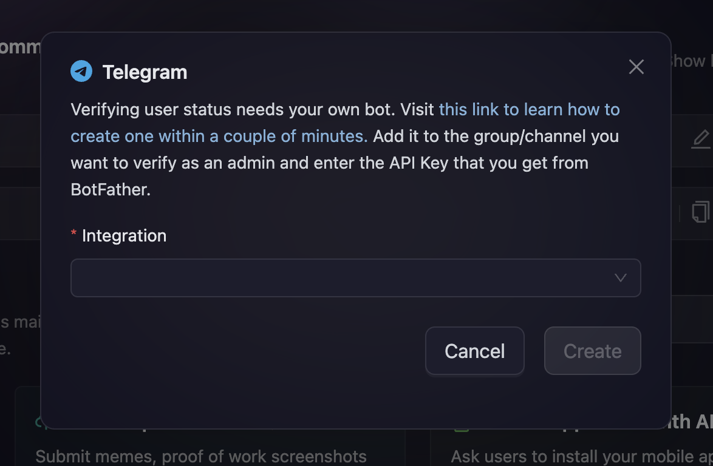

# Telegram

AirLyft now supports Telegram integration and you can create Telegram-based tasks for AirLyft to check if the participants have joined your Telegram group/channel or not. Please follow the steps below on how to create Telegram tasks.

- Login to AirLyft and create an event. On the event page, click on the Quests tab where you can find the Telegram block. 

- Next, enter the basic details of the Telegram tasks that you are creating. Click on the basic details option to enter the Title, Description, and Entries. It is advisable to elaborate on the title and description so that participants have a much greater understanding of the task.

- Then expand 'Task Condition and Recurrence' option to set the task frequency and task conditions. 
    - 'Task Frequency' determines how often users can complete a task. There are four options:
        - **None:** The task can only be completed once.
        - **Daily:** The task resets daily at midnight.
        - **Weekly:** The task resets at the start of every week.
        - **Monthly:** The task resets at the start of every month.

    - 'Task Conditions' determines if a user can perform a task or not. There are four options:
        - **Task Completed:** It only allows a user to perform a task if he has either completed or not completed another task.
        - **Date:** It only allows user to perform a task before or after the set date.
        - **Max Participants:** The task is locked after a certain number of users have completed it.

- After you have filled in the basic details, the next step is to enter the public group or channel handle. Once you have entered the handle, AirLyft will fetch its validity and show the name of the group/channel that you are entering. Please take a look at the screenshot below. 

- Moving to the next step, you will need to select the verification type. 
    - No Verification
    - Check if the user has joined the group/channel

In a few cases, projects don't want to have any bots added and directly verify the entrance into the group/channel by the bots available in the official group. In those cases, the No Verification method is chosen where AirLyft won't verify the join action and directly reward points to the users. 

On another note, if projects want AirLyft to verify if a participant has joined the group/channel or not, they can select the second option ** "Check if the user has joined group channel" **. Click on it and AirLyft will provide you the option to ** Setup Telegram Integration". 

- After you have clicked on Setup Telegram Integration, you will be asked to enter a BOT API Key that you can create using Godfather. To know in-depth how to create a Telegram bot for verification using Godfather, please click on this link [Set Up Telegram Bot](https://kyteone.medium.com/airlyft-update-improved-telegram-integration-c5636f19c8e5) where step by step details about bot creation is mentioned. 

- Finally, click on Create to associate the bot API key for verification and then Add the task to create a Telegram Action.

> ** NOTE: You can always delete this bot post-event completion by navigating to the BotFather window on Telegram and using the command “/deletebot”! **

> ** AirLyft does not read any group/channel messages, we also do not read any user PII through this bot. **

> ** This bot will not send any message to your group/channel and you can revoke all access to this bot to just verify participation. **

If you are facing any issues with Telegram task creation, please drop a line at ** support@kyte.one **!