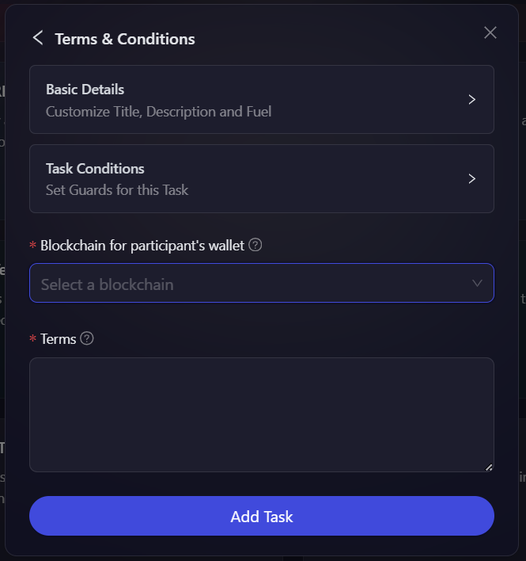

# Terms & Conditions

The Terms & Conditions module allows companies to define the rules and guidelines for their giveaway campaigns. Before participants can engage in any tasks within the campaign, they must agree to the provided terms and conditions, ensuring compliance and informed participation. Please follow the steps below on how to create Terms & Conditions task.

- On the event page, click on Quests tab where you can find the **Terms & Conditions** block.

  

- Next, you will be provided with two specific options:

  - **T&C Box:** Users can agree to the conditions by checking a simple checkbox.
  - **Dotsama Wallet Signature:** Users will need to sign the terms using their Dotsama Wallet.

  

- Let us first see how to create the **T&C Box** task, select the T&C Box option, then configure the basic details by referring to the [Quest Basic Details](../quest-basic-details.md) guide. You can also configure task conditions by referring to the [Task Condition & Recurrence](../task-condition-and-recurrence.md) page. After that, write the terms & conditions for the giveaway that the participants have to agree to. Then, click on 'Add Task'.

  

- Now, lets take a look at how to add the **Dotsama Wallet Signature** task, select the Dotsama Wallet Signature option, then configure the basic details by referring to the [Quest Basic Details](../quest-basic-details.md) guide and set up task conditions using the [Task Condition & Recurrence](../task-condition-and-recurrence.md) page. After that, select the blockchain required to sign the terms, then write the terms & conditions for the giveaway. Then, click on 'Add Task'.

  
