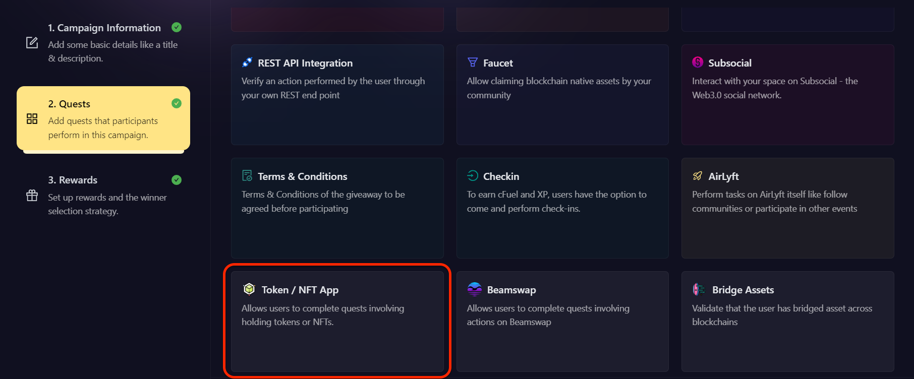
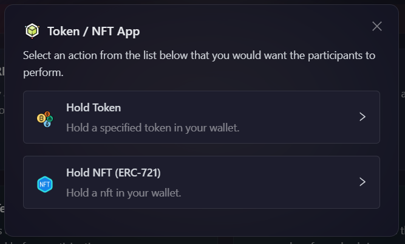
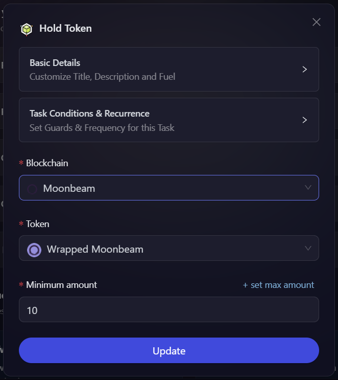
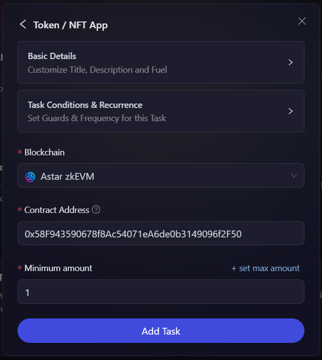

# Token / NFT App

The Token / NFT App module allows you to check whether a user holds a specified amount of a token or a certain quantity of an NFT in their wallet. This can be used to verify if a user meets certain criteria, such as being an early supporter, by checking if they hold a specific token. In this module, we will be discussing below actions:

- [Hold a Token](#hold-a-token)
- [Hold NFT (ERC721)](#hold-nft-erc721)

Creating these actions are very simple and straight forward at AirLyft.

- On the event page, click on Quests tab where you can find the 'Token / NFT App' block.

  

- You will be provided with two options. Lets learn about each one in depth.

  

#### Hold a Token

- Configure the basic details for your token/NFT task. For detailed instructions on setting up basic details, refer to the [Quest Basic Details](../quest-basic-details.md) guide.

- To configure the **Task Condition & Recurrence**, refer to the [Task Condition & Recurrence](../task-condition-and-recurrence.md) page.

- Select the blockchain, and the token to check for.
- Enter the amount of tokens to verify in the participant's wallet. You can specify either a minimum number of tokens or a range of token amounts to verify.

  

- Click on **Add Task**.

#### Hold NFT (ERC721)

- Configure the basic details and task conditions. For detailed instructions on setting up basic details, refer to the [Quest Basic Details](../quest-basic-details.md) guide. For task conditions, refer to the [Task Condition & Recurrence](../task-condition-and-recurrence.md) page.
- Select the blockchain, and add the token address that you want to check for.
- Enter the amount of NFTs to verify in the participant's wallet. You can specify either a minimum number of NFTs or a range of NFT amounts to verify.

  

- Click on **Add Task**.
