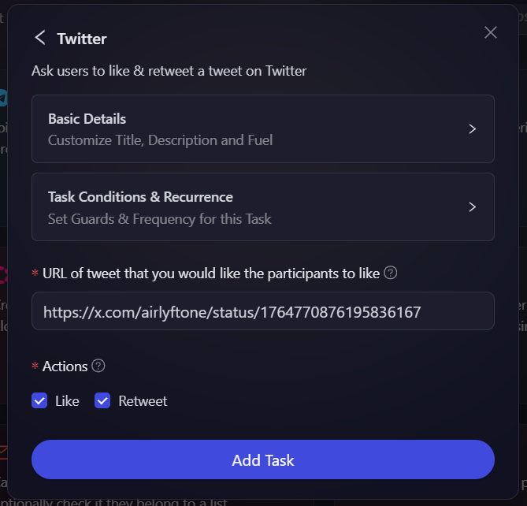
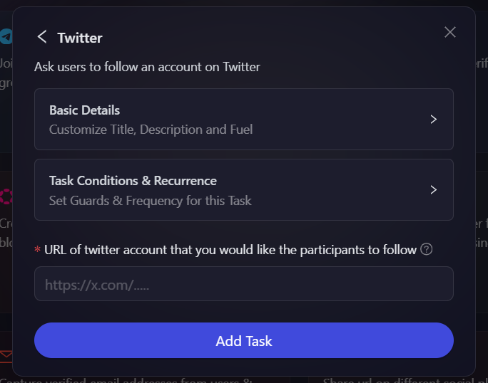

# Twitter - AI Powerd Verification

Twitter is by far one of the most important social channel that probably any web 3 companies look forward to for building, scaling, and engaging their communities. With that in mind, we have integrated Twitter actions on AirLyft that projects can create action on and ask their community members to complete. In this module, we will be discussing below Twitter actions:

- [Like and Retweet a post on Twitter](#like-and-retweet-a-post-on-twitter)
- [Tweet Specific Content on Twitter](#tweet-specific-content-on-twitter)
- [Follow an account on Twitter](#follow-an-account-on-twitter)
- [Allow only specific accounts on Twitter](#allow-only-specific-accounts-on-twitter)

Creating these actions are very simple and straight forward at AirLyft. Let's dive deep into steps on how to create Twitter Actions on AirLyft.

- Head over to Quests tab, and select the **Twitter with AI** module as shown in the screenshot below.

  

- After clicking on the Twitter box, you will then be presented with options for selecting Twitter Actions. Let's read in depth about each of them.

  

### Like and Retweet a post on Twitter

Follow these simple steps below on how to create like & retweet tasks on AirLyft.

- As shown in screenshot above, click on the Twitter box where you can find the Like & Retweet option. Click on it.

- Next, configure the basic details for your Like & Retweet task. For detailed instructions on setting up basic details, refer to the [Quest Basic Details](../quest-basic-details.md) guide.

- To configure the **Task Condition & Recurrence**, refer to the [Task Condition & Recurrence](../task-condition-and-recurrence.md) page.

- Now the only thing left is to enter the URL of tweet that you want your participants to like and retweet, and under actions select the actions that you want the user to perform.

  

- Finally, click on **Add Task** Button and your Like & Retweet task has been added successfully.

### Tweet Specific Content on Twitter

Most of the times, projects wants user to post a specific content on Twitter pertaining to a certain release or upcoming events. For instance, let's suppose that a project XYZ is about to release a staking functionality in the month of January '23 and as a part of tasks.

Hence, if projects wants users to post a specific content, they can use the Tweet Specific content functionality on AirLyft and the platform will validate if this particular specific content by posted by the participants or not. Please follow steps below on creating a Tweet Specific content task.

- Configure the basic details for your Tweet Specific Content task. For detailed instructions on setting up basic details, refer to the [Quest Basic Details](../quest-basic-details.md) guide.

- To configure the **Task Condition & Recurrence**, refer to the [Task Condition & Recurrence](../task-condition-and-recurrence.md) page.

- Moving forward, select the type of Tweet i.e. New Tweet, Quote Tweet, Reply. It means that, you are giving users the direction to reply a specific content in form of a New Tweet, or QT, or a simple reply.

- Now, say in certain cases, if you dont want users to write anything and just add Hashtags or mention Specific users, in that case, just enter the required Hashtag and users as shown in screenshot below. You can also specify the number of friends to tag, and number of media attachments to include in the Tweet being sent out.

- You can also select the type of verification you want for the task. You can learn more about the available verification options by reading the [Verification Types](../quest-verification-type.md) guide.

  

- Finally, click on the **Add Task** button to create this task.

**Note:** In case of 'Auto verify submissions', AirLyft will automatically verify if participants have actually mentioned the hashtags, or they have mentioned 3 of their friends or not. Only if all the conditions have been carried out, points for this specific tasks will be awarded to the participants.

### Follow an account on Twitter

Follow these simple steps below on how to create follow a Twitter account task on AirLyft.

- Head over to Twitter box and click on the Follow option.

- Next, configure the basic details for your Follow task. For detailed instructions on setting up basic details, refer to the [Quest Basic Details](../quest-basic-details.md) guide.

- To configure the **Task Condition & Recurrence**, refer to the [Task Condition & Recurrence](../task-condition-and-recurrence.md) page.

- Now the only thing left is to enter the URL of the Twitter account that you want your participants to Follow.

  

- Finally, click on **Add Task** Button and your Follow account task has been added successfully.

### Allow Only Specific Accounts On Twitter

The Allow Only Specific Accounts on Twitter feature enables projects to restrict task participation to a predefined list of Twitter handles. This ensures that only whitelisted users can verify and complete the quest. AirLyft automatically cross-checks participants against the whitelist and approves only those included.

For example, suppose Project XYZ is launching a new staking feature in February 2025 and wants only its early adopters to share feedback on what tokens they'd like to see on the platform. By using the whitelist functionality, the project can ensure that only these selected participants can engage in the campaign. Let's go through the process of setting up this task.

- To begin, head over to the Twitter option in AirLyft and select the Whitelist option, as shown in the screenshot below.

- At the first step, configure the basic details for your whitelisted task. For detailed instructions on setting up basic details, refer to the [Quest Basic Details](../quest-basic-details.md) guide.

  

- After configuring the task conditions, the next step is to upload a **CSV file** containing the Twitter handles that should be whitelisted. This ensures that only approved users can participate in the task.

- Lastly, click on **Add task** to create this task.

If you are facing any issues with Twitter task creation, please drop a line at [support@airlyft.freshdesk.com](mailto:support@airlyft.freshdesk.com)!
