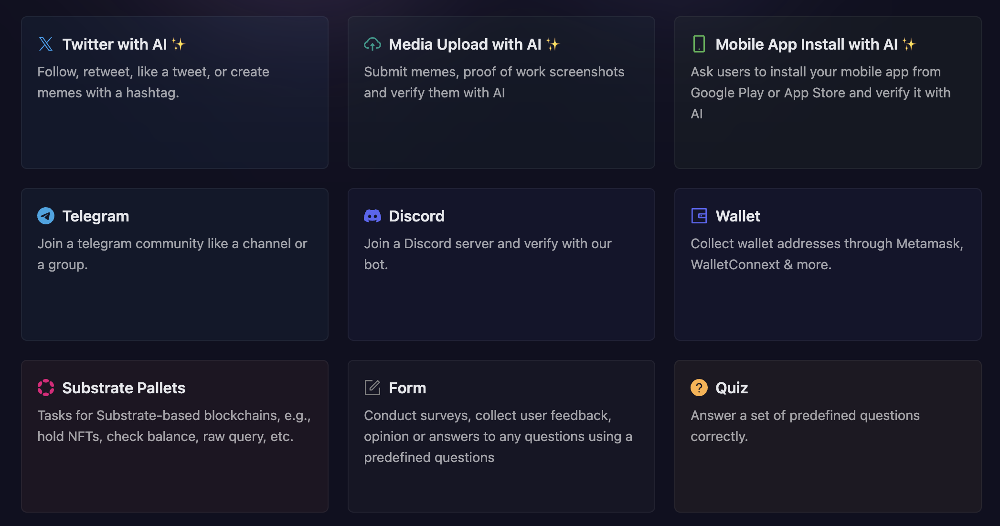
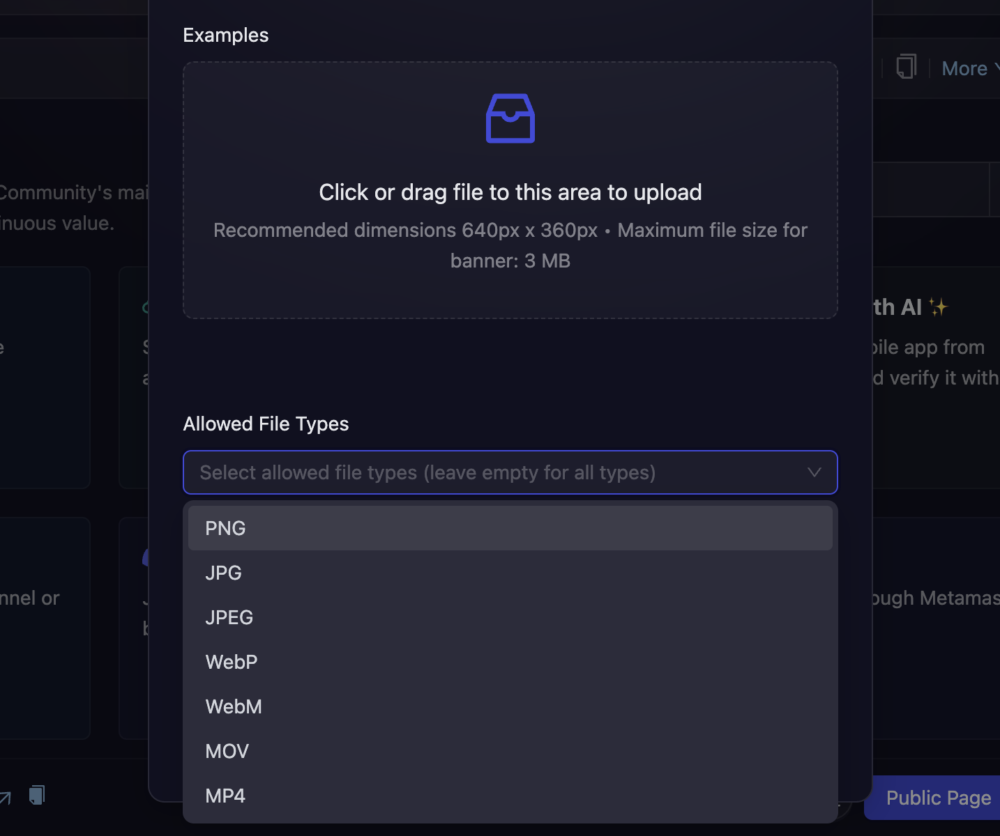

# Media Upload - AI Powered Verification

  <iframe 
    src="https://www.loom.com/embed/af5d107eb1874c6b94733a39abcb6629" 
    frameBorder="0" 
    webkitAllowFullScreen 
    mozAllowFullScreen 
    allowFullScreen 
    style={{ position: "absolute", top: 0, left: 0, width: "100%", height: "100%" }}
  />

---

- Click on Quests tab and choose the **Media with AI verification** task module.

  

- Next, configure the basic details for your Like & Retweet task. For detailed instructions on setting up basic details, refer to the [Quest Basic Details](../quest-basic-details.md) guide.

- To configure the **Task Condition & Recurrence**, refer to the [Task Condition & Recurrence](../task-condition-and-recurrence.md) page.

- You can also add an example image, which the participants can refer to while making their submissions.

  

- You can also specify the file format from **Allowed File Types** dropdown. You can leave it blank to allow all the file types, or you can choose one or more formats incluing PNG, JPG, JPEG, WebP, WebM, MOV, and MP4.

- You can also select the type of verification you want for the task. You can learn more about the available verification options by reading the [Verification Types](../quest-verification-type.md) guide.

- Click **Save** to add the AI-powered UGC task to your campaign. Once saved, the task will be live, and submissions will be automatically verified based on your prompt.

:::tip For instant help

1. Create a support ticket on our Discord: https://discord.gg/bx6ZCTwbYw
2. Join [this Telegram group](https://t.me/kyteone): https://t.me/kyteone

**_The AirLyft Team is there to help you. AirLyft is a platform to run marketing events, campaigns, quests and automatically distribute NFTs or Tokens as rewards._**

:::
