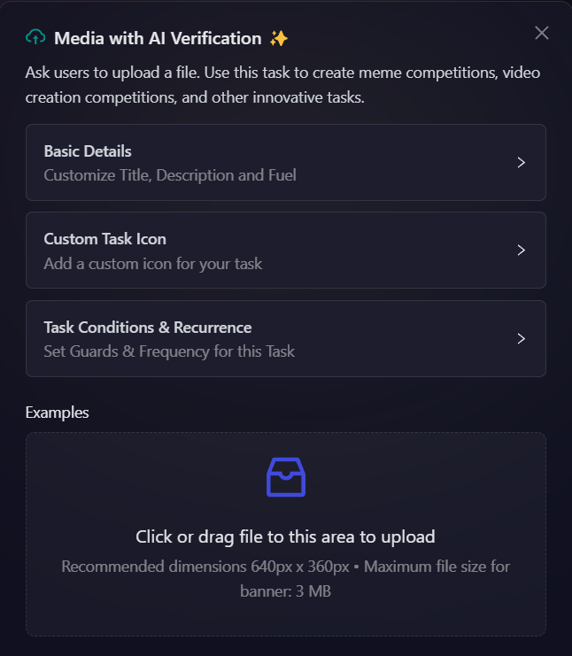

# AI-Powered Verification UGC Task

  <iframe 
    src="https://www.loom.com/embed/af5d107eb1874c6b94733a39abcb6629" 
    frameBorder="0" 
    webkitAllowFullScreen 
    mozAllowFullScreen 
    allowFullScreen 
    style={{ position: "absolute", top: 0, left: 0, width: "100%", height: "100%" }}
  />

---

AirLyft's **AI Agentic Verification** enables projects to automate the verification of User Generated Content (UGC) submissions. This powerful feature helps ensure content authenticity and saves 100+ hours for marketing and community teams.

## 🧠 What is AI-Powered Verification?

Instead of manually checking every UGC submission, you can configure AI-powered rules to **automatically verify** the content and award points only when it meets the campaign criteria. This prevents irrelevant or fake submissions (like blank screenshots or gibberish text) from being accepted.

---

## ✅ Steps to Create an AI-Powered UGC Task

### 1. Login to the AirLyft Dashboard

Go to [account.airlyft.one](https://account.airlyft.one) and log in to your project dashboard.

---

### 2. Create a Campaign

Click on **"Create Campaign"** and fill out the basic campaign details such as campaign name, description, and duration.

---

### 3. Add a New Task

Within your campaign:

- Click on Quests tab and Choose the task type: **Media with AI verification**.

  

---

### 4. Configure Task Settings

Fill out the following details:

- **Task Title**: Name of the task
- **Points**: How many points to reward for successful submission
- **Custom Icon**: (Optional) Icon that represents the task

- To configure the **Task Condition & Recurrence**, refer to the [Task Condition & Recurrence](../task-condition-and-recurrence.md) page.

  

---

### 5. Set Verification Type

Scroll to the **Verification Type** section and select AI Powered Verification

:::note
There are three available options:

- **Manually verify submissions:** Manually select which submission to mark as valid.
- **Accept all submissions:** All submissions are automatically marked as valid.
- **AI-powered verification:** Use AI to automatically verify if the uploaded content matches your requirements.
  :::

### 6. Enter the AI Prompt

In the **Prompt Box**, describe in detail what the AI should check in the submission.

> 💡 **The better your prompt, the more accurate the AI's verification will be.**

#### 📘 Example Prompt:

You are provided with a screenshot. Please verify the following:
The screenshot is from Medium.com. Confirm this by checking layout, branding, URL (if visible), or common Medium elements (like title style, author block, etc.).

The user has clapped for the article. Confirm if the clap icon (hand emoji) appears filled in solid black (not just outlined).

### 7. Save the Task

Click **Save** to add the AI-powered UGC task to your campaign. Once saved, the task will be live, and submissions will be automatically verified based on your prompt.

## 🔍 Tips for Better Results

- Be as specific as possible in your prompt.
- Avoid vague instructions—clarity improves AI accuracy.
- Test the task yourself to validate the AI response before launching publicly.

---

:::tip For instant help

1. Create a support ticket on our Discord: https://discord.gg/bx6ZCTwbYw
2. Join [this Telegram group](https://t.me/kyteone): https://t.me/kyteone

**_The AirLyft Team is there to help you. AirLyft is a platform to run marketing events, campaigns, quests and automatically distribute NFTs or Tokens as rewards._**

:::
