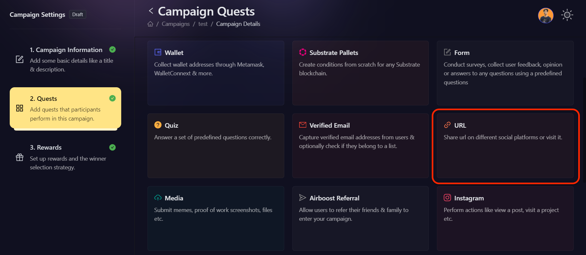

# URL

Projects often have this requirement where they need to redirect users to their website, roadmap, or store link to perform certain activities and with that in mind, AirLyft provides projects with the flexibility to

- Share a particular on social channels.
- Visit any particular link on web browsers.

One of the examples giveaway is like and share facebook competition that you can conduct using this feature to promote your growth on Facebook social channel. Let's dive deep into understanding how to create such tasks at AirLyft.

- On the event page, click on the Quests tab where you can find the **URL** section.

  

- The first action projects can create is **Share A Link** in which participants need to share the link on multiple social channels such as Twitter, Telegram, Discord, Whatsapp, or any other apps available on their phone or laptop.

  

- Once you click on the share a link action, configure the basic details by referring to the [Quest Basic Details](../quest-basic-details.md) guide, then enter the URL of the website that you want your participants to share.

- To configure the **Task Condition & Recurrence**, refer to the [Task Condition & Recurrence](../task-condition-and-recurrence.md) page.

- Enter the details and finally click on Add Task button to create a **Share Link** task.

  

- Next is the **Visit A Link** option in which you can redirect the user to a specific link so that they can read about it and understand the platform well. It can be a link to your website, mainnet application, roadmap, whitepaper, or anything.

- Once you click on the Visit a link action, configure the basic details by referring to the [Quest Basic Details](../quest-basic-details.md) guide, then enter the URL of the website that you want your participants to visit. Finally click on Add Task button to create the Visit Link task.

- To configure the **Task Condition & Recurrence**, refer to the [Task Condition & Recurrence](../task-condition-and-recurrence.md) page.

- Enter the details and finally click on Add Task button to create a **Visit a Link** task.

Use the URL functionality based on your campaign requirement and let AirLyft take care of the rest. If you are facing any issues with URL task creation, please drop a line at [support@airlyft.freshdesk.com](mailto:support@airlyft.freshdesk.com)!
