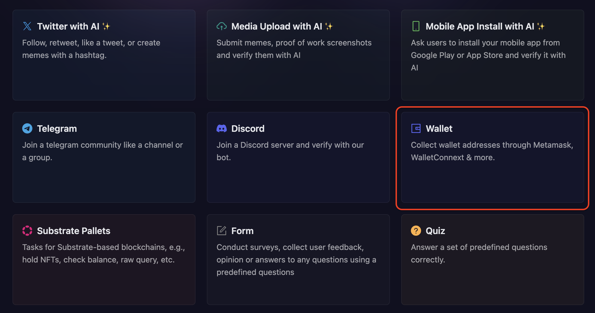
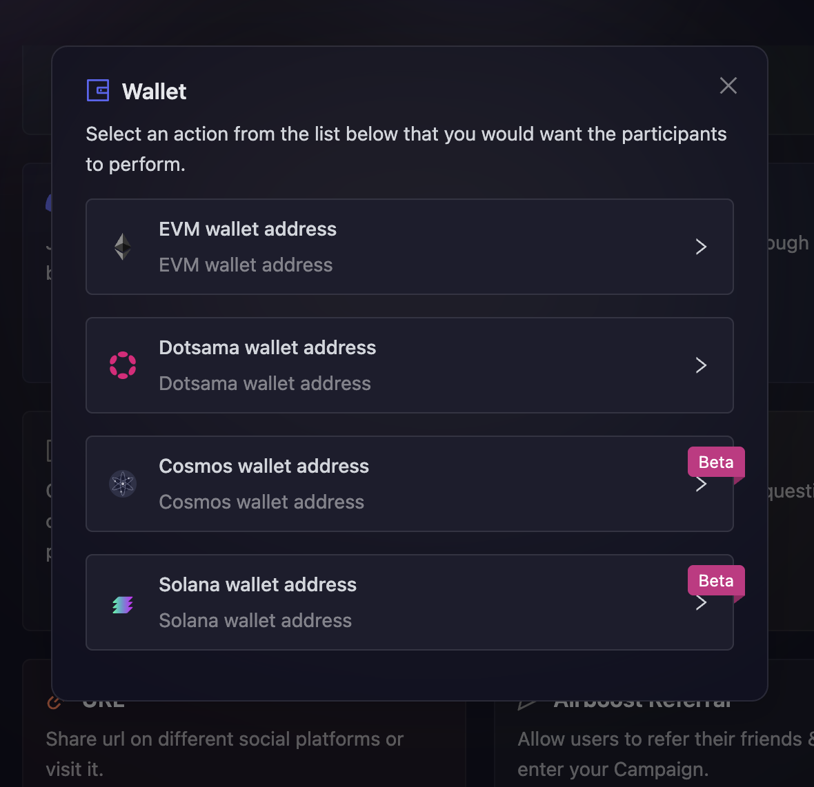
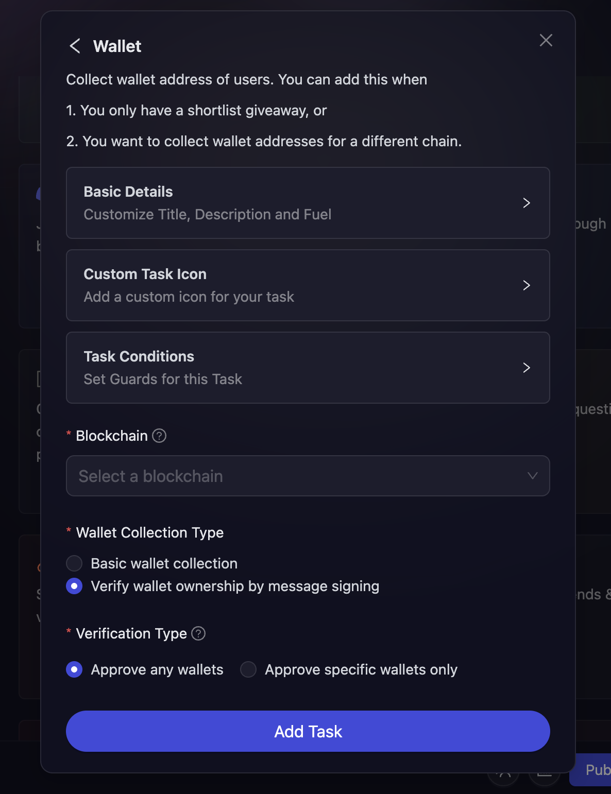
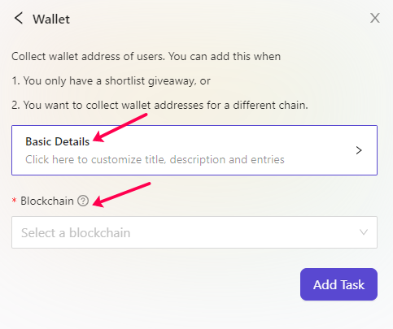

# Wallet Address Collection

Certain projects prefer manual distribution of rewards, or wants to distribute rewards later once your tokens/NFT go live. We understand that how difficult is it for the marketing an community team to manually collect these address on any chain and with that in mind, projects can create Wallet tasks at AirLyft in which participants during the time of event can collect wallet addresses of participant through MetaMask, Wallet Connect & more. Let's take a look at how to set up Wallet Tasks at AirLyft.

- On the event page, click on Quests tab where you can find the **Wallet** block.

  

- Next, select the type of wallet address you want to collect from users. Currently we provide 4 options which are EVM, Dotsama, Cosmos, and Solana baseed blockchain.

  

- In case of EVM, Cosmos, and Solana Wallet Address collection task. 
    - You can configure the basic details for your wallet task by referring to the [Quest Basic Details](../quest-basic-details.md) guide. 
    - Next, configure the [Task Condition & Recurrence](../task-condition-and-recurrence.md) settings. 
    - Then, select the blockchain for which you want to verify and collect users public address. 
    - After that, select the **Wallet Collection Type**, if you select **Basic wallet collection**, the participant can submit their address without signing message, and if you choose **Verify wallet ownership by message signing**, the participants will need to sign a message to verify their ownership of the address.
    - Finally, select the **Verification Type** you want, choose **Approve any wallets** to accept submissions from all the users, and **Approve specific wallets only** to whitelist specific wallets, only those wallet owners will be able to verify the task. Once selected, click on Add Task to add this to your upcoming campaign.

  

- In case of Dotsama Wallet Address collection task. 
    - You can configure the basic details for your wallet task by referring to the [Quest Basic Details](../quest-basic-details.md) guide. 
    - Next, configure the [Task Condition & Recurrence](../task-condition-and-recurrence.md) settings. 
    - Then, select the blockchain for which you want to verify and collect users public address. 
    - After that, select the **Wallet Collection Type**, if you select **Basic wallet collection**, the participant can submit their address without signing message, and if you choose **Verify wallet ownership by message signing**, the participants will need to sign a message to verify their ownership of the address.
    - Finally, select the **Verification Type** you want, choose **Approve any wallets** to accept submissions from all the users, and **Approve specific wallets only** to whitelist specific wallets, only those wallet owners will be able to verify the task. Once selected.
    - Select the wallets from the dropdown to only allow user to participate from a specific wallet, click on Add Task to add this to your upcoming campaign.

  

That's it... You can now automatically collect required public wallet addresses and use it to shortlist, distribute rewards, or anything.

:::tip For instant help

1. Create a support ticket on our Discord: https://discord.gg/bx6ZCTwbYw
2. Join [this Telegram group](https://t.me/kyteone): https://t.me/kyteone

**_The AirLyft Team is there to help you. AirLyft is a platform to run marketing events, campaigns, quests and automatically distribute NFTs or Tokens as rewards._**

:::
