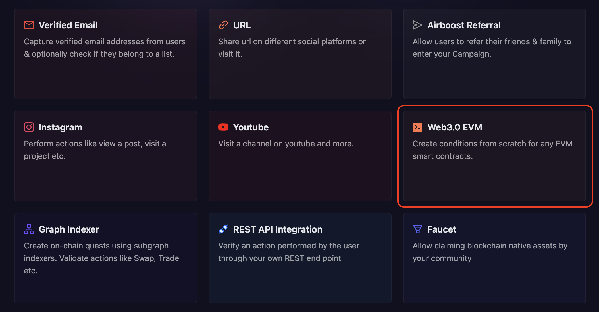
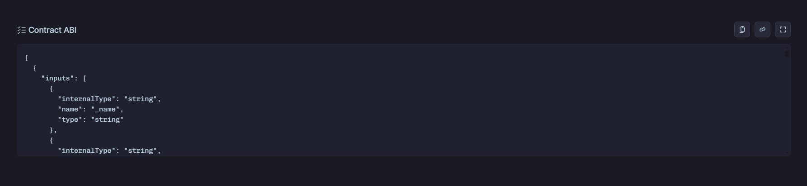
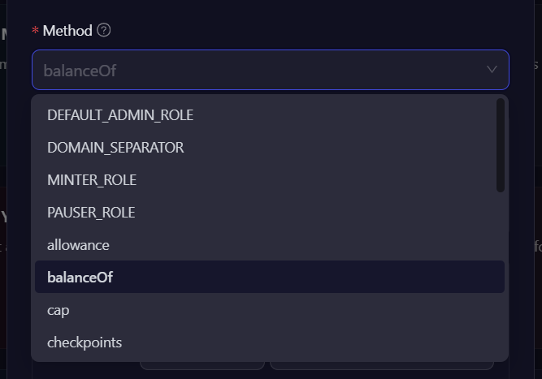

# Web3 EVM

Using the Web3.0 EVM Task, you can easily put conditions on a smart contract and verify onchain actions. Let's dive deep into how can we create a web 3.0 EVM task at AirLyft!

- Login to AirLyft and create an event. On this, head to the Quests tab and select Web 3.0 EVM block as shown in the screenshot below.

  

- At the very first step, configure the basic details for your EVM task. For detailed instructions on setting up basic details, refer to the [Quest Basic Details](../quest-basic-details.md) guide.

- To configure the **Task Condition & Recurrence**, refer to the [Task Condition & Recurrence](../task-condition-and-recurrence.md) page.

- After filling in the basic details, the next step is to select the Blockchain on which you want your users to perform this task.

- You can also select the address verification type you want for your task.

- Post selection of Blockchain, enter the contract address of the token on which you want to perform an on-chain task.

  

- Now, for the Contract JSON ABI, head over to your explorer, search for the token, and copy the contract JSON ABIs of the token as shown in the screenshot below.

  

  Paste the JSON ABI in the contract field on ABI as shown below.

  

- The method drop-down will show all the read functions in your ABI that you can select and put conditions. Now, the instance that we are discussing is to check if the user holds 10 KTE or not, let's select the **balanceOf** function.

  

- Once you have the method selected, you will be asked to enter the inputs of the interaction method and output conditions. So, for the example that we are discussing, select the Value under the interaction method as "Users Connected Wallet Address" or "Ask users to enter manually" and then select in output conditions (=, \<, \<=, >, >=) on your requirement and finally enter the criteria (numberic values only).

  

> Note: Please check the decimals in the profile summary and then enter the number of Zeroes in the criteria accordingly. As the precision of KTE is 18 decimals, hence we have entered the criteria as 10 followed by 18 zeroes in a blockchain-readable format.

- Finally, click on Add Task button and that's it... Your first EVM Based decentralized action is successfully created.

These EVM-based tasks support conditions on all sorts of tokens such as ERC 20, ERC 721, and ERC 1155. You can have conditions set on them based on your campaign requirements and have these actions verified on-chain without any issues.

If you are facing any issues with EVM Based task creation, please drop a line at [support@airlyft.freshdesk.com](mailto:support@airlyft.freshdesk.com)!
