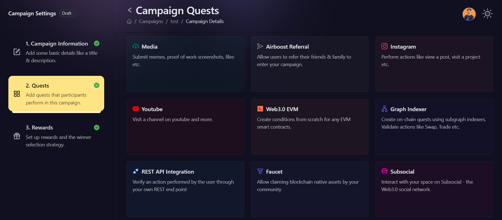
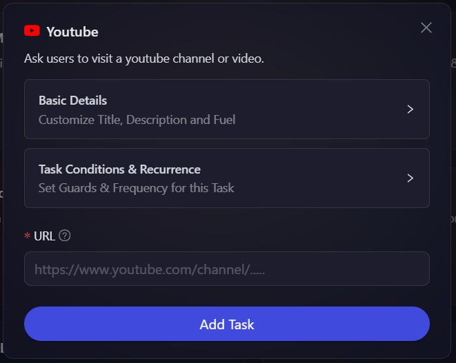

# Youtube

Certain projects have the need to create video contents that give users a better perspective of the platform they are trying to understand. With that in mind, AirLyft has now integrated Youtube and supports the creation of Youtube tasks in your upcoming campaign. Let's dive deep into how we can create a Youtube task.

- Login to AirLyft and create an event. On the event page, click on Quests tab where you can find the Youtube block.

  

- Next, expand on the basic details option to enter the Title, Description, and Entries. It is advisable to elaborate on the title and description so that participants have a much greater understanding of the task if it is to visit a video or Youtube channel.

- Last step would be for you to enter the URL of the Youtube link that you would want your users to visit. Finally, click on Add Task button to add it on your campaign.

  

> **NOTE:** In accordance with Google's Youtube privacy policies, please note that we won't be able to verify if a particular user has actually subscribed, followed, or liked your Youtube post or channel as they don't allow read information to third party applications. Additionaly, YouTube doesn’t allow anything that artificially increases the number of views, likes, comments, or other metrics either by using automatic systems or serving up videos to unsuspecting viewers. AirLyft can only help you redirect to their account but won't verify it. For clearer information on Youtube policies, please click on the link [here](https://support.google.com/youtube/answer/3399767?hl=en).

:::tip For instant help

1. Create a support ticket on our Discord: https://discord.gg/bx6ZCTwbYw
2. Join [this Telegram group](https://t.me/kyteone): https://t.me/kyteone

**_The AirLyft Team is there to help you. AirLyft is a platform to run marketing events, campaigns, quests and automatically distribute NFTs or Tokens as rewards._**

:::
