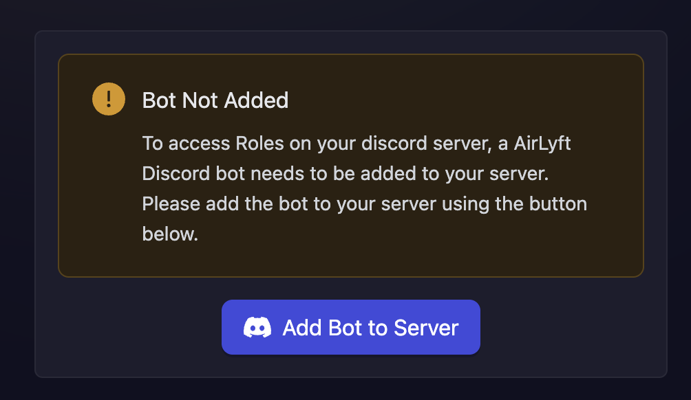
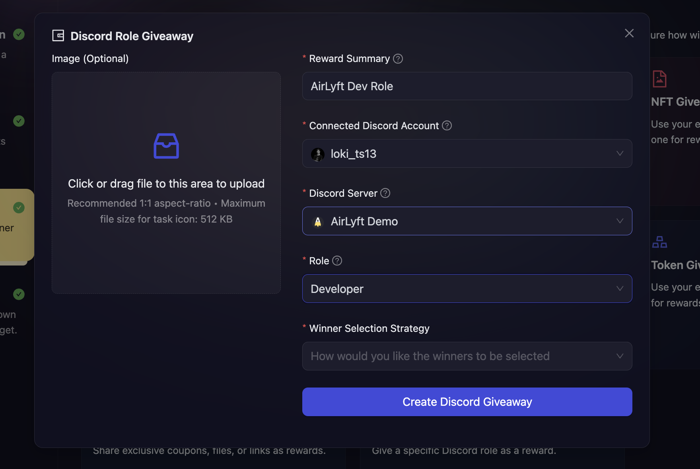

# Discord Role Giveaway

## What is a Discord Role Giveaway?

Discord Role Giveaway allows you to automatically assign Discord roles to campaign winners. This is a powerful way to reward your community members with exclusive access, special privileges, or status within your Discord server based on their campaign participation.

## When to use Discord Role Giveaway?

Use Discord Role Giveaway when you want to:

- Grant exclusive roles to top performers in your campaign
- Reward active community members with special status
- Provide access to private channels or features based on campaign completion
- Create tiered membership systems based on participation
- Recognize and incentivize community engagement

## How to create a Discord Role Giveaway?

1. In the campaign creation process, navigate to the 'Rewards' section and select "Discord Giveaway" as your reward type.

   

2. Then, fill in the details about the reward. You need to fill the following details:

   - **Reward Summary:** Enter a descriptive title for your giveaway that clearly explains what role is being awarded.

   - **Connected Discord Account:** Select your Discord account from the dropdown. You must first connect your Discord account through the [Discord Integration](../../../integrations/discord.md) before you can create this giveaway type.

   - **Discord Server (Guild):** Choose the Discord server where the role will be assigned. Only servers where the connected account is the owner will be displayed.

   - **Add Bot to Server:** If AirLyft's bot is not already added to your selected server, you will see on-screen instructions. Follow these instructions to add the bot to your server. This is required for AirLyft to assign roles to winners.

   

   - **Role:** Select the role that you want to award to winners. A list of all available roles in your selected server will be displayed.

   - **Winner Selection Strategy:** Choose how you want winners to be selected. Click [here](../winner-selection) to learn more about the types of winner selection strategies.
     Note: Based on your chosen winner selection strategy, you may be presented with additional options. Configure these as needed.

   - **Image (Optional):** You can optionally upload a custom giveaway icon to make your reward more visually appealing.

   

3. Click **Create Giveaway** button to finalize the Discord Role Giveaway setup.

## Winner Selection Strategies

Discord Role Giveaways support various winner selection strategies:

1. **[FCFS](../winner-selection/fcfs):** Set conditions based on fuel secured or tasks completed. Users can claim roles instantly upon meeting conditions.
2. **[Task FCFS](../winner-selection/task-fcfs):** Users instantly receive roles upon successful completion of designated tasks.
3. **[Manual selection at the end of the campaign](../winner-selection/manual):** Manually select winners from participants after the campaign ends.
4. **[Ranked Random Raffle at the end of the campaign](../winner-selection/ranked-random):** Automatically select winners randomly, prioritizing those with higher points.
5. **[Ranked Random Raffle at specific time](../winner-selection/ranked-random-specific.md):** Same as above, but distribute rewards at a specific time.
6. **[Pure Random Raffle at specific time](../winner-selection/pure-random-specific.md):** Completely random winner selection at a specific time, regardless of points.

## Important Notes

- The connected Discord account must be the owner of the server where roles will be assigned
- AirLyft's bot must be added to the server and have appropriate permissions to manage roles
- The bot's role in your Discord server must be higher in the hierarchy than the role you're assigning
- Winners will automatically receive the role once they are selected according to your winner selection strategy

:::tip For instant help

1. Create a support ticket on our Discord: https://discord.gg/bx6ZCTwbYw
2. Join [this Telegram group](https://t.me/kyteone): https://t.me/kyteone

**_The AirLyft Team is there to help you. AirLyft is a platform to run marketing events, campaigns, quests and automatically distribute NFTs or Tokens as rewards._**

:::
