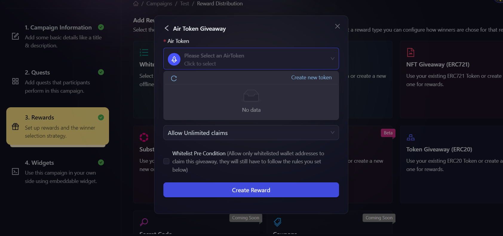

# NFT Giveaway (ERC1155)

## What are ERC1155 NFTs?

ERC1155 NFTs are multi-token standard assets on the Ethereum blockchain. This standard allows for the creation of both fungible and non-fungible tokens within the same contract. ERC1155 tokens can represent multiple types of assets, making them versatile for various use cases.

## When to use ERC1155 NFTs?

Use ERC1155 NFTs when you want to:

- Offer a combination of unique and multiple-copy digital items.
- Distribute game items or digital collectibles efficiently.
- Reduce gas fees by batching multiple token transfers.

## How to create ERC1155 NFT reward?

1. In the campaign creation process, navigate to the 'Rewards' section and select "NFT Giveaway (ERC1155)" as your reward type. Then, choose between [AirToken](../../../air-token) and [AirPool](../../../air-pool).

2. Then, fill in the details about the reward. You need to fill the following details:
    - Select the AirPool you want to use for the reward. You can use an existing one, or create a new one by clicking on the **Create New Pool** button. Click here to learn how to create a new ERC1155 [AirToken](../../../air-token/create-airtoken-erc1155) or [AirPool](../../../air-pool/create-airpool-erc1155).
    - Total claim limit: Enter the total number of NFTs that can be minted as rewards, you can either set it to unlimited or put an upper limit on it.
    - Winner selection strategy: Select how you want winners to be chosen. Click [here](../winner-selection) to learn more about the types of winner selection strategy. 
    Note: Based on your chosen winner selection strategy, you may be presented with additional options. Configure these as needed.

    

3. Click **Create Giveaway** button to finalize the ERC20 token reward setup.

## Winner Selection Strategies
1. **[FCFS](../winner-selection/fcfs):** In this, you can set conditions based on the amount of fuel secured or the number of tasks completed (e.g., “Number of Tasks > X”).
2. **[Task FCFS](../winner-selection/task-fcfs):** In this, AirLyft allows users to instantly claim rewards from your campaign upon successful completion of designated tasks.
3. **[Manual selection at the end of the campaign](../winner-selection/manual):** If you select this then you will have the option to manually select winners from the participants after the campaign ends.
4. **[Ranked Random Raffle at the end of the campaign](../winner-selection/ranked-random):** In this, AirLyft will automatically select winners in a random way (but selecting those with higher points first). For more details on how Ranked Random Raffle work [read this page](../winner-selection/ranked-random).