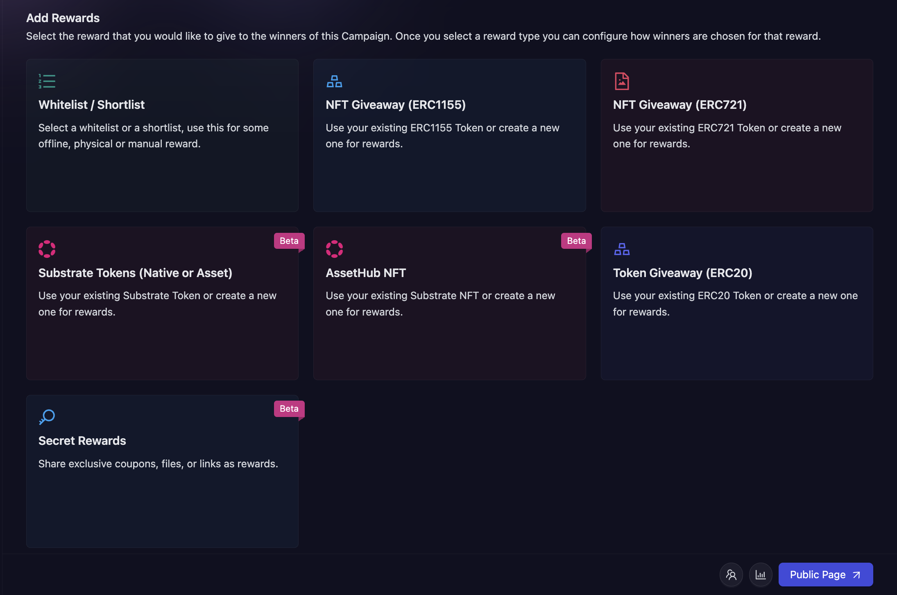

# Token Giveaway (ERC20)

## What are ERC20 Tokens?

ERC20 tokens are standardized, fungible tokens on the Ethereum blockchain. Companies can create these tokens and distribute them to campaign participants as rewards.

## When to use ERC20 Tokens?

Use ERC20 tokens when you want to:

- Reward participants with a divisible, tradable asset.
- Create a loyalty or points system for your community.
- Distribute your company's own cryptocurrency or utility token.

## How to create an ERC20 Token reward?

1. In the campaign creation process, navigate to the 'Rewards' section and select "Token Giveaway (ERC20)" as your reward type. Then, choose between [AirToken](../../../air-token) and [AirPool](../../../air-pool).

2. Then, fill in the details about the reward. You need to fill the following details:
    - Select the AirPool you want to use for the reward. You can use an existing one, or create a new one by clicking on the **Create New Pool** button. Click here to learn how to create a new ERC20 [AirPool](../../../air-pool/create-airpool-erc20).
    - Total amount: Enter the total number of tokens you're allocating for this campaign.
    - Winner selection strategy: Select how you want winners to be chosen. Click [here](../winner-selection) to learn more about the types of winner selection strategy. 
    Note: Based on your chosen winner selection strategy, you may be presented with additional options. Configure these as needed.

    

3. Click **Create Giveaway** button to finalize the ERC20 token reward setup.

## Winner Selection Strategies
1. **[FCFS](../winner-selection/fcfs):** In this, you can set conditions based on the amount of fuel secured or the number of tasks completed (e.g., “Number of Tasks > X”).
2. **[Task FCFS](../winner-selection/task-fcfs):** In this, AirLyft allows users to instantly claim rewards from your campaign upon successful completion of designated tasks.
3. **[Manual selection at the end of the campaign](../winner-selection/manual):** If you select this then you will have the option to manually select winners from the participants after the campaign ends.
4. **[Ranked Random Raffle at the end of the campaign](../winner-selection/ranked-random):** In this, AirLyft will automatically select winners in a random way (but selecting those with higher points first). For more details on how Ranked Random Raffle work [read this page](../winner-selection/ranked-random).