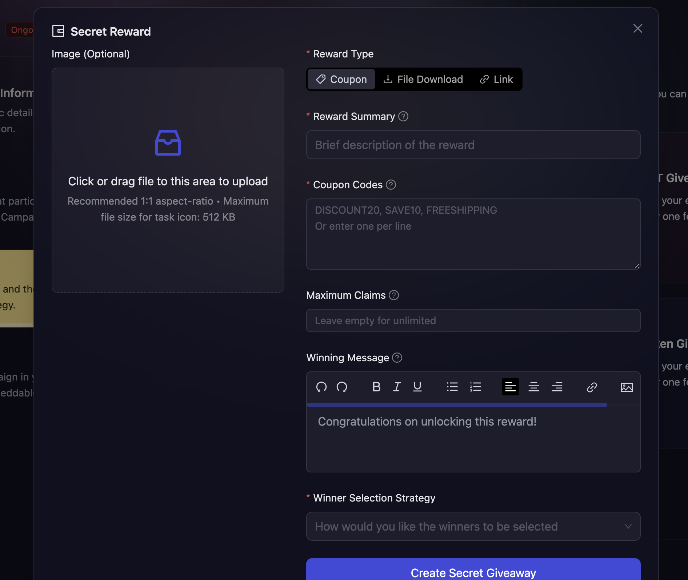

# Secret Rewards

## What are Secret Rewards?

Secret Rewards allow hosts to distribute confidential prizes like exclusive coupons, downloadable files, or private links to campaign winners. These rewards are kept hidden until claimed by the winner, making them perfect for exclusive content distribution and personalized rewards.

## When to use Secret Rewards?

Use Secret Rewards when you want to:

- Distribute exclusive discount coupons or promo codes to winners
- Share private downloadable content like exclusive documents, images, or media files
- Provide winners with access to special links such as private communities, exclusive content, or beta access
- Create personalized rewards where each winner receives something unique
- Maintain confidentiality of reward content until it's claimed by the winner

## How to create Secret Rewards?

1. In the campaign creation process, navigate to the 'Rewards' section and select "Secret Rewards" as your reward type.

2. Choose your secret reward type from the three available options:

- **Coupon**: For discount codes, promo codes, or vouchers
- **File Download**: For exclusive documents, images, videos, or other downloadable content
- **Link**: For private URLs, exclusive access links, or special web resources

3. Fill in the reward configuration details:

- **Reward Type**: Choose the type of secret reward that you want to distribute.
- **Reward Summary**: Enter the title that will be displayed to users on the campaign page. This should describe the reward without revealing the secret content.

- **Secret Data**: This field changes based on your selected reward type:
  - For **Coupon**: "Coupon Codes" - Enter the actual coupon codes
  - For **Link**: "External Links" - Enter the private URLs or links
  - For **File Download**: Drag and drop your files to be distributed
- **Maximum Claims**: Set the upper limit for how many people can claim this reward (optional for single secrets)
- **Winning Message**: Customize the message winners will see when they claim their reward
- **Winner Selection Strategy**: Choose how winners will be selected

  

## Reward Distribution Modes

Secret Rewards operates in two distinct modes based on the number of secrets you provide:

### Single Secret Mode

When you enter only one secret (coupon, file, or link):

- **Unlimited Claims**: Leave the maximum claims field empty to allow unlimited winners to receive the same reward
- **Limited Claims**: Set a maximum claims limit to restrict the number of winners who can claim the reward

### Multiple Secrets Mode

When you enter multiple secrets (more than one coupon, file, or link):

- Maximum claims automatically equals the number of secrets entered
- Each winner receives a unique reward from your secret collection
- For example: If you enter 5 coupon codes, up to 5 winners can claim, and each gets a different coupon code

## Winner Selection Strategies

1. **[FCFS](../winner-selection/fcfs):** In this, you can set conditions based on the amount of fuel secured or the number of tasks completed (e.g., “Number of Tasks > X”).
2. **[Task FCFS](../winner-selection/task-fcfs):** In this, AirLyft allows users to instantly claim rewards from your campaign upon successful completion of designated tasks.
3. **[Manual selection at the end of the campaign](../winner-selection/manual):** If you select this then you will have the option to manually select winners from the participants after the campaign ends.
