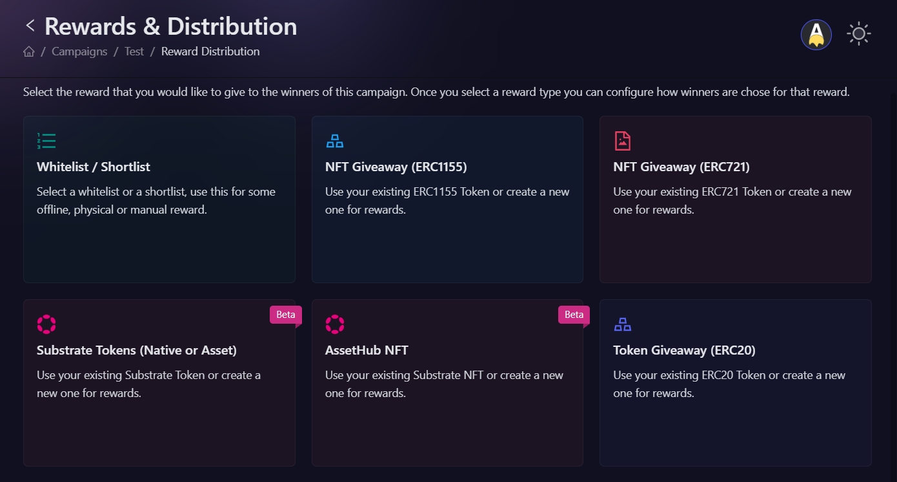
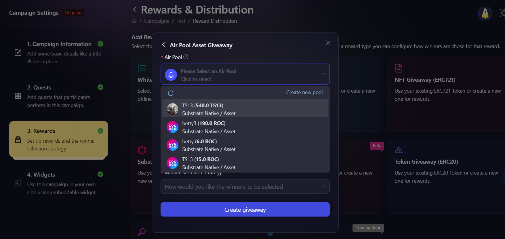

# Substrate Tokens (Native or Asset)

## What are Substrate Tokens?

Substrate tokens are digital assets that exist on blockchain networks built using the Substrate framework. These can be either native tokens of the blockchain (like DOT for Polkadot) or custom assets created on the network.

## When to use Substrate Tokens?

Use Substrate tokens when you want to:

- Engage with communities in the Substrate ecosystem.
- Distribute rewards on networks like Polkadot and its parachains.
- Promote adoption and use of Substrate-based projects.

## How to create Substrate tokens reward?

1. In the campaign creation process, navigate to the 'Rewards' section and select "Substrate Tokens (Native or Asset)" as your reward type. Then, choose between [AirToken](../../../air-token) and [AirPool](../../../air-pool).

   

2. Then, fill in the details about the reward. You need to fill the following details:

   - Select the AirPool you want to use for the reward. You can use an existing one, or create a new one by clicking on the **Create New Pool** button.
   - Total claim limit: Enter the total number of NFTs that can be minted as rewards, you can either set it to unlimited or put an upper limit on it.
   - Winner selection strategy: Select how you want winners to be chosen. Click [here](../winner-selection) to learn more about the types of winner selection strategy.
     Note: Based on your chosen winner selection strategy, you may be presented with additional options. Configure these as needed.

   

3. Click **Create Giveaway** button to finalize the ERC20 token reward setup.

## Winner Selection Strategies

1. **[FCFS](../winner-selection/fcfs):** In this, you can set conditions based on the amount of fuel secured or the number of tasks completed (e.g., “Number of Tasks > X”).
2. **[Task FCFS](../winner-selection/task-fcfs):** In this, AirLyft allows users to instantly claim rewards from your campaign upon successful completion of designated tasks.
3. **[Manual selection at the end of the campaign](../winner-selection/manual):** If you select this then you will have the option to manually select winners from the participants after the campaign ends.
4. **[Ranked Random Raffle at the end of the campaign](../winner-selection/ranked-random):** In this, AirLyft will automatically select winners in a random way (but selecting those with higher points first). For more details on how Ranked Random Raffle work [read this page](../winner-selection/ranked-random).
5. **[Ranked Random Raffle at specific time](../winner-selection/ranked-random-specific.md):** Similarly to the previous one, AirLyft will automatically select winners in a random way (but selecting those with higher points first), but you can choose the rewards to be distributed at a specific time.
6. **[Pure Random Raffle at the end of the campaign](../winner-selection/pure-random-specific.md):** In this, AirLyft will automatically select winners in a random way, completely randomly, irrespective of how many points participants have scored. You can choose the rewards to be distributed at a specific time.
7. **[Lucky Draw](../winner-selection/luckydraw.md):** Winners are selected based on the results of a Lucky Draw task (Spin the Wheel, Slot Machine, or Mystery Box).
