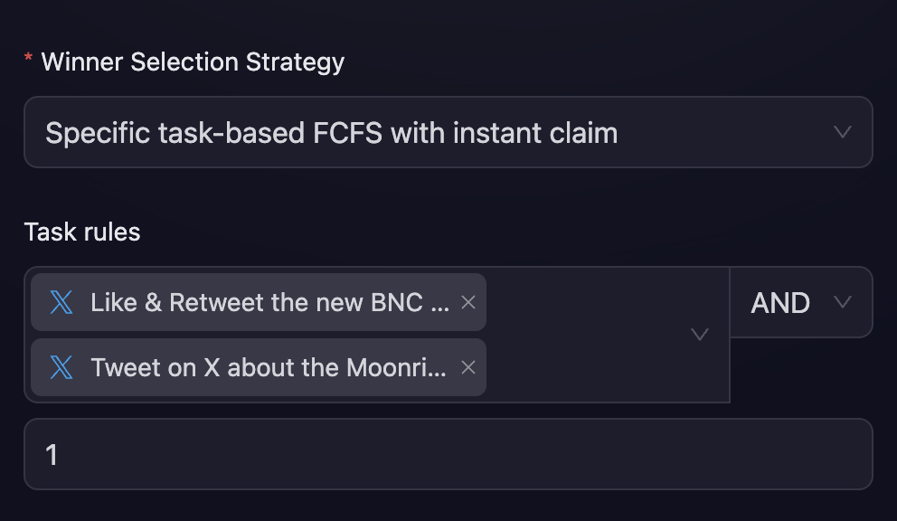
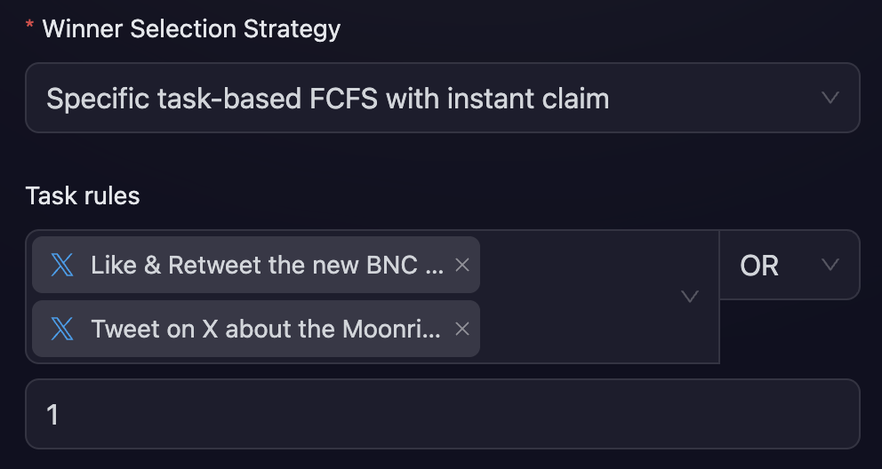
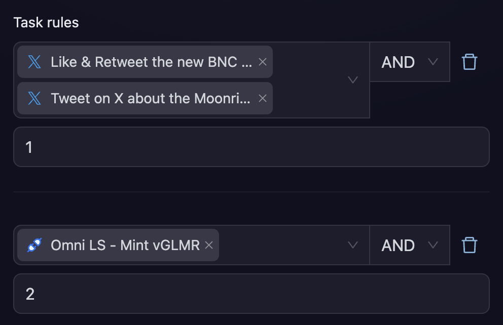

# Task Based FCFS

The “Specific Task-Based FCFS with Instant Claim” winner selection strategy allows users to instantly claim rewards from your campaign upon successful completion of designated tasks. Rewards can be claimed as long as there are sufficient funds in the reward pool.

To implement this in your campaign, navigate to the “Rewards” section, select the type of reward you wish to offer, and choose “Specific Task-Based FCFS with Instant Claim” under the Winner Selection Strategy.

You can then define the tasks that users need to complete and specify the reward amount they can claim upon fulfilling these tasks.

## Example 1 (AND): Reward after completing ALL selected tasks

In the case below, when users completes `BOTH` of the given tasks, they can claim `1` reward, the claim can happen instantly without waiting for the event end.

## Example 2 (OR): Reward after completing ANY of the selected tasks

In the case below, when users completes `ANY` of the given tasks, they can claim `1` reward, the claim can happen instantly without waiting for the event end.

In case you want the users to get multiple rewards based on many different conditions, then you can add more than one rule.

## Example 3: Mutliple rules for multiple rewards
1. Get 1 Token for completing BOTH the "Follow" & "Like" Task
2. Get 2 MORE Tokens for completing the "Omni LS - Mint vGLMR" Task.

Which means, that users can claim a maximum of 3 Tokens from this Reward.

