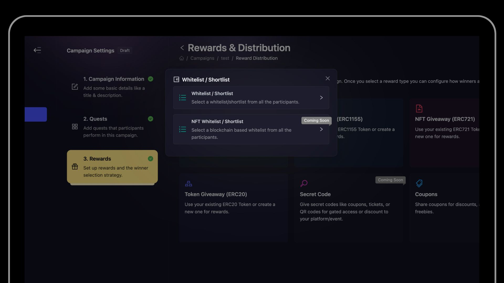
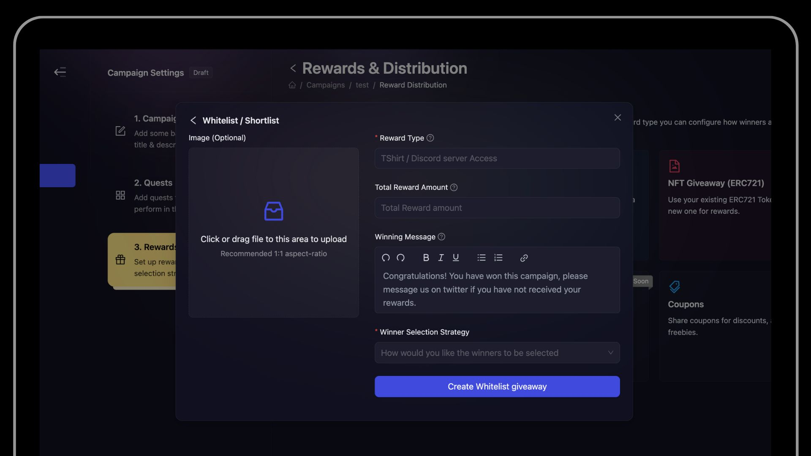

# Whitelist/Shortlist

## What is a whitelist/shortlist?
A "Whitelist/Shortlist" is a manual reward that can be configured to show any image and title that you would like.

## When to use a whitelist/shortlist?
Usually, a whitelist/shortlist reward is used for instances where you cannot use AirLyft to distribute the reward. 

For example:
- You are launching an NFT project and want to capture early community members or supporters.
- The reward is some merchandise that you will manually send to the winners.
- You want to create an event for a beta product access, discount, pre-launch offers etc.

## How to create a whitelist?

1. While creating a campaign, you would be able to see "Whitelist/Shortlist" in the the 'Rewards' section. Make your reward type selection by clicking on the Whitelist/Shortlist button.

4. Once clicked, this will show you 2 options, one is Whitelist/Shortlist & the other is NFT Whitelist/Shortlist. Click your reward choince and the it will take you to the final page.

5. Once at the final page, fill in all the details starting from reward type, reward amount, total winners, customize your congratulatory message as per your liking, and then finally the distribution date of the campaign rewards.
Note that from AirLyft, you will receive a list of winners, what the winners will actually receive depends upon you.
- *Reward Type*: This means what would be the FINAL reward like Tshirts, or access to some NFT project etc.
- *Reward Amount*: How many rewards will each winner receive? If each winner will win 1 tshirt, then enter '1' here.
- *Total Winners*: What will be the number of winners total winners.
- *Winning Message*: This will be the message that the winners will see.
- *Winner Selection Strategy*: How will the winners be chosen?

## Winner Selection Strategies
1. **Manual selection at the end of the campaign:** If you select this then you will have the option to manually select winners from the participants after the campaign ends.
2. **[Ranked Random Raffle at the end of the campaign](./ranked-random)** In this, AirLyft will automatically select winners in a random way (but selecting those with higher points first). For more details on how Ranked Random Raffle work [read this page.](./ranked-random)