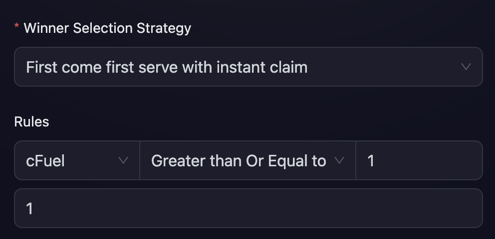
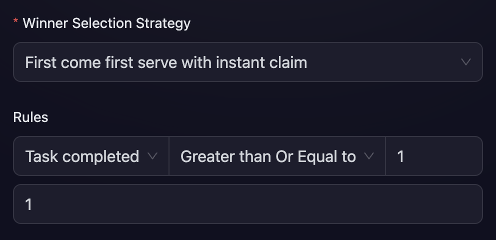
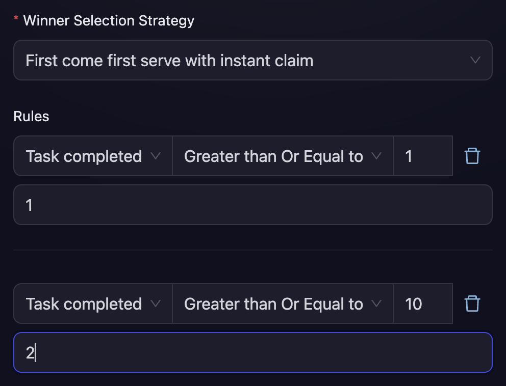

# First Come First Serve

The "First come first serve with instant claim" winner selection strategy allows you to set conditions based on the amount of fuel secured or the number of tasks completed (e.g., “Number of Tasks > X”).

Users can claim their rewards as soon as they meet these specified conditions. Unlike the [task-based approach](task-fcfs.md), this option allows you to set conditions on the quantity of tasks completed rather than the specific type of tasks. A standout feature of FCFS approach is the instant claim option, allowing users to receive their rewards immediately upon fulfilling all conditions, without needing to wait for the campaign to conclude.

To implement this in your campaign, navigate to the “Rewards” section, select the type of reward you wish to offer, and choose "First come first serve with Instant Claim” under the Winner Selection Strategy.

You can then define the tasks that users need to complete and specify the reward amount they can claim upon fulfilling these tasks.

## Example 1 (cFuel): Reward after scoring certain amount of cFuel

    In the case below, when users score `1` cFuel, they can claim `1` reward, the claim can happen instantly without waiting for the event end.

        

## Example 2 (Tasks): Reward after scoring certain number of tasks

    In the case below, when users successfully verify `1` task, they can claim `1` reward, the claim can happen instantly without waiting for the event end.

        

In case you want the users to get multiple rewards based on many different conditions, then you can add more than one rule.

## Example 3: Mutliple rules for multiple rewards

1.  Get 1 Token for completing atleast 1 tasks
2.  Get 2 MORE Tokens for completing atleast 10 tasks

    Which means, that users can claim a maximum of 3 Tokens from this Reward.

         
