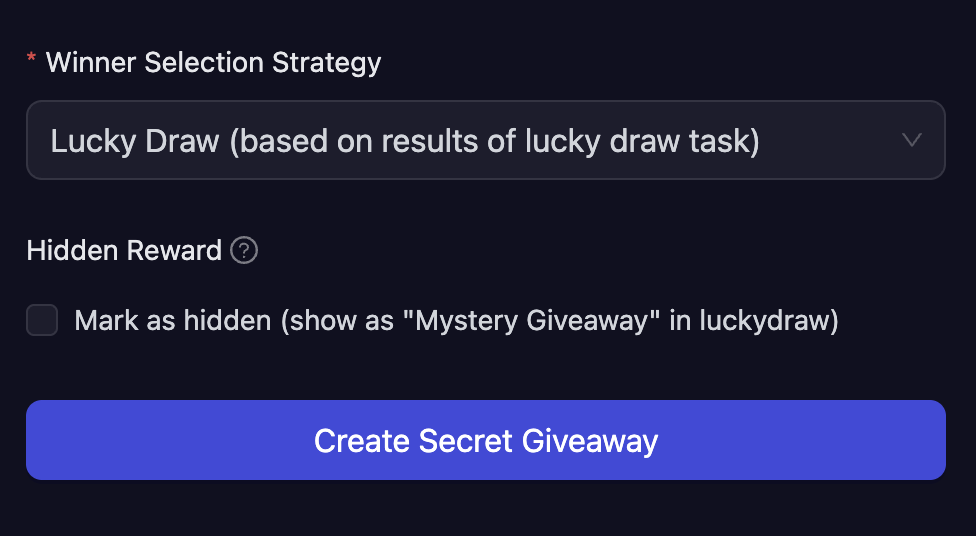

# Lucky Draw

The Lucky Draw winner selection strategy creates an exciting, gamified experience where winners are determined based on the results of a [Lucky Draw task](../../quests/lucky-draw.md). This approach combines task completion with chance-based rewards, making your campaign more engaging and interactive for participants.

## How Lucky Draw Winner Selection Works

When you create a giveaway with the Lucky Draw distribution strategy, winners are automatically selected based on what participants win when they complete the Lucky Draw task (Spin the Wheel, Slot Machine, or Mystery Box). The giveaway rewards are distributed according to the Lucky Draw task results, creating a seamless connection between task completion and reward distribution.

## Creating a Lucky Draw Giveaway

To set up a giveaway with Lucky Draw winner selection:

1. **Navigate to the Rewards section** in your campaign and select the type of reward you wish to offer (NFT, Tokens, Discord Roles, etc.).

2. **Select Lucky Draw** from the Winner Selection Strategy dropdown.

   

3. **Configure the giveaway details** based on your selected reward type:

   - **Reward Summary:** Enter a descriptive title for the giveaway
   - **Total Amount/Quantity:** Specify how many rewards are available
   - Additional fields will vary depending on the reward type (amount per winner for token/NFT, role selection for Discord, etc.)

4. **Hidden Reward Option:**

   The Lucky Draw strategy includes a unique **Hidden Reward** feature:

   - **When checked:** The reward details will not be shown to users until they win it from the Lucky Draw task. In the Lucky Draw interface, it will appear as "Mystery Giveaway" to maintain the element of surprise.

   - **When unchecked:** The reward will be visible to all participants, just like other distribution types. Users will know what they're playing for before completing the Lucky Draw task.

5. Click **Create Giveaway** to finalize the setup.

## Use Cases

The Lucky Draw winner selection strategy is perfect for:

- **Surprise Rewards:** Keep participants guessing with hidden rewards that create excitement and anticipation
- **Tiered Campaigns:** Combine multiple Lucky Draw giveaways with different probabilities for rare and common rewards
- **Gamified Experiences:** Turn standard reward distribution into an interactive game that participants remember
- **Engagement Boosting:** Encourage repeat participation by making reward distribution entertaining and fun

## Important Notes

- The Lucky Draw task configuration (reward types and probabilities) determines who receives which giveaway rewards
- Each participant's Lucky Draw result directly impacts which giveaway they win
- Hidden rewards add an element of mystery, while visible rewards let users know exactly what they're playing for

:::tip For instant help

1. Create a support ticket on our Discord: https://discord.gg/bx6ZCTwbYw
2. Join [this Telegram group](https://t.me/kyteone): https://t.me/kyteone

**_The AirLyft Team is there to help you. AirLyft is a platform to run marketing events, campaigns, quests and automatically distribute NFTs or Tokens as rewards._**

:::
