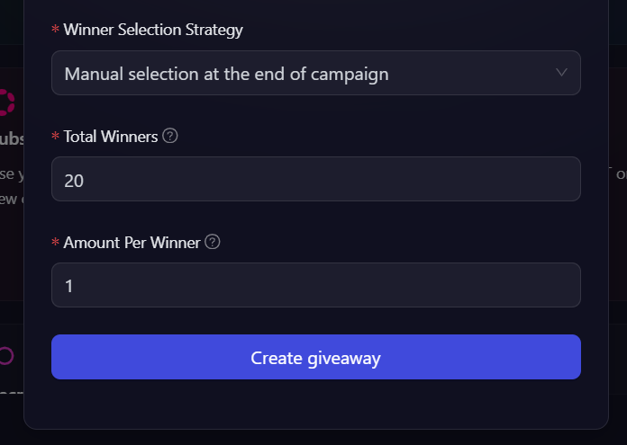
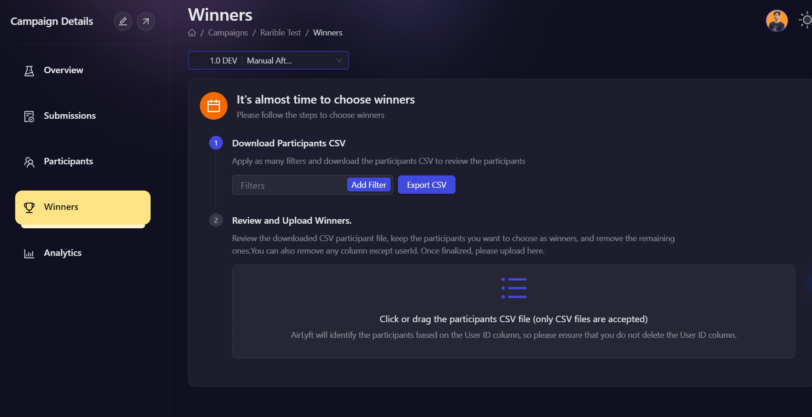
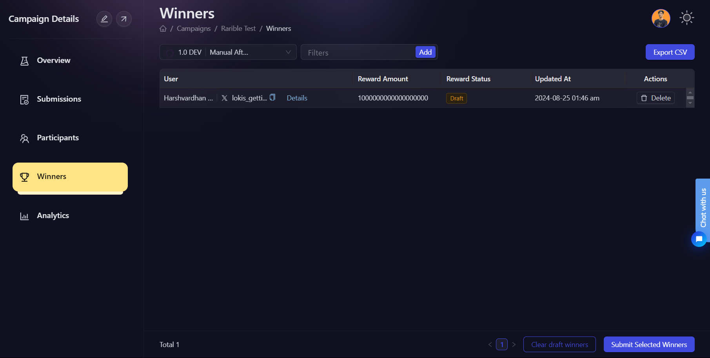

# Manual Selection

## What is Manual Selection?

The Manual Selection strategy allows campaign organizers to personally choose winners from the pool of participants after the campaign has concluded. This approach offers maximum flexibility and control over the winner selection process.

## When to use Manual Selection?

Consider using Manual Selection when:

- You want to review participants' contributions individually before selecting winners.
- Your campaign requires a qualitative assessment of entries.
- You want to have the final say in who receives rewards, based on campaign-specific factors.

## Example

- **Total Winners:** 20
- **Amount per winner:** 1

## Selection Process

1. In order to choose winners for the Manual Selection Strategy. First go to the **Campaigns** tab, click the More button next to your campaign and click on Submissions, then from there go to the **Winners** tab.

2. Choose Manual reward in the filter options on top. Then click the **Export CSV** button to export the list of all participants. Then you can edit the CSV to filter out th winners. Then upload this updated CSV file to **Reward and Upload Winners** Section.

3. After uploading the CSV file, click on the **Submit Selected Winners** option. And that's it.

By choosing Manual Selection, you retain full control over who receives rewards in your campaign, allowing for a more tailored and nuanced approach to winner selection.