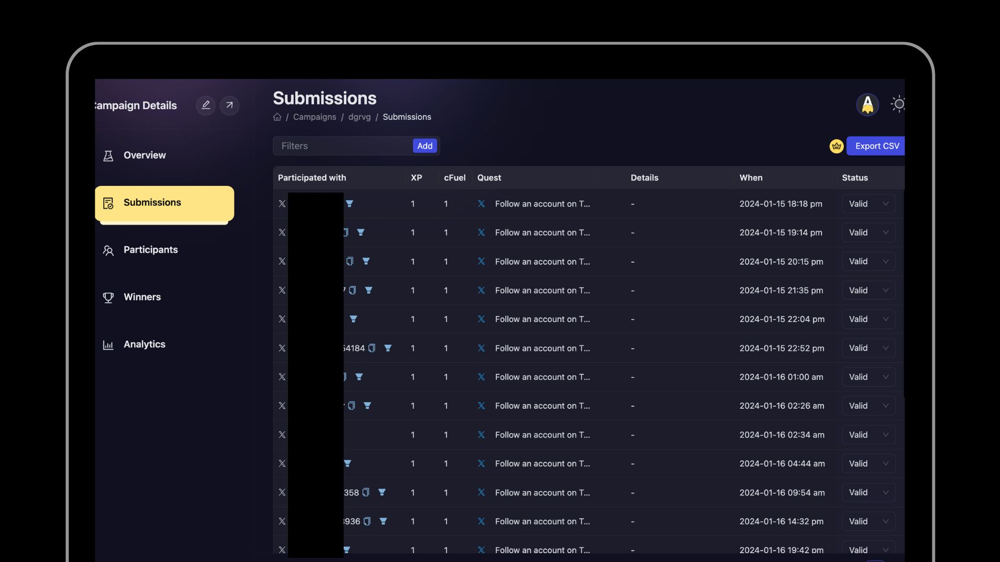

# Submissions

At times, projects in order to guage the performance of campaign needs to check participation data of ongoing events. With that in mind, we have built a submission view at AirLyft in which you can view task level breakdown of users, the number of entries they scored for that particular task, the status of their entry and other things.

- Open the [Campaigns page (https://account.airlyft.one/campaigns)](https://account.airlyft.one/campaigns)

1. In the "Action" column select
2. Hover on "More"
3. And then select "Submissions"

- You would then reach Submissions. The Submission tab is where you can see all the quests performed in your campaign.

  

- You can view all the submitted data such as their login method, their wallet addresses, their tasks completed, and every related parameters in a single view and then action upon it in case of discrepancies.

- You can also filter submissions based user the quest, participation date or user.

- You can also use [**"Export CSV"**](./export-data#submissions-data-export) to get all the submissions in a CSV for further analysis.

:::tip For instant help

1. Create a support ticket on our Discord: https://discord.gg/bx6ZCTwbYw
2. Join [this Telegram group](https://t.me/kyteone): https://t.me/kyteone

**_The AirLyft Team is there to help you. AirLyft is a platform to run marketing events, campaigns, quests and automatically distribute NFTs or Tokens as rewards._**

:::
