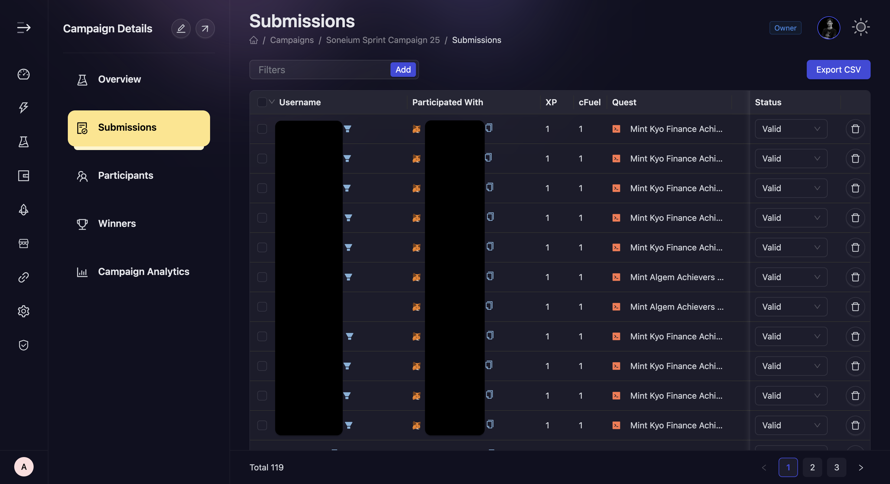

# Submissions

At times, projects in order to guage the performance of campaign needs to check participation data of ongoing events. With that in mind, we have built a submission view at AirLyft in which you can view task level breakdown of users, the number of cFuel/XP they scored for that particular task, the status of their entry and other things.

- Open the [Campaigns page (https://account.airlyft.one/campaigns)](https://account.airlyft.one/campaigns)

1. In the "Action" column select
2. Hover on "More"
3. And then select "Submissions"

- You would then reach Submissions. The Submission tab is where you can see all the quests performed in your campaign.

  

- You can view all the submitted data such as their login method, their wallet addresses, their tasks completed, and every related parameters in a single view and then take action upon it in case of discrepancies.

- If you want to manually review the submissions, or want to change the validation status of a submission, you can do that from too, you can either change the status one-by-one, or batch update it by selecting multiple submissions. Or you can delete a submission by clicking on the delete button.

- You can also filter submissions based on quest type, participation date, verification status or user.

- You can also use [**"Export CSV"**](./export-data#submissions-data-export) to get all the submissions in a CSV for further analysis.

:::tip For instant help

1. Create a support ticket on our Discord: https://discord.gg/bx6ZCTwbYw
2. Join [this Telegram group](https://t.me/kyteone): https://t.me/kyteone

**_The AirLyft Team is there to help you. AirLyft is a platform to run marketing events, campaigns, quests and automatically distribute NFTs or Tokens as rewards._**

:::
