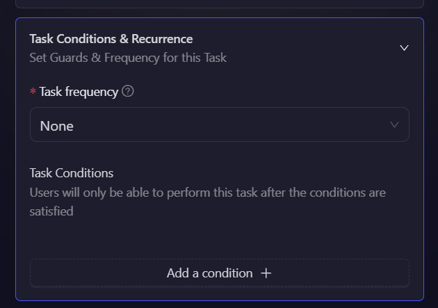
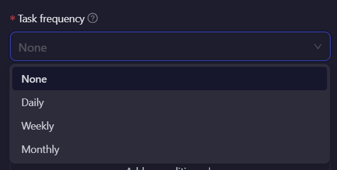
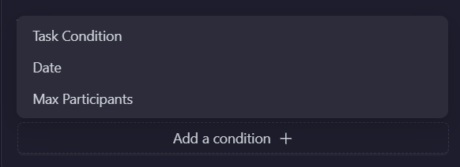
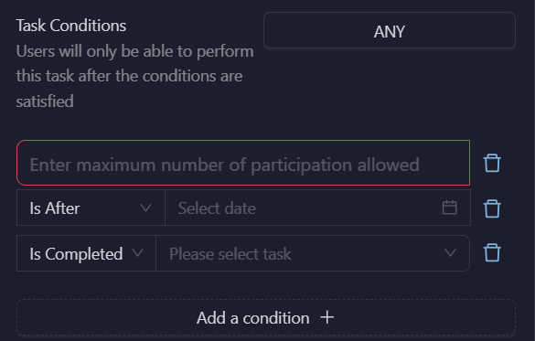

# Task Condition & Recurrence

The **Task Condition & Recurrence** settings define how often a task can be completed and under what conditions users can participate. This ensures better control over task availability, participation limits, and automation of recurring quests.

## Setting Up Task Frequency & Conditions

    

    To configure these settings, expand the **Task Condition & Recurrence** section, as shown above.

### Task Frequency

    

    The Task Frequency setting determines how often a user can complete a task. Choose from the following options based on the campaign requirements:

    - **None:** The task can only be completed once.
    - **Daily:** The task resets daily at midnight.
    - **Weekly:** The task resets at the start of every week.
    - **Monthly:** The task resets at the start of every month.

### Task Conditions

    

The Task Conditions settings define whether a user is eligible to perform the task. You can set multiple conditions and specify whether all conditions must be met or if any one condition is enough.

- **Task Completed:** It only allows a user to perform a task if he has either completed or not completed another task.

- **Date:** It only allows user to perform a task before or after the set date.

- **Max Participants:** The task is locked after a certain number of users have completed it.

  

When adding multiple conditions, you can choose:

- **"ALL"** → All conditions must be satisfied; users must meet every condition to access the task.
- **"ANY"** → Any one condition must be satisfied; users can complete the task if they meet at least one of the conditions.

:::tip For instant help

1. Create a support ticket on our Discord: https://discord.gg/bx6ZCTwbYw
2. Join [this Telegram group](https://t.me/kyteone): https://t.me/kyteone

**_The AirLyft Team is there to help you. AirLyft is a platform to run marketing events, campaigns, quests and automatically distribute NFTs or Tokens as rewards._**

:::
