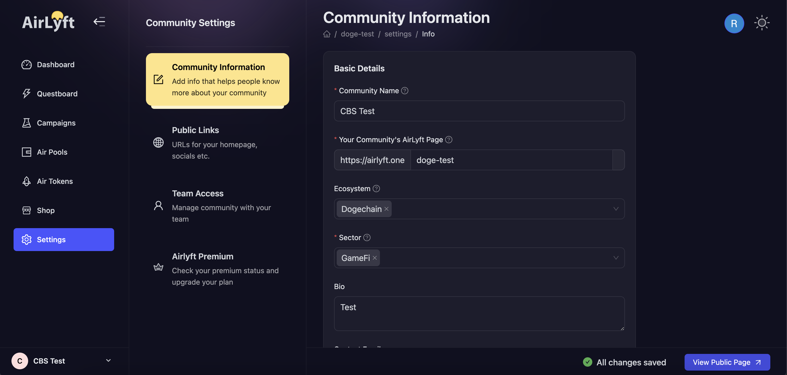

# Community

A Community is a starting point to Airlyft. Every community gets it's own page and URL that acts as an entry point to the system. You can think of your community as a profile on twitter or instagram.

## Creating a community

Visit [https://account.airlyft.one/](https://account.airlyft.one/) and create a community for free. You can create more than one community and change the current community from the bottom left of the dashboard.

## Settings

As a community admin you can

1. Configure the community name, url, ecosystem, sector, bio, logo and banner
2. Add different links to help airlyft members discover more about your community
3. Add team members
4. Upgrade your community for more features and higher rate limits

:::tip For instant help

1. Create a support ticket on our Discord: https://discord.gg/bx6ZCTwbYw
2. Join [this Telegram group](https://t.me/kyteone): https://t.me/kyteone

**_The AirLyft Team is there to help you. AirLyft is a platform to run marketing events, campaigns, quests and automatically distribute NFTs or Tokens as rewards._**

:::
