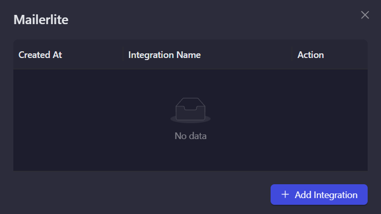
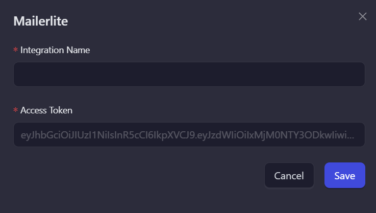
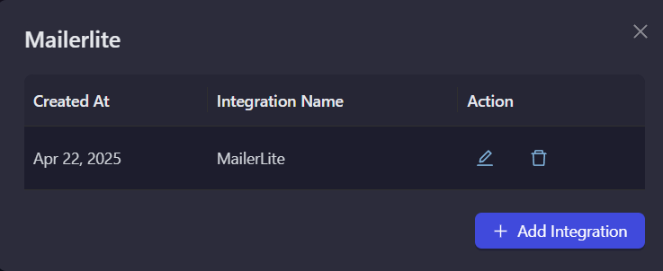

# MailerLite

MailerLite is a user-friendly email marketing platform that makes it easy to create and manage email campaigns. Use this integration to verify subscribers as part of your AirLyft campaign tasks.

## Setting Up MailerLite Integration

To integrate MailerLite with your AirLyft campaign, you'll need to obtain your API Access Token. Follow these steps:

### Obtaining your Access Token:

- Log in to your MailerLite dashboard
- Navigate to "Integrations" → "API"
- Generate an API Token

### Managing Subscribers

You can view all subscribers in your MailerLite account by navigating to the "Subscribers" tab in your dashboard.

### Setting Up MailerLite Integration in AirLyft

Follow these steps to configure your MailerLite integration:

1. **Access Integration Page**

   - Navigate to the Integration Page in your AirLyft dashboard.

     

2. **Select MailerLite**

   - Locate and click on the MailerLite integration block from the available options.

3. **Initialize Integration**

   - Click the "Add Integration" button to start the configuration process.

     

4. **Configure Integration Details**

   - Enter the following required information:

     - Integration Name: Provide a descriptive name for easy identification.
     - Access Token: Enter your MailerLite API Access Token.

       

5. **Verification and Completion**

   - Review your entered credentials.
   - Click "Save" to complete the integration setup.
   - Your MailerLite integration is now ready for use in campaign tasks.

     

Note: Double-check all credentials before saving to ensure proper connectivity with your MailerLite account.

:::tip For instant help

If you are facing any issues with the MailerLite integration, please contact [support@airlyft.freshdesk.com](mailto:support@airlyft.freshdesk.com)!

1. Create a support ticket on our Discord: https://discord.gg/bx6ZCTwbYw
2. Join [this Telegram group](https://t.me/kyteone): https://t.me/kyteone

**_The AirLyft Team is there to help you. AirLyft is a platform to run marketing events, campaigns, quests and automatically distribute NFTs or Tokens as rewards._**

:::
