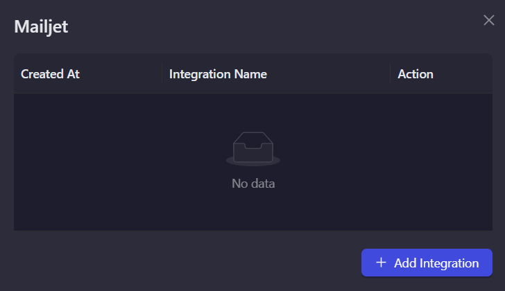
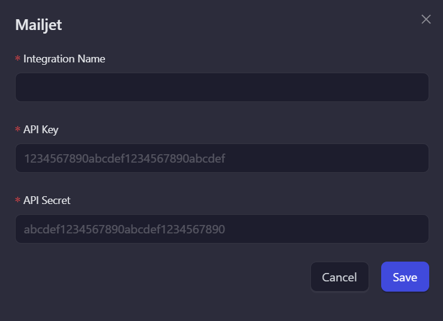
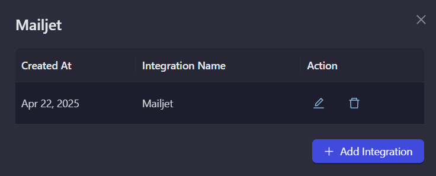

# Mailjet

Mailjet is a comprehensive email marketing solution for businesses of all sizes. Use this integration to verify subscribers as part of your AirLyft campaign tasks.

## Setting Up Mailjet Integration

To integrate Mailjet with your AirLyft campaign, you'll need to obtain your API Key and Secret Key. Follow these steps:

### Obtaining your API and Secret Keys:

- Log in to your Mailjet dashboard
- Navigate to the "API" tab → "API Key Management"
- Generate or copy your existing API Key and Secret Key

### Managing Subscribers

You can view all subscribers in your Mailjet account by navigating to the "Contacts" tab → "All Contacts".

### Setting Up Mailjet Integration in AirLyft

Follow these steps to configure your Mailjet integration:

1. **Go to Integration Page**

   - Navigate to the Integration Page in your AirLyft dashboard.

     

2. **Select Mailjet**

   - Locate and click on the Mailjet integration block from the available options.

3. **Initialize Integration**

   - Click the "Add Integration" button to start the configuration process.

     

4. **Configure Integration Details**

   - Enter the following required information:

     - Integration Name: Provide a descriptive name for easy identification.
     - API Key: Enter your Mailjet API key.
     - Secret Key: Enter your Mailjet Secret key.

     

5. **Verification and Completion**

   - Review your entered credentials.
   - Click "Save" to complete the integration setup.
   - Your Mailjet integration is now ready for use in campaign tasks.

     

> Note: Double-check all credentials before saving to ensure proper connectivity with your Mailjet account.

:::tip For instant help

If you are facing any issues with the Mailjet integration, please contact [support@airlyft.freshdesk.com](mailto:support@airlyft.freshdesk.com)!

1. Create a support ticket on our Discord: https://discord.gg/bx6ZCTwbYw
2. Join [this Telegram group](https://t.me/kyteone): https://t.me/kyteone

**_The AirLyft Team is there to help you. AirLyft is a platform to run marketing events, campaigns, quests and automatically distribute NFTs or Tokens as rewards._**

:::
