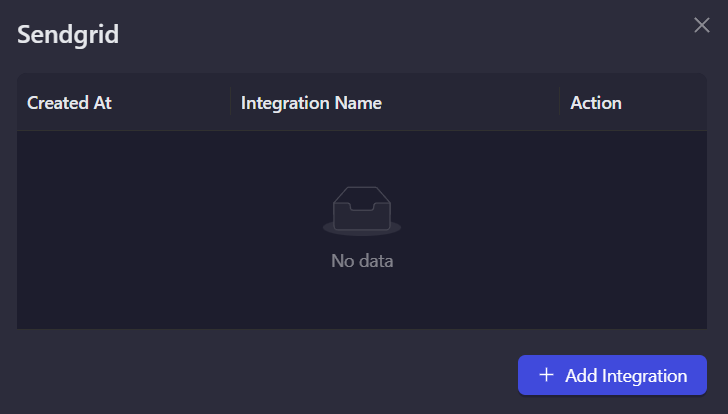
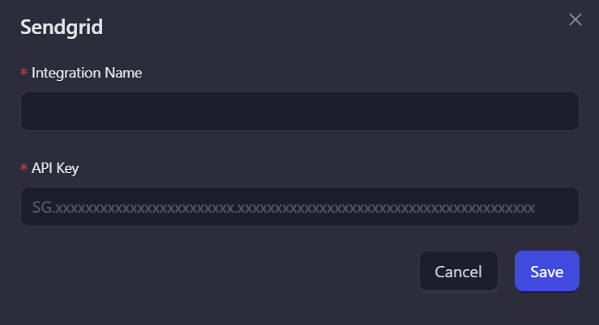
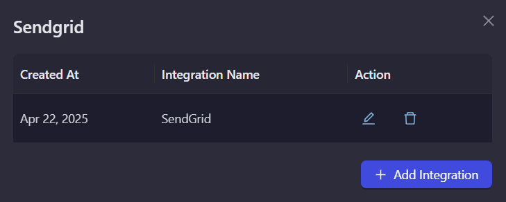

# SendGrid

SendGrid is a leading email delivery platform that enables businesses to send transactional and marketing emails. Use this integration to verify subscribers as part of your AirLyft campaign tasks.

## Setting Up SendGrid Integration

To integrate SendGrid with your AirLyft campaign, you'll need to obtain your API Key. Follow these steps:

### Obtaining your API Key:

- Log in to your SendGrid dashboard
- Navigate to "Settings"
- Click on the "API Keys" tab
- Generate a new API key

### Managing Subscribers

You can view all subscribers in your SendGrid account by:

- Navigating to "Marketing"
- Clicking on "Contacts" → "Global" (all contacts)

### Setting Up SendGrid Integration in AirLyft

Follow these steps to configure your SendGrid integration:

1. **Navigate to Integration Page**

   - Navigate to the Integration Page in your AirLyft dashboard.

     

2. **Select SendGrid**

   - Locate and click on the SendGrid integration block from the available options.

3. **Initialize Integration**

   - Click the "Add Integration" button to start the configuration process.

     

4. **Configure Integration Details**

   - Enter the following required information:

     - Integration Name: Provide a descriptive name for easy identification.
     - API Key: Enter your SendGrid API key.

     

5. **Verification and Completion**

   - Review your entered credentials.
   - Click "Save" to complete the integration setup.
   - Your SendGrid integration is now ready for use in campaign tasks.

     

> Note: Double-check all credentials before saving to ensure proper connectivity with your SendGrid account.

:::tip For instant help

If you are facing any issues with the SendGrid integration, please contact [support@airlyft.freshdesk.com](mailto:support@airlyft.freshdesk.com)!

1. Create a support ticket on our Discord: https://discord.gg/bx6ZCTwbYw
2. Join [this Telegram group](https://t.me/kyteone): https://t.me/kyteone

**_The AirLyft Team is there to help you. AirLyft is a platform to run marketing events, campaigns, quests and automatically distribute NFTs or Tokens as rewards._**

:::
