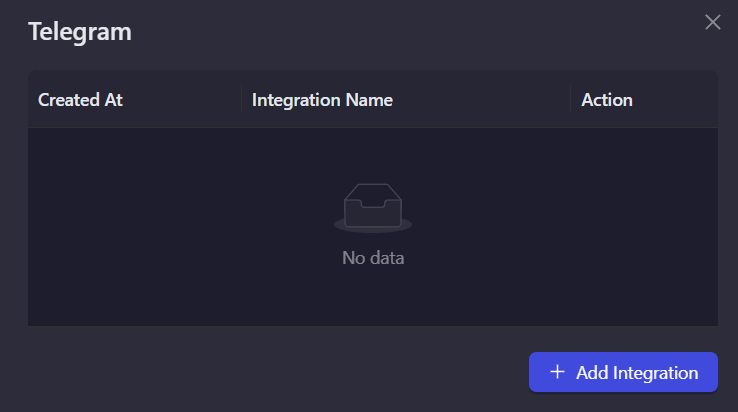
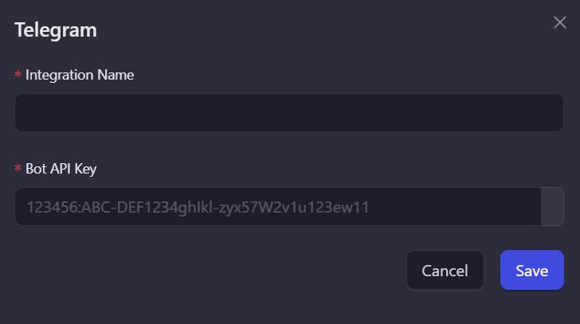
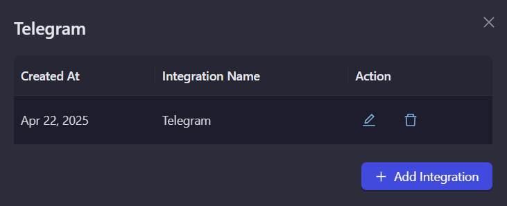

# Telegram

Telegram is a popular messaging platform with powerful group and channel features. The AirLyft Telegram integration allows you to verify user membership in your Telegram groups and channels, enabling you to create campaign tasks that require users to join your Telegram communities.

## Setting Up Telegram Integration

To integrate Telegram with your AirLyft campaign, you'll need to obtain a Bot API Key by creating a Telegram bot using BotFather.

### Creating a Telegram Bot:

For detailed step-by-step instructions on how to create a Telegram bot for verification using BotFather, please refer to our guide: [Set Up Telegram Bot](https://kyteone.medium.com/airlyft-update-improved-telegram-integration-c5636f19c8e5)

This guide covers:

- How to create a bot using BotFather
- How to obtain your Bot API Key
- How to add your bot to your Telegram group or channel

### Setting Up Telegram Integration in AirLyft

Follow these steps to configure your Telegram integration:

1. **Navigate to Integration Page**

   - Navigate to the Integration Page in your AirLyft dashboard.

     

2. **Select Telegram**

   - Locate and click on the Telegram integration block from the available options.

3. **Initialize Integration**

   - Click the "Add Integration" button to start the configuration process.

     

4. **Configure Integration Details**

   - Enter the following required information:

     - Integration Name: Provide a descriptive name for easy identification.
     - Bot API Key: Paste your Telegram Bot Token.

     

5. **Verification and Completion**

   - Review your entered credentials.
   - Click "Save" to complete the integration setup.
   - Your Telegram integration is now ready for use in campaign tasks.

     

:::tip For instant help

If you are facing any issues with the Telegram integration, please contact [support@airlyft.freshdesk.com](mailto:support@airlyft.freshdesk.com)!

1. Create a support ticket on our Discord: https://discord.gg/bx6ZCTwbYw
2. Join [this Telegram group](https://t.me/kyteone): https://t.me/kyteone

**_The AirLyft Team is there to help you. AirLyft is a platform to run marketing events, campaigns, quests and automatically distribute NFTs or Tokens as rewards._**

:::
