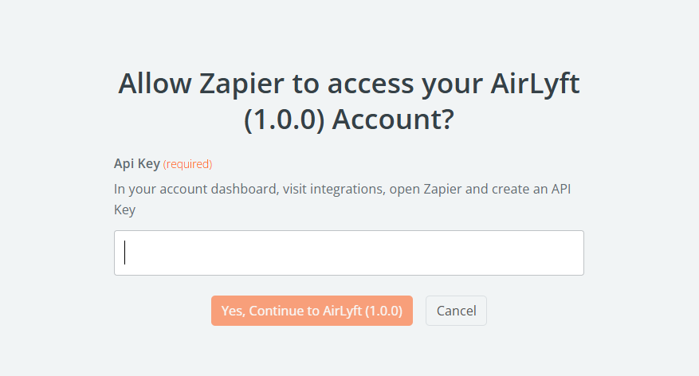

# Zapier

Zapier is a powerful automation platform that connects your AirLyft campaigns with thousands of other applications - no coding required. Use it to automate workflows, sync data, and enhance your campaign capabilities.

## Setting Up Zapier Integration

To integrate Zapier with your AirLyft campaigns, you'll need to set up both your AirLyft account and your Zapier account. Follow these steps in order:

### Step 1: Access AirLyft Integration Settings

1. Log into your [AirLyft dashboard](https://account.airlyft.one/).
2. Navigate to the Integration Page.

   

### Step 2: Enable Zapier Integration

1. Find and select the Zapier integration block.
2. Click "Generate API Key".
3. Copy your generated API key.

   

### Step 3: Create Your Zap

1. Sign in to your Zapier account.
   If you don't have a Zapier account:

   - Visit [zapier.com](https://zapier.com/).
   - Click "Sign Up".
   - Complete the registration process and verify your email.

2. Click the "Create" button and select "Zaps".
3. Search for and select "AirLyft" as your trigger app.

   

4. Choose a trigger event - there are two options: Participation Data and Subscribe Newsletter.
5. Select your AirLyft account or connect a new one by clicking "Connect a new account".

   

6. Enter your AirLyft API key when prompted.

   

7. Click "Continue" and test the connection to ensure it works properly.

### Step 4: Set Up the Action

1. Choose the app you want to connect with AirLyft (e.g., Google Sheets, Slack, Discord).

   

2. Select the specific action to perform (e.g., "Create Spreadsheet Row").

   

3. Connect your account for the action app if you haven't already.
4. Follow the app-specific instructions to complete the connection.

5. **Map the Data Fields**

   - Match the data from AirLyft to the corresponding fields in your action app
   - Common fields to map include:
     - User email address
     - User name or username
     - Wallet address (for Web3 campaigns)
     - Task completion status
     - Timestamp of the action
   - Use Zapier's formatting options to customize how the data appears

   

6. **Test and Activate**

   - Click the "Test & Continue" button to run a test of your complete Zap.
   - Review the test results to ensure all data is being passed correctly.

### Step 5: Configure Webhook in AirLyft

1. Return to your AirLyft dashboard and navigate to the Zapier integration page.

   

2. Click on "Add Webhook" to open the configuration form.

   

3. Enter a descriptive name for your webhook (e.g., "Participation Data").
4. Paste the Webhook URL you copied from Zapier.
5. Click "Save" to create the webhook connection.

   

:::tip For instant help

If you are facing any issues with the Zapier integration, please contact [support@airlyft.freshdesk.com](mailto:support@airlyft.freshdesk.com)!

1. Create a support ticket on our Discord: https://discord.gg/bx6ZCTwbYw
2. Join [this Telegram group](https://t.me/kyteone): https://t.me/kyteone

**_The AirLyft Team is there to help you. AirLyft is a platform to run marketing events, campaigns, quests and automatically distribute NFTs or Tokens as rewards._**

:::
