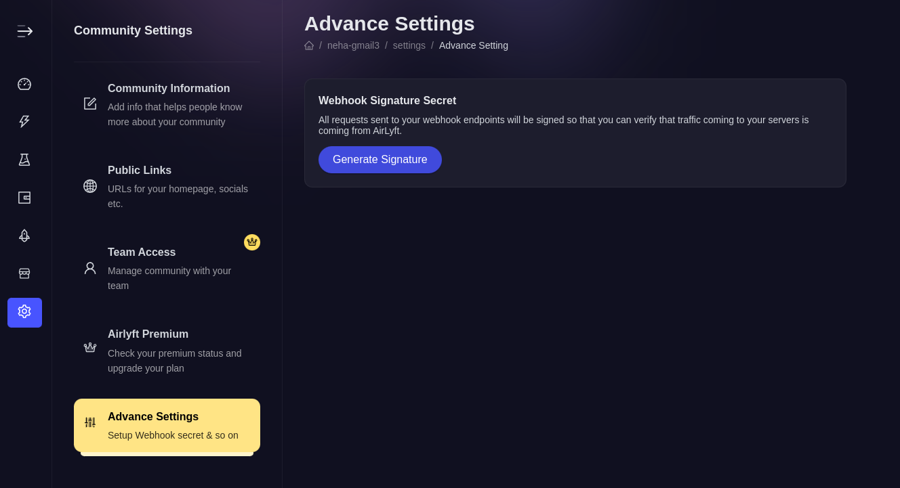
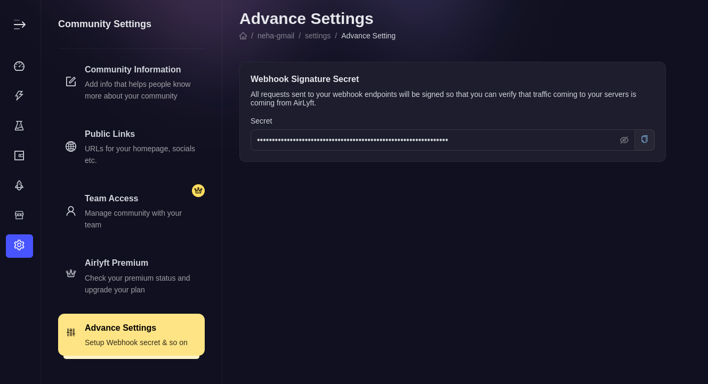

# Webhook

Webhooks provide a powerful way to receive real-time notifications when a user participates in a task. By configuring a webhook for your campaign, you can receive detailed information about user interactions directly to your specified endpoint.

## Setting Up a Webhook

To set up a webhook for your campaign:

1. Go to your campaign setup page.
2. Enter the URL endpoint in the webhook configuration section.
3. Your endpoint must be capable of handling `HTTP POST` requests and processing the incoming `JSON` payload.

The request's body will get the following data which you can further use at your disposal

```
{
  userId: '2d4fcba2-817b-4322-93b5-47a075796c90',
  provider: 'TWITTER',
  providerId: '1485502052562194432',
  xp: 1,
  points: 1,
  data: 'null',
  taskId: 'd5a459ba-43cc-42fa-bc19-3c87821dbd43',
  eventId: 'eae7405a-11d2-4a23-ad40-ff50a4d73497',
  tasktype: 'URL_VISIT',
  apptype: 'URL',
  participationStatus: 'VALID',
}

```

## Details of the payload fields

### 1. Property details

| Property            | Description                                                              | Type          | Default |
| ------------------- | ------------------------------------------------------------------------ | ------------- | ------- |
| userId              | Unique UUID given to every new user                                      | string        | -       |
| provider            | It will have one of the stated values from the table given below         | string        | -       |
| providerId          | It can be unique ID from any social API / wallet address / email address | string        | -       |
| xp                  | It is a value given to that task                                         | number        | -       |
| points              | It is a value earned by the user once he/she does that task              | number        | -       |
| data                | It will have value(s) as specified in the TaskType table                 | JSON / `null` | -       |
| taskId              | Unique UUID given to every task                                          | string        | -       |
| eventId             | Unique UUID given to every campaign                                      | string        | -       |
| taskType            | It will have one of the stated values from the table given below         | string        | -       |
| appType             | It will have one of the stated values from the table given below         | string        | -       |
| participationStatus | It will have one of the stated values from the table given below         | string        | -       |

### 2. Providers

For a given data, this specifies which social platform they have used to perform this action.

| Provider           | ProviderId                                          |
| ------------------ | --------------------------------------------------- |
| TWITTER            | Gives the account's ID from Twitter API             |
| DISCORD            | Gives the account's ID from Discord API             |
| MAGIC_LINK         | Email address used by user's for passwordless login |
| EVM_BLOCKCHAIN     | EVM Wallet address                                  |
| DOTSAMA_BLOCKCHAIN | Dotsama Wallet address                              |

### 3. TaskType & AppType

Every action will following under one of the AppTypes states below and one of the TaskType depending on the subcategory

| AppType   | TaskType                         | Data                                                                      |
| --------- | -------------------------------- | ------------------------------------------------------------------------- |
| DISCORD   | DISCORD_JOIN                     | `null`                                                                    |
| FORM      | FORM_ANSWER                      | `{ "answers" : [ "id" : string, "value": [ string ] ] }`                  |
| QUIZ      | QUIZ_PLAY                        | `{ "answers" : [ string ] }`                                              |
| EVM       | EVM_CONTRACT                     | `{ "formResponses": [{ "id": string, "value": string(wallet address)}] }` |
| TELEGRAM  | TELEGRAM_JOIN                    | `null`                                                                    |
| TWITTER   | TWITTER_FOLLOW                   | `null`                                                                    |
| TWITTER   | TWITTER_POST                     | `{ "url": string, "media": [string], "tweet": string }`                   |
| TWITTER   | TWITTER_UGC                      | `{ "url": string, "media": [string], "tweet": string }`                   |
| TWITTER   | TWITTER_LIKE_RETWEET             | `null`                                                                    |
| UPLOAD    | UPLOAD_FILE                      | `{ "urls": [string] }`                                                    |
| URL       | URL_VISIT, URL_SHARE             | `null`                                                                    |
| INSTAGRAM | INSTAGRAM_VISIT, INSTAGRAM_VIEW  | `null`                                                                    |
| YOUTUBE   | YOUTUBE_VISIT                    | `null`                                                                    |
| WALLET    | WALLET_EVM, WALLET_DOTSAMA       | `{ "address": string }`                                                   |
| SUBGRAPH  | SUBGRAPH_RAW                     | JSON based on the task                                                    |
| AIRBOOST  | AIRBOOST_REFERRAL                | `null`                                                                    |
| REST      | REST_RAW, REST_EVM, REST_DOTSAMA | JSON based on the task                                                    |
| EMAIL     | EMAIL_ADDRESS                    | `null`                                                                    |
| TERMS     | TERMS_TEXT                       | `null`                                                                    |
| TERMS     | TERMS_DOTSAMA                    | `{ "address": string, "signature": string }`                              |
| CHECKIN   | CHECKIN_DAILY                    | `null`                                                                    |

### 4. Participation Status

Every action taken by a users belongs to one of the follow status

| Status    | Details                                                                                                                  |
| --------- | ------------------------------------------------------------------------------------------------------------------------ |
| VALID     | The action taken by the user is correct                                                                                  |
| INVALID   | The campaign manager found something incorrect so marked the user action INVALID from AirLyft Dashboard                  |
| IN_REVIEW | The user action required campaign manager to manually review the action & mark it VALID / INVALID from AirLyft dashboard |

## Webhook Signature

To sign our requests, we use a hash-based message authentication code, or HMAC.

Each project that is created will be provided with a secret.

When a request is sent to your webhook endpoint a signature will be created by hashing the body of the request that is being sent with the shared secret.

This signature is sent in the signature variable in the HTTP body so that the client can verify it was made with the same secret that it has access to.

### Steps to get the secret

1. Go to https://account.airlyft.one/settings/community/advance & click on "Generate Signature"



2. Copy the secret & use it on your end



### How to verify the signature on your end

The signature value for this request was created by creating a SHA-256 hash of the above request body parameters except of the signature itself using the provided secret as a key.

In order for the client to verify the signature, it can create a hash signature using the same algorithm and see if the value matches.

Below is an example using Node.js.

```
const crypto = require('crypto');

const key = 'secret'; // from the secret copied from AirLyft dashboard
const body = '{"userId":"2d4fcba2-817b-4322-93b5-47a075796c90","provider":"TWITTER","providerId":"1485502052562194432","xp":1,"points":1,"data":"null","taskId":"d5a459ba-43cc-42fa-bc19-3c87821dbd43","eventId":"eae7405a-11d2-4a23-ad40-ff50a4d73497","tasktype":"URL_VISIT","apptype":"URL","participationStatus":"VALID"}';

const hash = crypto.createHmac('sha256', key).update(body);

const signature = hash.digest('hex');

```

:::tip For instant help

1. Create a support ticket on our Discord: https://discord.gg/bx6ZCTwbYw
2. Join [this Telegram group](https://t.me/kyteone): https://t.me/kyteone

**_The AirLyft Team is there to help you. AirLyft is a platform to run marketing events, campaigns, quests and automatically distribute NFTs or Tokens as rewards._**

:::
