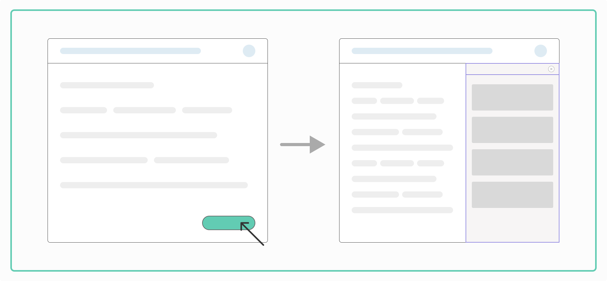
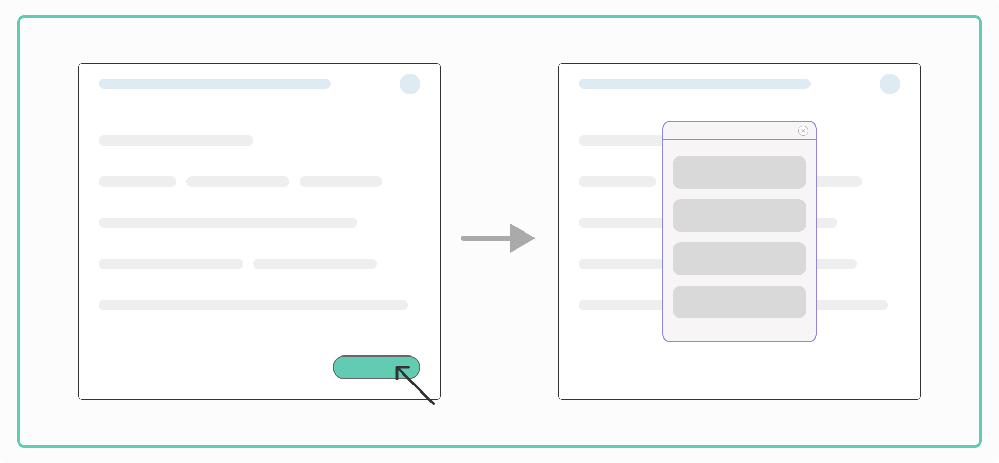

# Widget

The AirLyft Widget allows you to create onboarding flows, run quests, and campaigns easily on your own domain. This versatile tool enhances user interaction and streamlines the onboarding process for your platform.

:::tip Pre Release

The AirLyft Widget is currently in Pre-Release. To use this feature, you need to be in direct contact with an AirLyft Team member. Create a support ticket on our [Discord](https://discord.gg/bx6ZCTwbYw) to receive your Widget ID.

:::

## Types of Widgets

AirLyft offers two main types of widget:

1. [Sidebar Widget](#sidebar-widget)
2. [Popup Widget](#popup-widget)

## Installation

Installing the AirLyft Widget on your website is quick and easy. Simply insert the JavaScript code into your website’s code.

1. First get your `widgetId` by creating a support ticket on our [Discord](https://discord.gg/bx6ZCTwbYw)
2. Choose your widget style and variation.
3. Add the respective script to the `<body>` of your website.

## Sidebar Widget



The Sidebar Widget opens a panel on the side of your webpage, providing a non-intrusive way to engage users.

### Simple Sidebar

- Basic implementation that opens a sidebar through a button click
- Ideal for general onboarding flows and information display

Copy the code below for a simple sidebar (replace YOUR-WIDGET-ID with the ID you receive from the team):

```
<script src="https://assets.airlyft.one/widget/widget.js"></script>
<script>
  (async () => {
      try {
          const widget = await window.AirlyftWidget("YOUR-WIDGET-ID");
          widget.createSidebar({});
      } catch (err) {
          consolr.error(err)
      }
    })();              
</script>
```

### Open Quest Directly Sidebar

- Opens a specific quest directly in the sidebar
- Perfect for targeted user engagement and guided experiences

Copy the code below for an open quest directly sidebar (replace YOUR-WIDGET-ID with the ID you receive from the team, and TASK-ID with your task's ID):

```
<script src="https://assets.airlyft.one/widget/widget.js"></script>
<script>
  (async () => {
      try {
          const widget = await window.AirlyftWidget("YOUR-WIDGET-ID");
          const instance = await widget.createSidebar({});
          widget.openSpecificTask(instance, "TASK-ID");
      } catch (err) {
          console.error(err)
      }
    })();
</script>
```

### Async Script Load Sidebar

- Loads the widget script asynchronously in the background
- Improves website performance by not blocking other page elements from loading

Copy the code below for an async script load sidebar (replace YOUR-WIDGET-ID with the ID you receive from the team):

```
<script
      src="https://assets.airlyft.one/widget/widget.js"
      async
      onload="window.InitAirlyft()">
</script>
<script>
      window.InitAirlyft = async () => {
        try {
          const widget = await window.AirlyftWidget("YOUR-WIDGET-ID");
          widget.createSidebar({});
        } catch (err) {
          console.error(err);
        }
      };
</script>
```

## Popup Widget



The Popup Widget appears as a modal window over your webpage, creating a focused interaction space.

### Simple Popup

- Basic implementation that opens a popup through a button click
- Suitable for announcements, promotions, or brief interactions

Copy the code below for a simple popup (replace YOUR-WIDGET-ID with the ID you receive from the team):

```
<script src="https://assets.airlyft.one/widget/widget.js"></script>
<script>
  (async () => {
      try {
          const widget = await window.AirlyftWidget("YOUR-WIDGET-ID");
          widget.createModal({});
      } catch (err) {
          consolr.error(err)
      }
    })();              
</script>
```

### Open Quest Directly Popup

- Opens a specific quest directly in the popup
- Ideal for immediate user engagement with particular content or tasks

Copy the code below for an open quest directly popup (replace YOUR-WIDGET-ID with the ID you receive from the team, and TASK-ID with your task's ID):

```
<script src="https://assets.airlyft.one/widget/widget.js"></script>
<script>
  (async () => {
      try {
          const widget = await window.AirlyftWidget("YOUR-WIDGET-ID");
          const instance = await widget.createModal({});
          widget.openSpecificTask(instance, "TASK-ID");
      } catch (err) {
          console.error(err)
      }
    })();
</script>
```

### Async Script Load Popup

- Loads the widget script asynchronously in the background
- Enhances page load times and overall site performance

Copy the code below for an async script load popup (replace YOUR-WIDGET-ID with the ID you receive from the team):

```
<script
      src="https://assets.airlyft.one/widget/widget.js"
      async
      onload="window.InitAirlyft()">
</script>
<script>
      window.InitAirlyft = async () => {
        try {
          const widget = await window.AirlyftWidget("YOUR-WIDGET-ID");
          widget.createModal({});
        } catch (err) {
          console.error(err);
        }
      };
</script>
```

## Inline Widget

Coming Soon

## Demo Website

To help you better understand and visualize the AirLyft Widget in action, we've created a comprehensive demo website. This interactive demonstration showcases all our widget types and variations, allowing you to experience their functionality firsthand.

Visit our demo website at: [widget.airlyft.one](https://widget.airlyft.one/)

On the demo site, you can:
- Interact with live examples of Sidebar and Popup Widgets
- Explore different widget variations
- Test the user experience from both desktop and mobile perspectives

## Caveats

The AirLyft Widget is currently in Pre-Release mode. Please note the following caveats when using the platform:
1. Currently, PolkadotJS does not work for login or quests. Ask users to use Subwallet or Talisman for Substrate-based actions.