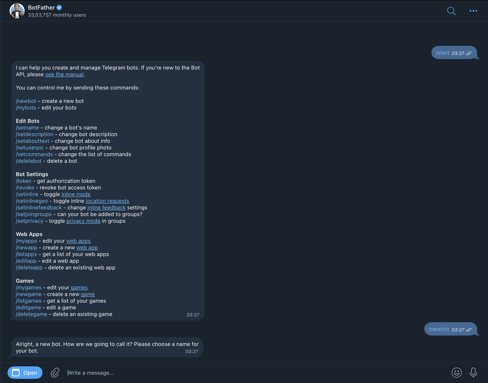
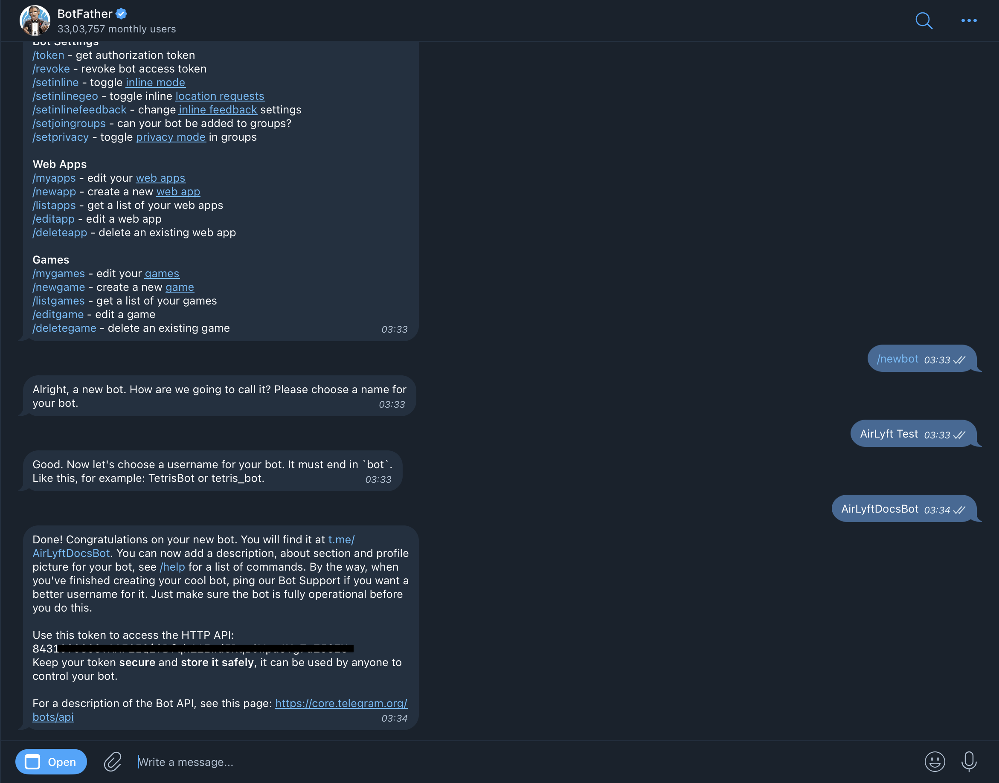
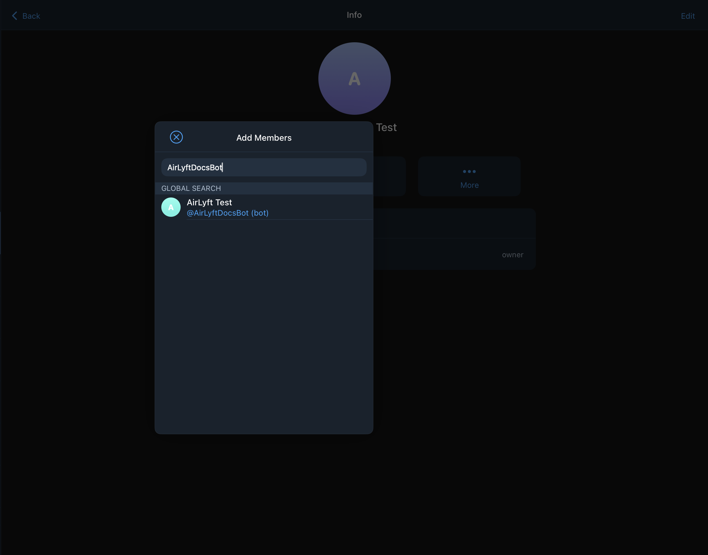

# How to create a Telegram Bot

This guide covers:

- How to create a bot using BotFather
- How to obtain your Bot API Key
- How to add your bot to your Telegram group or channel

## Steps to obtain API key and setup you bot

 - To get the API key, simply go to your Telegram and generate this using [@BotFather](http://twitter.com/BotFather). Press start and enter `/newbot` command and follow the instructions mentioned in the bot father window.

- Now, enter the name of the bot whose API Key will be generated. Let’s use AirLyft Test for testing purposes. Post that, you need to choose a username for the bot that ends with ‘bot’, taking AirLyftDocsBot for understanding. 

- After that hit enter, and then you'll get the API key for your bot.

- Now, once the bot is generated via Botfather, we need to first add it to the group you want your users to join. Simply, navigate to the group/channel and click on add member option to add the created bot.

> Please note that you need to make this bot an **ADMIN** and it will be entirely in your control as the Bot API Key is only available to you.

- Now, once the bot is added to the group, please copy the API key from the BotFather window and navigate to [AirLyft Integrations Page](https://account.airlyft.one/integrations) page.

- Follow the steps mentioned in [Telegram Integration](../integrations/telegram-integration.md) doc to add the Bot to your AirLyft account.

> **Note**
> - You can always delete this bot post-event completion by navigating to BotFather window on Telegram and using the command `/deletebot`!
> - AirLyft does not read any group/channel messages, we also do not read any user PII through this bot.
> - This bot will not send any message on your group/channel.