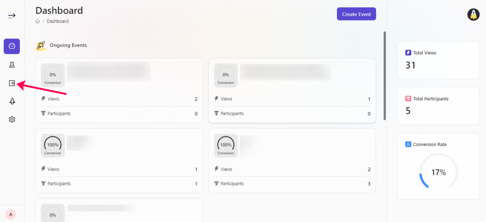
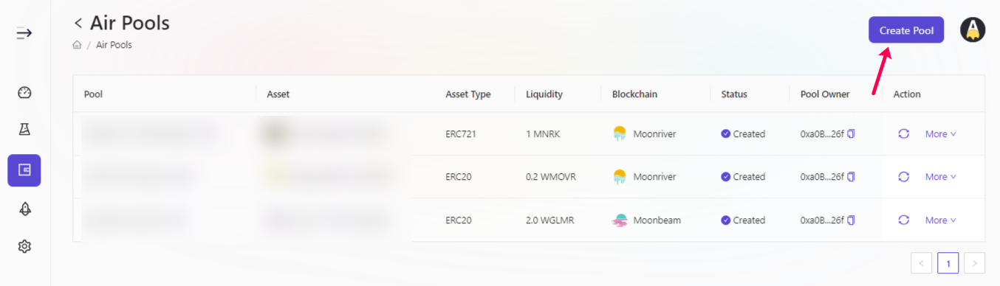
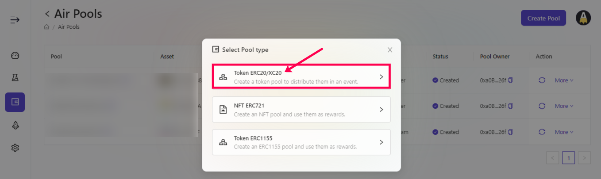
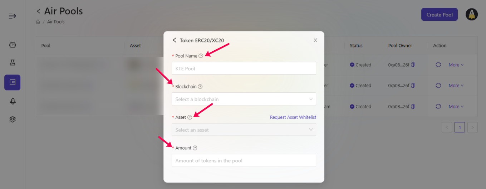
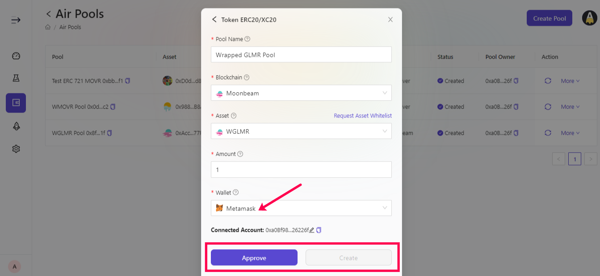
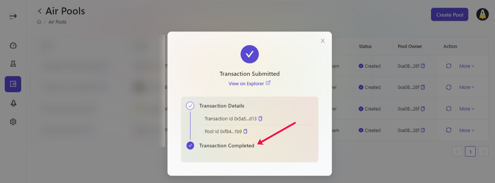

# Creating ERC20 Air Pool

This article focuses on how to create your first ERC20 or XC20 reward pool on AirLyft.

- Login to AirLyft and once you are on the dashboard, please click on AirPool icon as shown in the screenshot below.

- Next, you will be on AirPool page on which you can click on Create Pool option to create your first ERC20 Pool.

- Next step is for you to select the pool type where you will be provided with three options ERC20/XC20, NFT ERC721, and NFT ERC1155. Select Token ERC20/XC20 from the list. 

- You will now be provided with few options to fill about the reward pool that you want to create such as Pool Name, Blockchain, Asset, Amount to be locked.

- Next, if you don't see your tokens available on the list, you can find the [Request Asset Whitelist](https://docs.google.com/forms/d/e/1FAIpQLSdmdE3BmNwWQ1kZbKZqFzzRoBX38ltecXiSjuS5VEthwH28Yw/viewform) option. Click on it and fill up the short form for us to manually add the tokens to the asset list. 

- Once you fill up the pool details, next you will be asked to connect your Metamask, or any EVM supported wallet to sign the transaction, and approve locking of mentioned Amount into the pool. 

- Next step is for you to approve the transaction by paying minimal gas fees on the network and let a reward pool be approved for creation at AirLyft. Once you have approved it, you can now see Create option enabled for you to create the reward pool.

- After you click on create, allow some time for the transaction to be included in the block until the transaction is completed.

- Wohoo... Your first ERC 20 reward pool on AirLyft is now successfully created. You can now see your created reward pool along with pool id, transaction id, and other details on the AirPool page.

:::tip For instant help
1. Email us at support@kyte.one
2. Join our official [Telegram group](https://t.me/kyteone)
::: 
