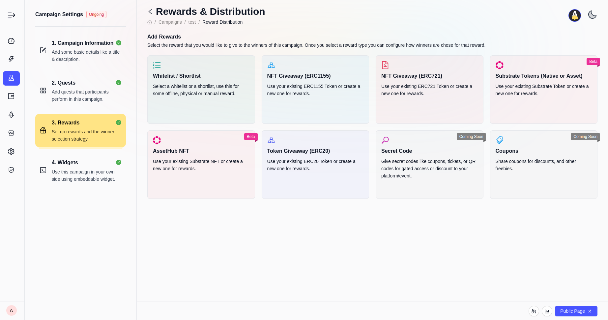
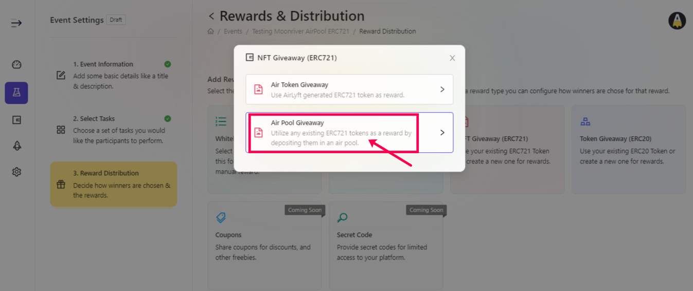
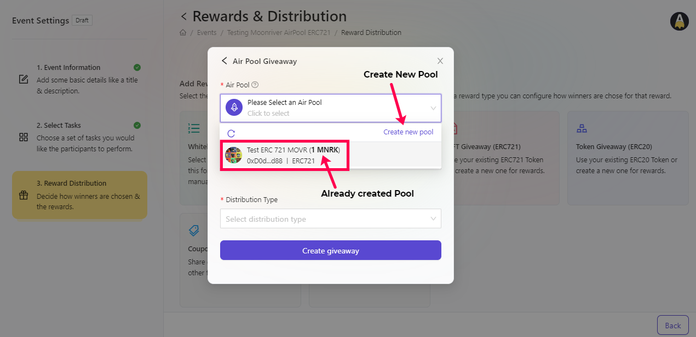
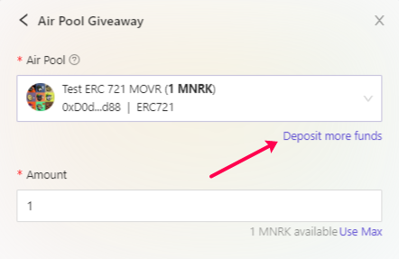
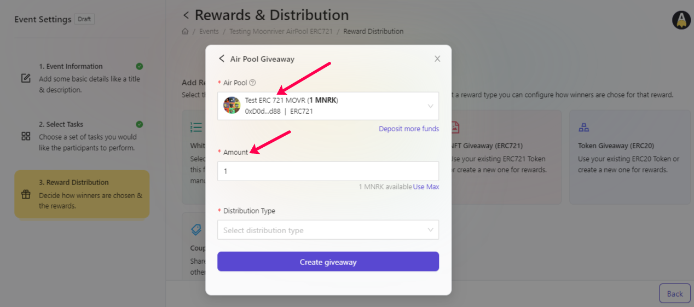
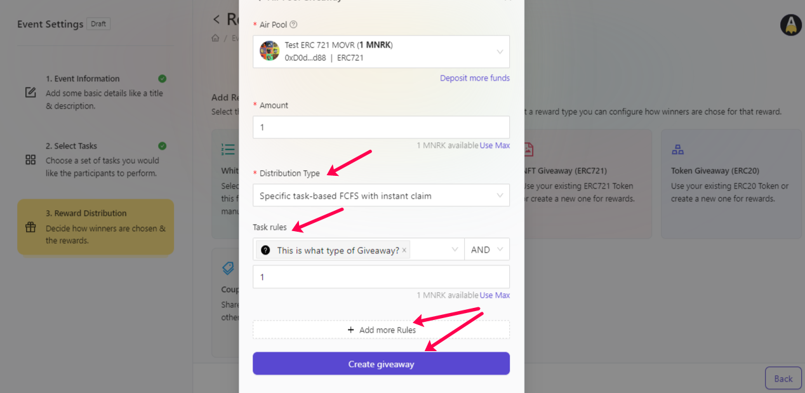
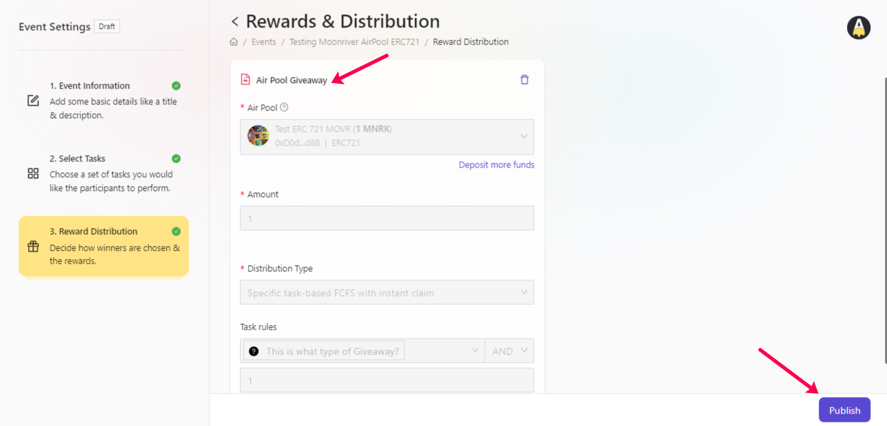

# Using Created AirPool

Now that you have your ERC 20, ERC 721, ERC 1155 AirPools created, the next step is to understand on how can we use the created reward pools at AirLyft. Let's dive deep into the details.

- Firstly, login to your AirLyft account with which you have signed in earlier and go to your dashboard. 

- Next, headover to top right part of your screen where you can see the button "Create Event". Click on the button as shown in screenshot below.

- Next, fill up the basic details and then creation actions on the select apps tab. While these are self explanatory, however, you cna still refer to the event creation and task creation documents here for a much better understanding. 

- Once your details are filled and tasks have been created, the last step is to create your reward distribution strategy. Just so that we are on the same page, here is a screenshot showing the reward distribution page. 

- On the reward distribution page, you will be provided with multiple reward modules which is Whitelist, NFT Giveaway (ERC 721), NFT Giveaway (ERC 1155), Token Giveaway (ERC 20), Coupons, and secret codes. Now, if you want to distribute NFT rewards on-chain, you can use the NFT giveaway blocks. However, if you want to distribute your ERC20, XC20 rewards on-chain as part of campaign, you can use the token giveaway module. Let's say for the sake of document, we want to do a ERC 721 NFT giveaway.

- Click on the NFT Giveaway (ERC721) and a popup window appears asking you to choose your selection between AirToken & AirPool. Click on the AirPool option here. 

- After you click on AirPool Giveaway option, you will have the option to select the created AirPool that you did earlier. If you haven't created it yet, click on the create new pool option to create your own AirPool reward. 

- Please also note that you can use the deposit more fund option here to add more liquidity to your reward pool. 

- Let's select the already created pool which shows we have a reward pool with name of "**Test ERC 721 MOVR**" that has the **liquidity available of 1 MNRK**. Now, as the liquidity is only 1 MNRK, you can write 1 in the amount shown and then go ahead with the selection of distribution type.

- Next is, select the best distribution strategy for your NFT giveaway which AirLyft would ensure reward distribution on. For instance, one of the distribution strategy is "Specific Task Based FCFS with instant claim" which means as soon as users complete specific number of tasks, they can claim the NFT instantly. There will be different strategies available in the list moving forward. Keep an eye on distribution strategy document available. 

- Now, as you have selected the specific task distribution, select specific task rules after which you want users to claim the NFT and then enter the reward amount which would be 1 if you want users to claim just 1 NFT. Finally, if you have any more rules, you can add it else click on create giveaway to finish creation of reward. 

- Finally, click on Publish and that's it... You have successfully used your AirPool reward to create a ERC721 NFT giveaway event.

> Note: ***You can select any type of giveway module from the Reward Distribution page and then publish your event rewards. The same steps will have to be followed for ERC20, ERC1155 modules too. ***

:::tip For instant help
1. Email us at support@kyte.one
2. Join our official [Telegram group](https://t.me/kyteone)
:::

