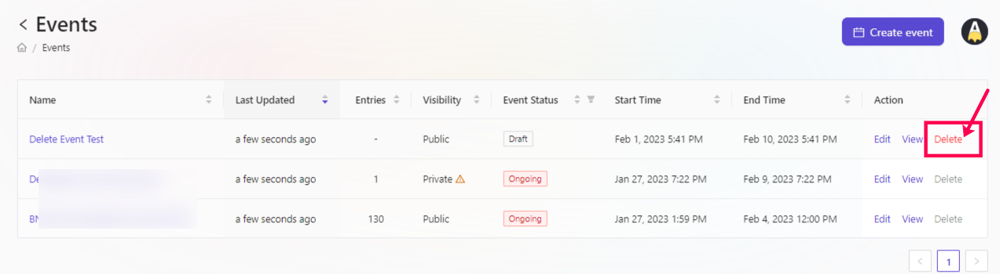

# Delete Event

To delete an event at AirLyft, please follow the steps below. 

- Login to AirLyft and once you are on the dashboard, please click on the events tab as shown in the screenshot below.

- On the event page, select the corresponding event that you want to remove and click on the Delete button against it to remove the event from the list. Please refer to the screenshot below for a better understanding. 

> **NOTE: Please be informed that an event can only be deleted when the status of that particular event is in a DRAFT state. Once the event is published or event status has been changed to "Scheduled" or "Ongoing", it CAN'T be deleted. If you want to get it deleted, please do get in touch with us via the links below.**

:::tip For instant help
1. Email us at support@kyte.one
2. Join our official [Telegram group](https://t.me/kyteone)
:::
