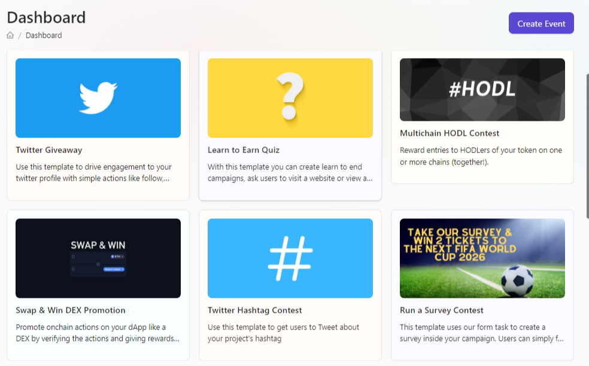
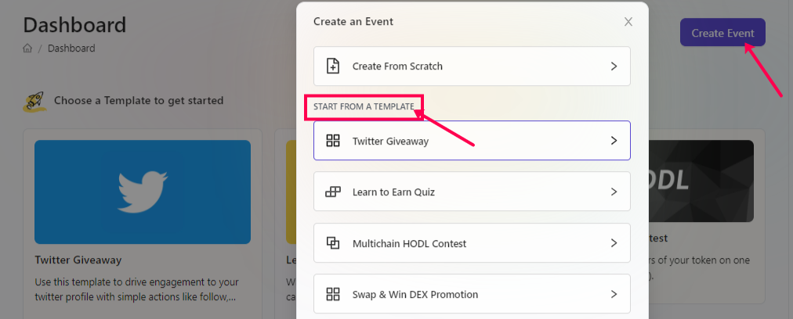

# Event Templates

We seriously believe that it's a bad experience for projects to create an event each time and we also understand that projects don't have the time to recreate the tasks again and again. Hence, at AirLyft, we have built some ready to use template that you can choose and create events in just a few clicks such as 

- Twitter Hashtag Contests
- Twitter Giveaway
- Multichain HODL Contest
- Swap & Win DEX Promotion
- Incentivized On-Chain Giveaway
- Discord Server Promotion
- Incentivized Survey Contest

And many more...

There are multiple ways how you can access the ready-to-use templates at AirLyft. Let's take a look at them all.

### DASHBOARD

To access the templates from Dashboard, please log in to your AirLyft account where upon successful login, you will be redirected to your dashboard where you can view all the available templates. 

### CREATE EVENT

The template view on the dashboard is removed once you create an event and publish it. This is because the dashboard then shows the current ongoing and settled events. But, you can still access templates and create new events. On the same dashboard, move to the top right part of the screen where you would find a blue create event button. Click on it and you will have the option to select from the list of Templates based on your usage. 

> **NOTE: If you feel certain templates can make your growth automated further, do get in touch using the information below.**

:::tip For instant help
1. Email us at support@kyte.one
2. Join our official [Telegram group](https://t.me/kyteone)
:::