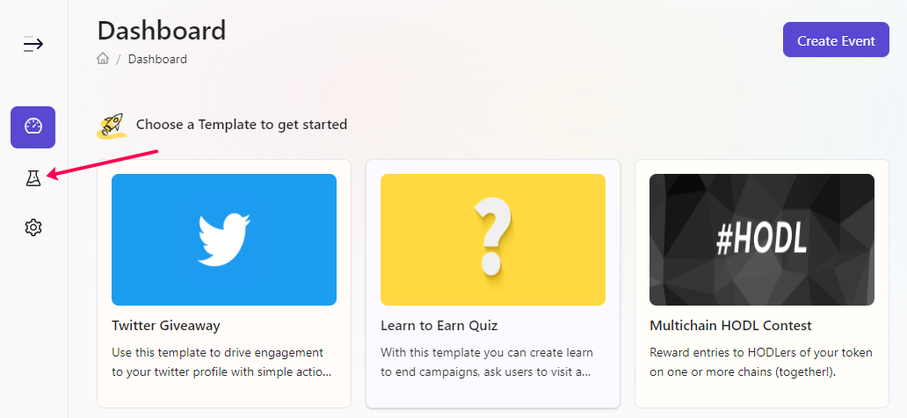
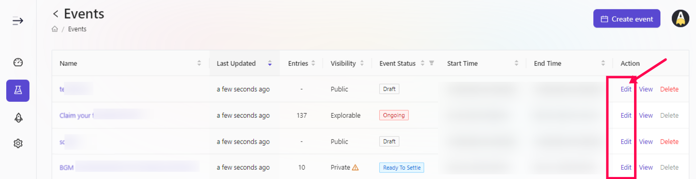

# Edit Ongoing Event

Projects always have the need to edit ongoing event for purpose of increasing engagement, adding weekly/daily tasks, changing certain parameters of the event and many other things which they feel is best to achieve dynamic engagement. With that in mind, AirLyft has provided its users the flexibility to edit ongoing events. 

- Login to AirLyft and once you are on the dashboard, please click on events tab as shown in the screenshot below.

- After you are on the event page, select the corresponding event that you want to edit and click on Edit button. 

- Next, you will be provided with a plethora of options where you can easily edit details such as 

**Event Information Page**:
    - Event Title  
    - Event Description    
    - Event Visibility   
    - Event Banner  

**Select Tasks Page**:
    - Add On-Chain Tasks 
    - Add Off-Chain Tasks
    - Edit already added Tasks 

> **NOTE:** Please note that you will not be able to edit the timestamp of event or delete an already added task.

- Once you have made your edits, please click on Publish for your changes to take into effect.

:::tip For instant help
1. Email us at support@kyte.one
2. Join our official [Telegram group](https://t.me/kyteone)
:::