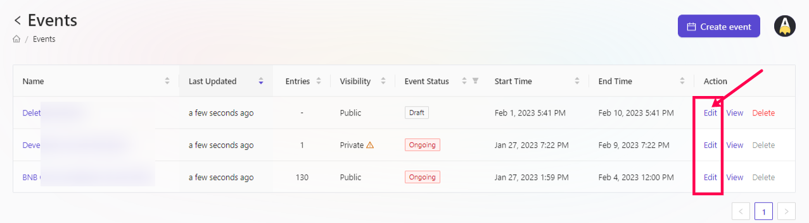
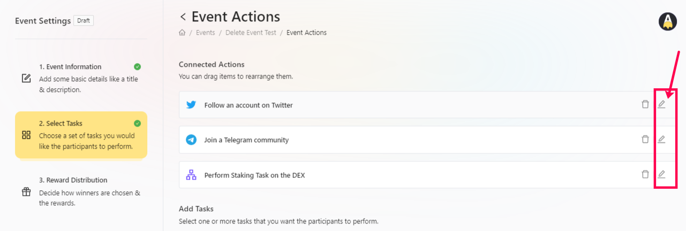
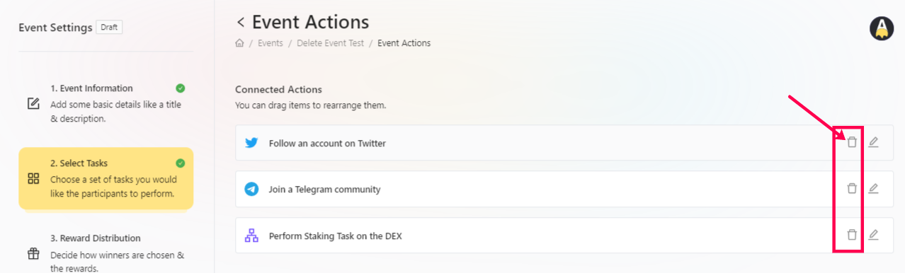
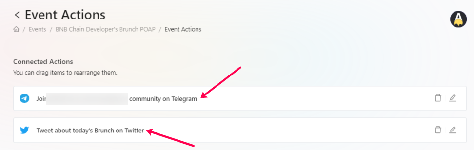

# Task

To delete an earlier created task at AirLyft, please follow the steps below. 

- Login to AirLyft and once you are on the dashboard, please click on the events tab as shown in the screenshot below.

- On the event page, select the corresponding event that you want to delete the task for and click on the Edit button against it.

- After you click on Edit, you will be redirected to the Event Information page where you can see all your created events. Select the event that you want to edit/delete the task for and click on the edit button.

- Now, click on the Select Tasks action where you would be able to see the tasks that you want to edit or delete. 

### EDIT

To edit, please click on the edit button as shown in the screenshot below and then make your changes accordingly. You can change the basic description, entries, or any other parameters as required.

### DELETE

To delete, simply click on the delete option against the task that you want to remove from the campaign. Once deleted, you would sometime have to do a hard refresh of the page for the changes to take effect. 

# Task Repositioning

To reposition created tasks based on priority either a draft event or an ongoing event, please follow the steps below.

- Login to AirLyft and once you are on the dashboard, please click on events tab as shown in the screenshot below.

- After you are on the event page, select the corresponding event that you want to edit and click on Edit button. 

- You will be redirected to the event page now where you can click on Select Tasks tab. 
- On the select tasks tab, you can find the list of tasks created. Click on the task and drag it based on your requirements to reposition that specific task. 

- That's it!!! Your campaign task is repositioned and ready for your usage based on your requirement.

> **NOTE:** Please be informed that Editing a particular task can be done as and when required but once an event is published, neither the event nor the included tasks can be deleted. The reason behind this is that users would have already participated and have entries rewarded to them as part of the completion of those tasks.

:::tip For instant help
1. Email us at support@kyte.one
2. Join our official [Telegram group](https://t.me/kyteone)
:::