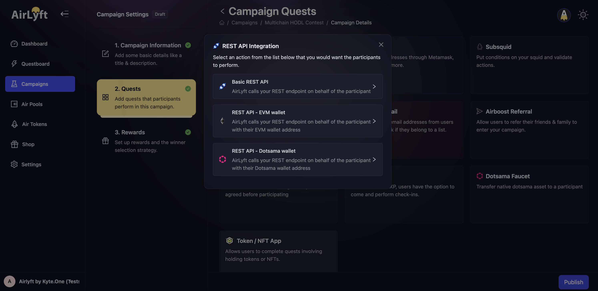
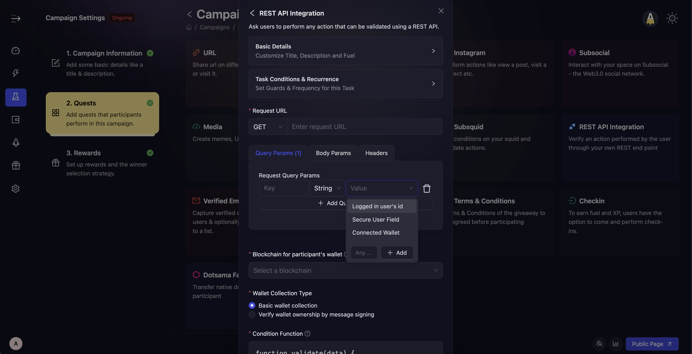
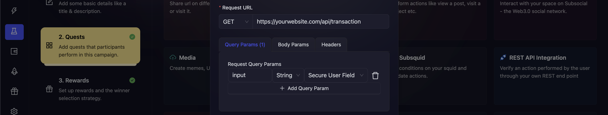
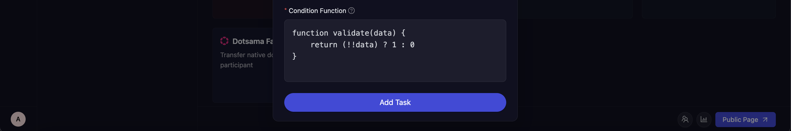

# REST API Integration

AirLyft integrates with any system that has REST API access. AirLyft can ask users to connect their EVM/Substrate wallets, take signatures to verify ownership, and send that wallet address to the API as a query or body param.

### What variables can AirLyft pass to the API?
AirLyft can pass the following information as a query/body param or header.
1. **Logged In user's id**: User's AirLyft UUID. Use this in case you have to save some data and match it with the exported data from the event.
2. **Secure User Field**: Any user input that is taken from the participant in the UI and securely sent to your API without being saved or logged in AirLyft's servers. Use this for usernames, keys, or any information your API might need to validate app installs, sign ups etc.
3. **Connected Wallet**: User's connected wallet address (Substrate or EVM depending on the quest type selected). Use this in case your dApp uses a wallet connection & you need to validate whether the user has used your particular feature.

These value types are available in all three params - Query, Body and Header.

### How to create a REST API to validate an action for a dApp?
REST APIs are best used when the quest you want to create is complex and cannot be easily validated using a smart contract function or an indexer.

### If your dApp supports EVM/Substrate
Say, your want to validate an action "Make a transaction on my dapp". Your REST API should look like the following:
1. Either `GET your-website/api/transaction?wallet=0x12345`
2. Or `POST your-website/api/transaction` with a body param for `wallet`
The API should return some data that can then be used in the condition function to validate whether the user performed the task or not.

Now, you can configure your params in the UI similar to this:

### If you want to validate via user input
Say, your want to validate an action "Make a transaction on my dapp". Your REST API should look like the following:
1. Either `GET your-website/api/transaction?input=0x12345`
2. Or `POST your-website/api/transaction` with a body param of `input`
The API should return some data that can then be used in the condition function to validate whether the user performed the task or not.

Now, you can configure your params in the UI similar to this:

Finally, the data returned by your API will be send to the condition function. You can modify your condition function to validate the data and return `1` if this is a valid case or `0` if this is an invalid case.

:::tip

Configuring the REST API Integration often needs support from the dev or devrel team of your company. Our team also provides support to our Professional Plan community hosts. [Open a support ticket on our Discord](https://discord.gg/4W6Bxq9rtc) to move to a Professional Plan today.

:::