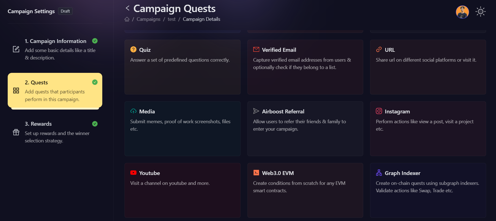
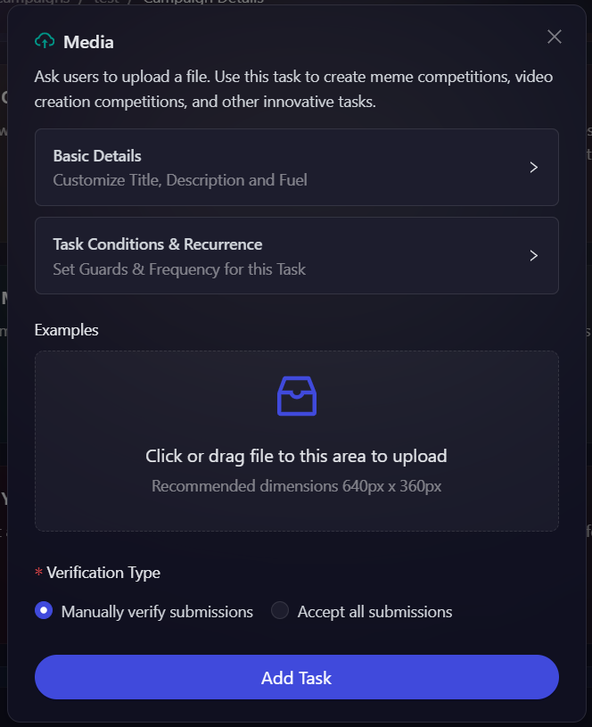

# Creating UGC (Upload) Tasks

Projects love engaging with the community and on a regular basis perform engagement activities such as creating a meme, infographics, writing contents, creating funny videos, creating telegram stickers, and many more. Keeping that in mind, AirLyft has introduced a Media functionality in which projects can ask users to create certain contents in form of an image, or video, or simple document and upload their content as an submission for which participants will be rewarded entries. Let's take a look on how we can create Media actions.

- Login to AirLyft and create an event. On the event page, click on select Apps tab where you can find the Media block. 

- Next, expand the basic details option to enter the Title, Description, and Entries. It is advisable to elaborate on the title and description so that participants have a much greater understanding of the task. You can also provide a screenshot example that gives a better perspective of what type of contents users need to upload. **Do take a note of the dimensions which is 598px X 288px!**

- Finally click on **Add Task** and that's it. Your media task creation is complete and ready for campaign.

:::tip This document is in progress, for instant help

1. Email us at support@kyte.one
2. Join [this Telegram group](https://t.me/kyteone): https://t.me/kyteone

**_The AirLyft Team is there to help you. AirLyft is a platform to run marketing events, campaigns, quests and automatically distribute NFTs or Tokens as rewards._**

:::